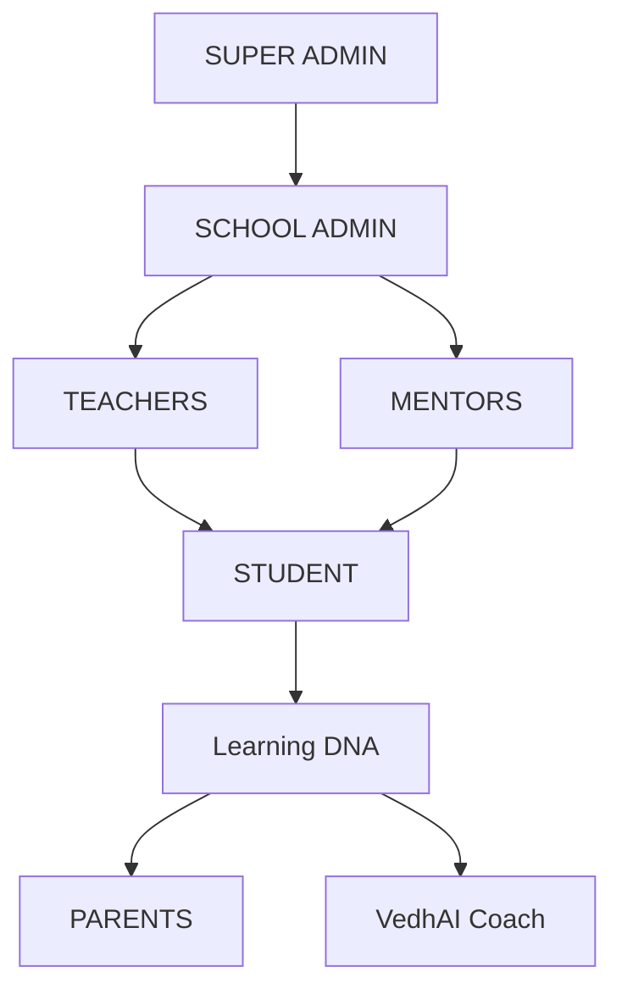

# Vedhkrit: India's AI-Powered Learner Development Operating System

This document outlines the architectural relationships, user journey, dashboard philosophies, and operational scope of **Vedhkrit** — positioned not as a basic EdTech website or administrative ERP, but as **India's AI-Powered Learner Development Operating System**.

---

## 👥 Ecosystem Roles & Key Portals

### 1. 🛡️ SUPER ADMIN (Top Tier)
* **Description:** Global administrator responsible for platform governance, multi-tenant billing, and system operations.
* **Key Tasks:**
  * Manage school subscriptions and onboarding.
  * Monitor platform-wide system health and analytics.
  * Maintain global database structures, content libraries, and CMS configurations.
* **Portal Path:** [/dashboard/super](file:///c:/Users/yashr/OneDrive/Desktop/VEDHKRIT/apps/web/src/routes/dashboard.super.tsx)

### 2. 🏫 SCHOOL ADMIN (Institutional Tier)
* **Description:** Campus-specific administrators managing operational activities for a single school.
* **Key Tasks:**
  * Manage academic departments, timetables, and teacher/mentor roster allocations.
  * Oversee student enrollment and class cohort allocations.
  * Track school-wide performance statistics and diagnostic trends.
* **Portal Path:** [/dashboard/admin](file:///c:/Users/yashr/OneDrive/Desktop/VEDHKRIT/apps/web/src/routes/dashboard.admin.tsx)

### 3. 👨‍🏫 TEACHERS & MENTORS (Guidance Layer)
This tier consists of two complementary roles that feed directly into the student's development:
* **TEACHERS:**
  * Focus on daily academic instruction, lesson plans, class attendance, and curriculum tracking.
  * Log school assessment marks and grade performance.
  * **Portal Path:** [/dashboard/admin/teachers](file:///c:/Users/yashr/OneDrive/Desktop/VEDHKRIT/apps/web/src/routes/dashboard.admin.teachers.tsx)
* **MENTORS:**
  * Conduct 1:1 sessions for soft skill assessments, profile-building, and career alignment.
  * Outline growth plan milestones and provide personalized feedback notes.
  * **Portal Path:** [/dashboard/mentor](file:///c:/Users/yashr/OneDrive/Desktop/VEDHKRIT/apps/web/src/routes/dashboard.mentor.tsx)

### 4. 🎓 STUDENT (Core Subject)
* **Description:** The central subject of the ecosystem, around whom all other activities revolve.
* **Key Tasks:**
  * View personalized learning paths, goals, and daily schedules.
  * Complete diagnostic interest tests and profile assessments.
  * Log into live sessions and view career pathway recommendations.
* **Portal Path:** [/dashboard/student](file:///c:/Users/yashr/OneDrive/Desktop/VEDHKRIT/apps/web/src/routes/dashboard.student.tsx)

### 5. 🧬 Learning DNA (Central Profile)
* **Description:** The core profile storage mechanism containing the student's multi-dimensional capability map.
* **Attributes Tracked:**
  * **Academic Progress:** Cumulative grading, attendance index, and class standing.
  * **Core Capabilities:** Soft skill index metrics covering Leadership, Consistency, Innovation, and Communication.
  * **Learning Style:** Diagnostic output mapping (e.g. Visual, Kinesthetic, Auditory learner).
  * **Career Blueprint:** Pathway selections, active milestones, and portfolio assets.

### 6. 👪 PARENTS & VedhAI Coach (Support Layer)
The output of the student's **Learning DNA** is continuously analyzed and shared with:
* **PARENTS:**
  * Stay aligned on the child's learning metrics via live reports.
  * View mentor session feedback and directly book consultations.
  * Handle payments and review subscription logs.
  * **Portal Path:** [/dashboard/parent](file:///c:/Users/yashr/OneDrive/Desktop/VEDHKRIT/apps/web/src/routes/dashboard.parent.tsx)
* **VedhAI Coach:**
  * Always-on AI coach providing personal study hints and answering learning questions.
  * Recommends next steps based on the student's Learning DNA profiles and active roadmaps.
  * **Portal Path:** [/dashboard/student/ai](file:///c:/Users/yashr/OneDrive/Desktop/VEDHKRIT/apps/web/src/routes/dashboard.student.ai.tsx)

---

## 🚀 The Student Journey (Product Lifecycle)

The step-by-step lifecycle of a student within the Vedhkrit ecosystem:

```mermaid
graph LR
    Register["1. Register"]
    Discovery["2. AI Discovery Assessment"]
    DNA["3. Learning DNA Generated"]
    Mentor["4. Mentor Assigned"]
    Roadmap["5. Academic Roadmap Created"]
    Daily["6. Daily Learning"]
    Weekly["7. Weekly Assessments"]
    Monthly["8. Monthly Growth Reports"]
    Parent["9. Parent Feedback"]
    Career["10. Career Exploration"]
    Ready["11. Future Ready Student"]

    Register --> Discovery
    Discovery --> DNA
    DNA --> Mentor
    Mentor --> Roadmap
    Roadmap --> Daily
    Daily --> Weekly
    Weekly --> Monthly
    Monthly --> Parent
    Parent --> Career
    Career --> Ready
```

### Step Breakdown & Functional Flow

1. **📝 Register**
   * **Action:** Student or school admin registers the account on the platform.
   * **Route:** [/register](file:///c:/Users/yashr/OneDrive/Desktop/VEDHKRIT/apps/web/src/routes/register.tsx)

2. **🧠 AI Discovery Assessment**
   * **Action:** Student undergoes an initial AI-driven diagnostic evaluation testing aptitude, natural interests, and cognitive capabilities.
   * **Route:** [/assessment](file:///c:/Users/yashr/OneDrive/Desktop/VEDHKRIT/apps/web/src/routes/_marketing.assessment.tsx)

3. **🧬 Learning DNA Generated**
   * **Action:** System aggregates assessment results to build the dynamic **Learning DNA Profile** (visualizing soft skill indices, learning style, and initial path recommendation).
   * **Route:** [/dashboard/student/skillset](file:///c:/Users/yashr/OneDrive/Desktop/VEDHKRIT/apps/web/src/routes/dashboard.student.skillset.tsx)

4. **🤝 Mentor Assigned**
   * **Action:** Based on the learning profile recommendations, the student is paired with a matching professional mentor.
   * **Route:** [/dashboard/student/mentor](file:///c:/Users/yashr/OneDrive/Desktop/VEDHKRIT/apps/web/src/routes/dashboard.student.mentor.tsx)

5. **🗺️ Academic Roadmap Created**
   * **Action:** Mentor and student collaborate to create a personalized multi-year growth roadmap (grades 8 to 12).
   * **Route:** [/dashboard/student/planner](file:///c:/Users/yashr/OneDrive/Desktop/VEDHKRIT/apps/web/src/routes/dashboard.student.planner.tsx)

6. **📖 Daily Learning**
   * **Action:** Student logs into their dashboard daily to manage task lists, track schedules, review modules, and chat with their VedhAI Coach.
   * **Route:** [/dashboard/student](file:///c:/Users/yashr/OneDrive/Desktop/VEDHKRIT/apps/web/src/routes/dashboard.student.index.tsx)

7. **✍️ Weekly Assessments**
   * **Action:** Quick checks, homework submissions, and tests are administered to track progress and verify capabilities.
   * **Route:** [/dashboard/student/assessments](file:///c:/Users/yashr/OneDrive/Desktop/VEDHKRIT/apps/web/src/routes/dashboard.student.assessments.tsx)

8. **📊 Monthly Growth Reports**
   * **Action:** Student's core indices are dynamically recalculated and visual reports are published.
   * **Route:** [/dashboard/student/reports](file:///c:/Users/yashr/OneDrive/Desktop/VEDHKRIT/apps/web/src/routes/dashboard.student.reports.tsx)

9. **💬 Parent Feedback**
   * **Action:** Growth metrics and mentor recommendations are shared with parents to keep them aligned and engaged in the student's development.
   * **Route:** [/dashboard/parent](file:///c:/Users/yashr/OneDrive/Desktop/VEDHKRIT/apps/web/src/routes/dashboard.parent.index.tsx)

10. **🧭 Career Exploration**
    * **Action:** Ongoing deep-dives into 50+ futuristic careers, identifying matching roles, and aligning stream/university preparations.
    * **Route:** [/dashboard/student/career](file:///c:/Users/yashr/OneDrive/Desktop/VEDHKRIT/apps/web/src/routes/dashboard.student.career.tsx)

11. **🎓 Future Ready Student**
    * **Action:** Graduation of the student's skill portfolio, demonstrating strong consistency, communication, leadership, and preparedness for higher education/industry.
    * **Route:** [/dashboard/student/portfolio](file:///c:/Users/yashr/OneDrive/Desktop/VEDHKRIT/apps/web/src/routes/dashboard.student.portfolio.tsx)

---

## 🎯 Dashboard Philosophy

To maximize focus and efficiency, **every dashboard in the Vedhkrit platform must answer exactly one core question.** Design decisions, widgets, and layouts must directly serve this primary focus.

| Dashboard | Core Question it Answers | Portal Route / Files | Key UX & Visual Indicators |
| :--- | :--- | :--- | :--- |
| **Student** | **"What should I do today?"** | [/dashboard/student](file:///c:/Users/yashr/OneDrive/Desktop/VEDHKRIT/apps/web/src/routes/dashboard.student.index.tsx) | Daily checklist, active task gauge, scheduled mentor session card, next AI coach tip. |
| **Parent** | **"How is my child doing?"** | [/dashboard/parent](file:///c:/Users/yashr/OneDrive/Desktop/VEDHKRIT/apps/web/src/routes/dashboard.parent.index.tsx) | Vedhkrit growth index trends, attendance flags, mentor updates feed, child performance indicators. |
| **Mentor** | **"Which students need my attention?"** | [/dashboard/mentor](file:///c:/Users/yashr/OneDrive/Desktop/VEDHKRIT/apps/web/src/routes/dashboard.mentor.index.tsx) | Inactive alerts list, session scheduling requests, feedback drafting triggers, student milestone delays. |
| **Teacher** | **"Which students are struggling in my subject?"** | [/dashboard/admin/teachers](file:///c:/Users/yashr/OneDrive/Desktop/VEDHKRIT/apps/web/src/routes/dashboard.admin.teachers.tsx) | Course average distributions, red-zone grades indicators, attendance alerts, sub-topic performance gaps. |
| **School Admin** | **"How is my school performing?"** | [/dashboard/admin](file:///c:/Users/yashr/OneDrive/Desktop/VEDHKRIT/apps/web/src/routes/dashboard.admin.index.tsx) | Campus-wide enrollment status, department performance rankings, overall attendance rates, mentor utilization. |
| **Super Admin** | **"How is the Vedhkrit platform growing?"** | [/dashboard/super](file:///c:/Users/yashr/OneDrive/Desktop/VEDHKRIT/apps/web/src/routes/dashboard.super.index.tsx) | Total registered schools, active subscriptions & MRR growth, platform uptime, global active user activity trends. |

---

## 🚫 Product Boundaries (What We Will NOT Build)

To maintain a highly focused product direction and prevent scope creep:

### 1. No Redundant ERP Systems
* **Decision:** We will **not** build Vedhkrit into a generic School ERP (Enterprise Resource Planning) platform containing hundreds of administrative, inventory, payroll, or cafeteria menus.
* **Rationale:** Schools already have established ERP systems for operations, finance, and record-keeping. Competing in that space dilutes our core value.

### 2. The "Student Development Layer" Focus
* **Strategy:** Vedhkrit is designed exclusively as a **Student Development Layer** that integrates with existing school systems.
* **Scope Limits:**
  * **Integrate, Don't Replace:** We sync core academic data, student lists, and basic attendance records from existing school databases instead of forcing schools to migrate their administrative services.
  * **Value Focus:** All UI and feature engineering resources are directed toward capability diagnostics (Learning DNA), mentoring coordination, and AI-driven growth roadmaps.

