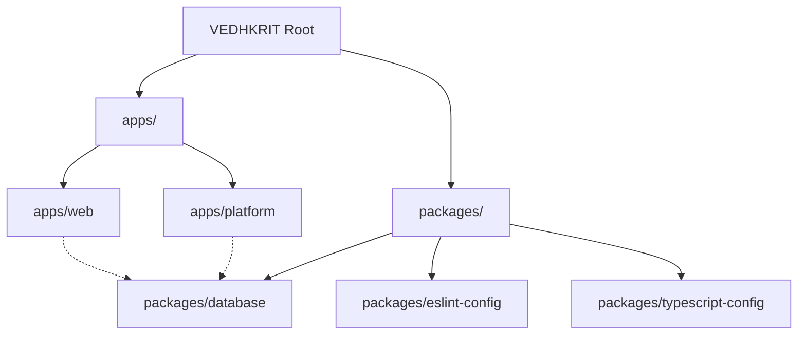

# Project Overview

This document describes the codebase structure, repository workspaces, and technology stack of **VEDHKRIT**.

---

## 🏗️ Repository Architecture (Monorepo)

The project is structured as a monorepo workspace managed via **Turborepo** and npm/yarn workspaces.

### Workspace Folders

1. **`apps/web`:** The primary client-facing web application. It includes marketing routes, public assessment systems, physical SLEC studios information, and student/parent portals.
2. **`apps/platform`:** Back-office administrative portal and cohorts management system.
3. **`packages/database`:** Shared database schemas and ORM clients.
4. **`packages/eslint-config`:** Shared ESLint configuration definitions.
5. **`packages/typescript-config`:** Shared tsconfig configurations.

---

## 🛠️ Technology Stack (apps/web)

* **Core Framework:** [React 19](https://react.dev) + [TypeScript 5](https://www.typescriptlang.org)
* **Router & Framework SSR:** [TanStack Router](https://tanstack.com/router) & [TanStack Start](https://tanstack.com/start)
* **Bundler & Tooling:** [Vite 8](https://vite.dev)
* **Styling:** [Tailwind CSS v4](https://tailwindcss.com) (using `@import "tailwindcss"` and direct theme configurations)
* **Animations:** [Motion v12](https://motion.dev) (formerly Framer Motion)
* **Iconography:** [Lucide React](https://lucide.dev)
* **Charts:** [Recharts](https://recharts.org)

---

## ⚙️ Development Commands

Orchestrated globally at the monorepo root via Turborepo:
* **`npm run dev`:** Starts parallel development servers for all workspaces.
* **`npm run build`:** Compiles, bundles, and checks Typescript across the entire workspace.
* **`npm run lint`:** Runs eslint syntax verification.
* **`npm run format`:** Restores prettier formats.
