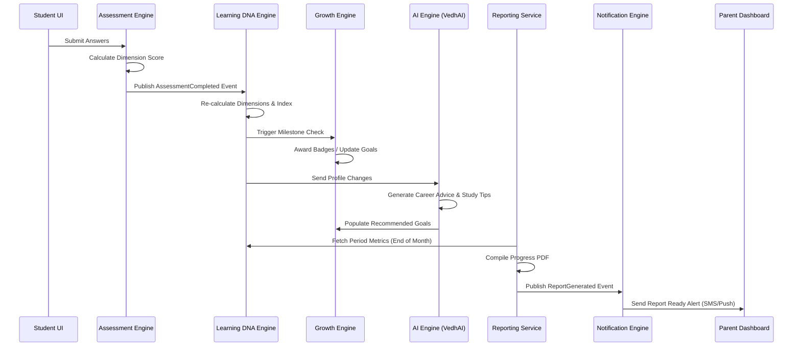
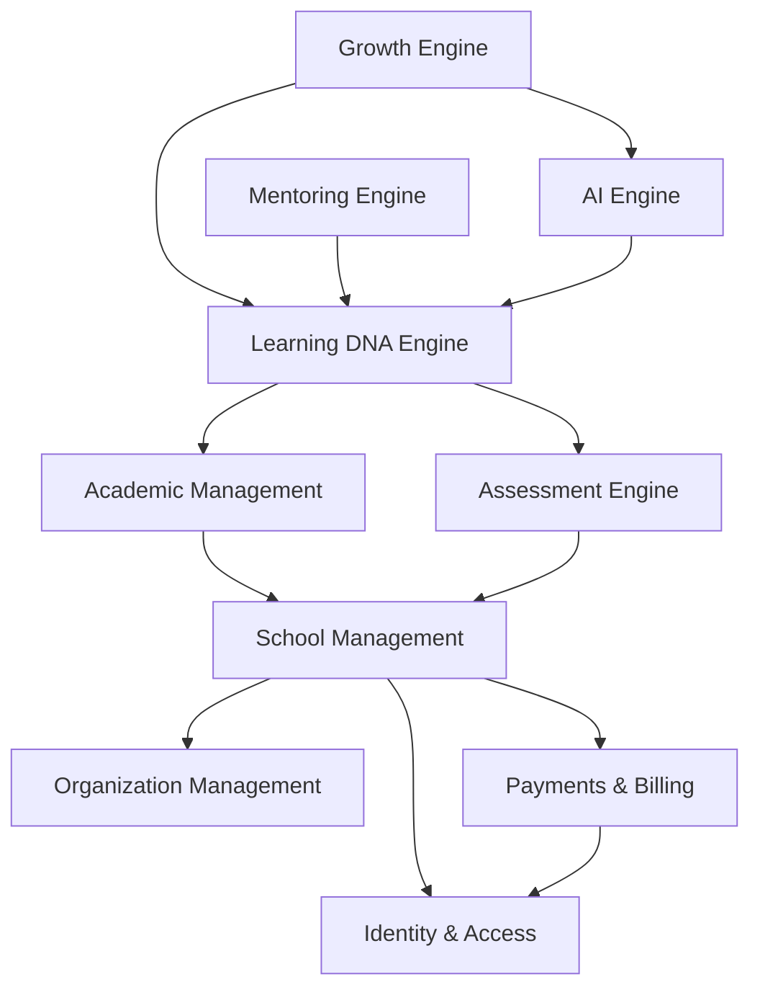
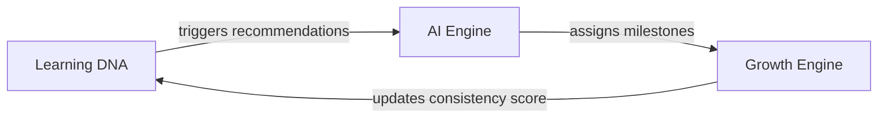

# VEDHKRIT Learner Development OS: Business Capability Map

This document serves as the master enterprise architecture blueprint for the **Vedhkrit Learner Development Operating System**. It defines the business capabilities of the platform, structured systematically around core operational competencies rather than technical components or visual dashboards.

---

## 1. Executive Overview

### What is a Business Capability?
A **Business Capability** represents a stable, fundamental building block of what the Vedhkrit platform does to deliver value. It defines a structural business capacity (e.g., "Student Assessment", "Franchise Licensing", "Payment Collection") that is self-contained, cohesive, and business-focused. It specifies *what* the platform is capable of doing, not *how* a specific task is coded or configured.

### Why Capabilities are Different from Modules and Dashboards
Capabilities focus on the business outcome and remain separate from application structure:

| Dimension | Business Capability | Software Module | Portal Dashboard |
| :--- | :--- | :--- | :--- |
| **Focus** | Business Outcome & Competency | Code Structure & Packaging | User Persona Interface |
| **Example** | *Identity Assessment* | `packages/database/prisma` | `/dashboard/student/index.tsx` |
| **Stability** | Static (stable over years) | Variable (refactored frequently) | Ephemeral (adapted to UX design) |
| **Scope** | Business Domain boundary | Technical files & directory | Role-based layout view |

### Why Capabilities Remain Stable While Technology Changes
Even if Vedhkrit migrates from PostgreSQL to an event-sourced database, replaces Next.js with Flutter, or changes the LLM backend from Gemini to a fine-tuned local Llama instance, the business capability of "calculating a student's diagnostic score" or "marking daily classroom attendance" remains structurally identical. Focusing on capabilities ensures the platform's core architecture survives code changes.

### Organizing around Business Capabilities instead of Dashboards
Traditional EdTech systems organize their backends around role-based dashboards (e.g., "Student API", "Parent API", "Mentor API"). This leads to:
1. **Duplicate Business Logic:** The student dashboard and parent dashboard both need to fetch grades, resulting in duplicate code paths.
2. **State Inconsistencies:** Updating an attendance status from a teacher screen might fail to propagate to parent SMS alert modules because they are handled in separate endpoints.
3. **High Coupling:** Changing a grade database field breaks unrelated student profile views.

Vedhkrit is organized around **Business Capabilities**. Each capability is managed as a distinct domain service that exposes a unified set of APIs. Dashboards (Student, Parent, Mentor, School Admin, Super Admin) simply act as presentation clients consuming these shared capabilities.

```
       +-----------------------------------------------------------+
       |                   PRESENTATION WORKSPACES                 |
       |  (Student App, Parent App, Mentor App, School Admin Portal)|
       +-----------------------------------------------------------+
                                     |
           +-------------------------+-------------------------+
           |                         |                         |
           v                         v                         v
+-----------------------+ +-----------------------+ +-----------------------+
|  IDENTITY CAPABILITY  | | ASSESSMENT CAPABILITY | | METRICS DNA ENGINE    |
|   (Auth, RBAC, OTP)   | |  (Quizzes, Grading)   | |  (Vedhkrit Index)     |
+-----------------------+ +-----------------------+ +-----------------------+
           |                         |                         |
           +-------------------------+-------------------------+
                                     |
                                     v
       +-----------------------------------------------------------+
       |                 COMMON PLATFORM SERVICES                  |
       |     (AI Gateway, Audit Log, SMS Broker, Caching API)      |
       +-----------------------------------------------------------+
```

---

## 2. Capability Hierarchy

The Vedhkrit enterprise landscape is partitioned into three levels:
* **Level 1 (L1):** Core Capability Domains.
* **Level 2 (L2):** Operational Competencies.
* **Level 3 (L3):** Functional Business Actions.

---

### L1: Identity & Access Management
Governs user onboarding, authentication verification, security permissions, and session tracking.

* **L2: Authentication**
  * **L3: OTP Dispatch & Verification:** Generates, dispatches via SMS/Email (MSG91), and validates 6-digit verification codes.
  * **L3: Password Authentication:** Secure registration and password hashing using bcrypt.
  * **L3: Session Management:** Handles JWT access tokens and long-lived refresh tokens.
  * *Purpose:* Authenticates the identity of users accessing the system.
  * *Owner:* Team Core Security.
  * *Dependencies:* Notification Engine, Platform SMS Service.
  * *Inputs:* Registration Payload, Login Credentials, Verification Codes.
  * *Outputs:* Verification Status, Signed Access Tokens.
  * *Business Value:* Protects user data and prevents unauthorized access.
  * *Criticality:* Tier-1 (Showstopper).

* **L2: Authorization**
  * **L3: Role-Based Access Control (RBAC):** Enforces static roles (Student, Parent, Teacher, Mentor, Admin).
  * **L3: Attribute-Based Access Control (ABAC):** Restricts data access based on relationships (e.g., linked children).
  * *Purpose:* Controls user permissions within the platform.
  * *Owner:* Team Core Security.
  * *Dependencies:* None.
  * *Inputs:* User Role, Target Resource, Access Context.
  * *Outputs:* Authorization Decision (Access Granted/Denied).
  * *Business Value:* Protects sensitive student and organizational records.
  * *Criticality:* Tier-1 (Showstopper).

---

### L1: Organization Management
Governs the configuration and licensing of schools, campuses, and franchise structures.

* **L2: Tenant Administration**
  * **L3: School Onboarding:** Configures schools, billing profiles, and license parameters.
  * **L3: Campus Management:** Controls physical branch listings and localized asset mapping.
  * **L3: Franchise Hierarchy Resolution:** Navigates relationships between organizations, schools, and branches.
  * *Purpose:* Manages multi-tenant configurations.
  * *Owner:* Team Cohorts.
  * *Dependencies:* Payments & Billing.
  * *Inputs:* Licensing Agreement, School Configuration Data.
  * *Outputs:* Active Tenant Space, Branch Registries.
  * *Business Value:* Supports scaling across franchise networks and school groups.
  * *Criticality:* Tier-2 (High).

* **L2: Academic Calendar Configuration**
  * **L3: Academic Year Administration:** Manages setup and close-out states of the operational calendar.
  * **L3: Timetable Management:** Structures class hours and lesson slots.
  * *Purpose:* Aligns platform operations with the physical school calendar.
  * *Owner:* Team Cohorts.
  * *Dependencies:* None.
  * *Inputs:* Term Timelines, Holiday Lists.
  * *Outputs:* Operational Calendar Context.
  * *Business Value:* Prevents administrative schedule overlap and coordinates grading periods.
  * *Criticality:* Tier-2 (High).

---

### L1: School Management
Manages student enrollment, department divisions, and cohort allocations.

* **L2: Class & Cohort Management**
  * **L3: Class Template Definition:** Creates standard curriculum divisions (e.g., "Grade 10").
  * **L3: Section Division:** Divides class standards into sections (e.g., "Section A").
  * **L3: Batch Assignment:** Links students and teachers to an active Academic Year.
  * *Purpose:* Organizes students into learning groups.
  * *Owner:* Team Cohorts.
  * *Dependencies:* Organization Management.
  * *Inputs:* Student Rosters, Teacher Assignments, Cohort Definitions.
  * *Outputs:* Active Batches.
  * *Business Value:* Maps real-world school classes to the digital platform.
  * *Criticality:* Tier-1 (Showstopper).

* **L2: Enrollment Management**
  * **L3: Student Registration Linkage:** Links registered users to student profiles and cohorts.
  * **L3: Parent-Child Linkage:** Connects parent accounts with their children's profiles.
  * *Purpose:* Sets up relationships between students, parents, and schools.
  * *Owner:* Team Cohorts.
  * *Dependencies:* Identity & Access Management.
  * *Inputs:* User Profile IDs, Linkage Keys.
  * *Outputs:* Verified Relationships.
  * *Business Value:* Links student telemetry to their parents' dashboards.
  * *Criticality:* Tier-1 (Showstopper).

---

### L1: Academic Management
Tracks the delivery of daily school instruction and student compliance.

* **L2: Syllabus Cataloging**
  * **L3: Subject Configuration:** Defines active courses (e.g., Mathematics).
  * **L3: Chapter Mapping:** Details structural syllabus breakdowns.
  * **L3: Lesson Outlining:** Catalogues instructional topics and details.
  * *Purpose:* Maps school curriculums within the platform.
  * *Owner:* Team Academics.
  * *Dependencies:* None.
  * *Inputs:* Curriculum Standards.
  * *Outputs:* Active Syllabus Structure.
  * *Business Value:* Organizes study resources and lesson plans.
  * *Criticality:* Tier-3 (Medium).

* **L2: Attendance Logging**
  * **L3: Absence Registration:** Records student presence or absence for classes or school days.
  * **L3: Safety Threshold Alerts:** Identifies attendance drops and alerts administration.
  * *Purpose:* Logs student attendance.
  * *Owner:* Team Academics.
  * *Dependencies:* Notification Engine.
  * *Inputs:* Attendance Checklists.
  * *Outputs:* Attendance Logs, Deficit Flags.
  * *Business Value:* Meets school attendance tracking requirements and alerts parents to absences.
  * *Criticality:* Tier-2 (High).

* **L2: Homework Administration**
  * **L3: Task Assignment:** Allows teachers to assign homework tasks to batches.
  * **L3: Submission Intake:** Handles file uploads and text submissions from students.
  * **L3: Scoring & Feedback:** Logs grades and comments.
  * *Purpose:* Manages and evaluates student homework assignments.
  * *Owner:* Team Academics.
  * *Dependencies:* Notification Engine.
  * *Inputs:* Homework Prompts, Student Submissions, Grades.
  * *Outputs:* Submission States, Performance Data.
  * *Business Value:* Tracks day-to-day academic progress.
  * *Criticality:* Tier-2 (High).

---

### L1: Learning Management
Delivers educational resources and virtual classroom instruction.

* **L2: Curated Study Library**
  * **L3: Material Repository:** Uploads PDFs, videos, and worksheets.
  * **L3: Material Recommendations:** Matches study resources with student weaknesses.
  * *Purpose:* Distributes study materials.
  * *Owner:* Team Academics.
  * *Dependencies:* AI Engine.
  * *Inputs:* Study Materials, Student Competency Data.
  * *Outputs:* Recommended Resources.
  * *Business Value:* Provides students with targeted study aids.
  * *Criticality:* Tier-3 (Medium).

* **L2: Virtual Classes**
  * **L3: Stream Scheduling:** Configures links for upcoming online lectures.
  * **L3: Stream Archival:** Links recorded sessions to batch folders.
  * *Purpose:* Delivers live online classes.
  * *Owner:* Team Academics.
  * *Dependencies:* Notification Engine, Platform Storage.
  * *Inputs:* Calendar Invites, Video Recording Files.
  * *Outputs:* Active Live Class Sessions, Video Archives.
  * *Business Value:* Supports hybrid and distance learning.
  * *Criticality:* Tier-3 (Medium).

---

### L1: Assessment Engine
Manages diagnostic testing, quizzes, and cognitive profiling.

* **L2: Question Repository**
  * **L3: Question Banking:** Uploads and categorizes assessment questions.
  * **L3: Capability Tagging:** Links questions to soft skills and cognitive levels.
  * *Purpose:* Builds a pool of evaluation questions.
  * *Owner:* Team Assessment & DNA.
  * *Dependencies:* None.
  * *Inputs:* Questions, Difficulty Levels, Capability Tags.
  * *Outputs:* Question Bank.
  * *Business Value:* Standardizes questions for diagnostic testing.
  * *Criticality:* Tier-1 (Showstopper).

* **L2: Test Delivery & Evaluation**
  * **L3: Session Delivery:** Presents assessments to students and tracks progress.
  * **L3: Evaluation:** Scores submissions and generates dimension matrices.
  * *Purpose:* Evaluates student responses.
  * *Owner:* Team Assessment & DNA.
  * *Dependencies:* None.
  * *Inputs:* Assessment Prompts, Student Responses.
  * *Outputs:* Evaluation Metrics, Dimension Matrices.
  * *Business Value:* Measures cognitive abilities and soft skills.
  * *Criticality:* Tier-1 (Showstopper).

---

### L1: Growth Engine
Manages student portfolios, goal setting, and gamification.

* **L2: Milestone Tracking**
  * **L3: Goal Management:** Sets and monitors student learning targets.
  * **L3: Digital Portfolio:** Hosts verified student projects and certificates.
  * *Purpose:* Tracks student achievements and portfolios.
  * *Owner:* Team Growth & Portfolio.
  * *Dependencies:* None.
  * *Inputs:* Projects, Certificates, Goals.
  * *Outputs:* Public Portfolios, Milestone Progress.
  * *Business Value:* Showcases verified student achievements.
  * *Criticality:* Tier-2 (High).

* **L2: Gamified Rewards**
  * **L3: Badges:** Awards visual badges for platform achievements.
  * **L3: Leaderboards:** Tracks engagement rankings across cohorts.
  * *Purpose:* Encourages student engagement.
  * *Owner:* Team Growth & Portfolio.
  * *Dependencies:* Assessment Engine.
  * *Inputs:* Telemetry Events, Performance Logs.
  * *Outputs:* Awarded Badges, Leaderboard Rankings.
  * *Business Value:* Increases platform usage and student engagement.
  * *Criticality:* Tier-3 (Medium).

---

### L1: Learning DNA Engine
Aggregates telemetry to calculate holistic growth indexes.

* **L2: Capability Profile Resolution**
  * **L3: Dimension Matrix Calculation:** Computes soft-skill indexes (Leadership, consistency, etc.).
  * **L3: Profile Generation:** Visualizes the student's overall development.
  * *Purpose:* Maps student soft-skills and learning styles.
  * *Owner:* Team Assessment & DNA.
  * *Dependencies:* Assessment Engine, Academic Management.
  * *Inputs:* Assessment Results, Homework History, Mentor Reviews.
  * *Outputs:* Soft-Skill Profile.
  * *Business Value:* Provides a multidimensional view of student capability.
  * *Criticality:* Tier-1 (Showstopper).

* **L2: Growth Indexing**
  * **L3: Index Recalculation:** Updates the student's holistic score (0-100).
  * **L3: History Archiving:** Stores progress logs for trend charts.
  * *Purpose:* Tracks student developmental progress.
  * *Owner:* Team Assessment & DNA.
  * *Dependencies:* None.
  * *Inputs:* Learning DNA Updates, Attendance Records.
  * *Outputs:* Holistic Growth Score.
  * *Business Value:* Offers a single indicator of student growth.
  * *Criticality:* Tier-1 (Showstopper).

---

### L1: Mentoring Engine
Coordinates scheduling and feedback for 1:1 mentorship sessions.

* **L2: Mentor Allocations**
  * **L3: Match Profiling:** Recommends mentors based on student interests.
  * **L3: Student Assignment:** Handles student-mentor pairings.
  * *Purpose:* Matches students with appropriate mentors.
  * *Owner:* Team Guidance & Mentorship.
  * *Dependencies:* Learning DNA Engine.
  * *Inputs:* Mentor Skillsets, Student Interest Profiles.
  * *Outputs:* Student-Mentor Pairings.
  * *Business Value:* Connects students with targeted career guidance.
  * *Criticality:* Tier-2 (High).

* **L2: Session Coordination**
  * **L3: Calendar Integration:** Manages scheduling for 1:1 sessions.
  * **L3: Review Logging:** Captures mentor feedback notes and soft-skill ratings.
  * *Purpose:* Manages 1:1 mentoring sessions.
  * *Owner:* Team Guidance & Mentorship.
  * *Dependencies:* Platform Calendar Service.
  * *Inputs:* Availability Configurations, Feedback Notes.
  * *Outputs:* Session Logs, Skill Evaluation Ratings.
  * *Business Value:* Incorporates qualitative mentoring assessments into student profiles.
  * *Criticality:* Tier-2 (High).

---

### L1: Career Engine
Maps student progress against futuristic career targets.

* **L2: Career Cataloging**
  * **L3: Pathway Profiling:** Manages descriptions and skill requirements for modern careers.
  * **L3: Roadmap Mapping:** Outlines pathways to prepare for specific careers.
  * *Purpose:* Details career requirements and paths.
  * *Owner:* Team Guidance & Mentorship.
  * *Dependencies:* None.
  * *Inputs:* Industry Standards.
  * *Outputs:* Career Profiles, Skill Prerequisites.
  * *Business Value:* Helps students explore futuristic career options.
  * *Criticality:* Tier-3 (Medium).

* **L2: Career Roadmap Tracking**
  * **L3: Path Selection:** Connects student profiles to selected careers.
  * **L3: Goal Alignment:** Automatically populates goals based on selected paths.
  * *Purpose:* Guides students along selected career pathways.
  * *Owner:* Team Guidance & Mentorship.
  * *Dependencies:* Growth Engine.
  * *Inputs:* Selected Careers, Completed Goals.
  * *Outputs:* Milestone Status.
  * *Business Value:* Tracks student progress toward long-term career goals.
  * *Criticality:* Tier-3 (Medium).

---

### L1: Communication Domain
Handles chat services and messaging.

* **L2: Unified Chat Platform**
  * **L3: Conversation Threads:** Initiates messaging groups between students, parents, and mentors.
  * **L3: Message Records:** Stores sent messages.
  * *Purpose:* Connects platform users via chat.
  * *Owner:* Team Core Security.
  * *Dependencies:* Identity & Access Management.
  * *Inputs:* Text Inputs, Media Files.
  * *Outputs:* Active Chats.
  * *Business Value:* Facilitates communication between students, parents, and mentors.
  * *Criticality:* Tier-3 (Medium).

---

### L1: Notification Engine
Dispatches transaction and behavior alerts.

* **L2: Alert Routing**
  * **L3: Message Formatting:** Configures notification templates.
  * **L3: Dispatch Routing:** Sends alerts via SMS, Email, or WebSockets.
  * *Purpose:* Delivers system notifications.
  * *Owner:* Team Core Security.
  * *Dependencies:* Platform Notification Service.
  * *Inputs:* Notification Prompts, Template IDs.
  * *Outputs:* Sent Alerts.
  * *Business Value:* Keeps parents and students updated on tasks and performance.
  * *Criticality:* Tier-1 (Showstopper).

---

### L1: Payments & Billing
Governs pricing plans, school subscriptions, and parent payments.

* **L2: Subscription Control**
  * **L3: Plan Management:** Configures pricing plans and features.
  * **L3: Access Lockouts:** Suspends account access for unpaid subscriptions.
  * *Purpose:* Coordinates licensing and access.
  * *Owner:* Team Operations & Payments.
  * *Dependencies:* Identity & Access Management.
  * *Inputs:* Billing Terms.
  * *Outputs:* Access Status.
  * *Business Value:* Manages platform monetization and licensing.
  * *Criticality:* Tier-1 (Showstopper).

* **L2: Transaction Processing**
  * **L3: Payment Gateway Integration:** Integrates with payment gateways (Razorpay).
  * **L3: Invoice Generation:** Generates invoice PDFs.
  * *Purpose:* Processes platform payments.
  * *Owner:* Team Operations & Payments.
  * *Dependencies:* Platform PDF Service.
  * *Inputs:* Payment Payloads.
  * *Outputs:* Transaction Records, Invoices.
  * *Business Value:* Automates collection of membership fees.
  * *Criticality:* Tier-1 (Showstopper).

---

### L1: Analytics Domain
Aggregates performance metrics across the platform.

* **L2: Performance Reporting**
  * **L3: Cohort Averages:** Calculates average scores for school cohorts.
  * **L3: Diagnostic Trends:** Evaluates school-wide diagnostic results.
  * *Purpose:* Analyzes academic performance trends.
  * *Owner:* Team Operations & Payments.
  * *Dependencies:* Academic Management.
  * *Inputs:* Student Scores, Homework Submissions.
  * *Outputs:* Performance Reports.
  * *Business Value:* Helps school administrators evaluate student performance.
  * *Criticality:* Tier-2 (High).

---

### L1: AI Engine (VedhAI)
Houses prompt-based machine learning workflows.

* **L2: Study Guide Generation**
  * **L3: Dynamic Hints:** Generates personalized study tips.
  * **L3: Performance Recommendations:** Identifies learning gaps.
  * *Purpose:* Generates study recommendations.
  * *Owner:* Team Assessment & DNA.
  * *Dependencies:* Platform AI Gateway.
  * *Inputs:* Dimension Scores, Homework Grades.
  * *Outputs:* Study Recommendations.
  * *Business Value:* Automatically generates study advice.
  * *Criticality:* Tier-2 (High).

* **L2: Portfolio Assessment**
  * **L3: Project Verification:** Reviews student projects.
  * **L3: Career Matching:** Suggests careers based on student portfolios.
  * *Purpose:* Matches student portfolios to careers.
  * *Owner:* Team Assessment & DNA.
  * *Dependencies:* Platform AI Gateway.
  * *Inputs:* Portfolios, Career Profiles.
  * *Outputs:* Career Recommendations.
  * *Business Value:* Links student achievements to career paths.
  * *Criticality:* Tier-3 (Medium).

---

### L1: CMS Domain
Manages public marketing pages and dynamic landing content.

* **L2: Page Content Layouts**
  * **L3: Section Content Config:** Edits marketing and information page content.
  * **L3: Contact query routing:** Processes queries from public landing pages.
  * *Purpose:* Updates public website content.
  * *Owner:* Team Operations & Payments.
  * *Dependencies:* None.
  * *Inputs:* Layout Designs.
  * *Outputs:* Dynamic Landing Pages.
  * *Business Value:* Manages the public-facing platform website.
  * *Criticality:* Tier-3 (Medium).

---

### L1: Reporting Service
Compiles static progress reviews.

* **L2: Document Generation**
  * **L3: Report Calculation:** Consolidates student metrics.
  * **L3: PDF Assembly:** Compiles student growth reports as read-only PDFs.
  * *Purpose:* Generates monthly student growth reports.
  * *Owner:* Team Operations & Payments.
  * *Dependencies:* Platform PDF Service.
  * *Inputs:* Student Growth Data.
  * *Outputs:* Monthly Reports.
  * *Business Value:* Provides parents with structured progress reports.
  * *Criticality:* Tier-2 (High).

---

### L1: Administration
Provides tools for super admins and school administrators.

* **L2: Super Administration**
  * **L3: System Telemetry Monitoring:** Tracks platform uptime and usage metrics.
  * **L3: Licensing Management:** Configures organizational access parameters.
  * *Purpose:* Administers the platform at a system level.
  * *Owner:* Team Core Security.
  * *Dependencies:* None.
  * *Inputs:* System Logs.
  * *Outputs:* Uptime Status.
  * *Business Value:* Governs overall platform configuration.
  * *Criticality:* Tier-1 (Showstopper).

---

## 3. Capability Matrix

This matrix evaluates each business capability on complexity, business priority, ownership, and technical interfaces:

| Capability (L1) | Sub-Capability (L2) | Priority | Complexity | Business Owner | Technical Owner | Frontend | Backend API | Database | AI / ML |
| :--- | :--- | :--- | :--- | :--- | :--- | :--- | :--- | :--- | :--- |
| **Identity & Access** | Authentication | P0 | Low | Chief Product Officer | Lead Security Architect | Login Forms | `/auth/login` | PostgreSQL | None |
| **Identity & Access** | Authorization | P0 | Medium | Chief Product Officer | Lead Security Architect | Access Errors | Middleware | PostgreSQL | None |
| **Organization** | Tenant Admin | P1 | Medium | VP Business Dev | Core Backend Lead | Admin Portal | `/orgs` | PostgreSQL | None |
| **School Management**| Cohorts & Enrollment| P0 | Medium | Head of Operations | Lead Systems Engineer | Enrollment UI | `/students` | PostgreSQL | None |
| **Academic Management**| Homework & Attendance| P0 | Medium | Head of Academics | Core Backend Lead | Teacher Portal| `/homework` | PostgreSQL | None |
| **Assessment Engine**| Test Delivery & Eval| P0 | High | Head of Diagnostics | Diagnostics Tech Lead | Exam Screen | `/assessments`| PostgreSQL | Cognitive Scoring|
| **Growth Engine** | Milestones & Portfolio| P1 | Medium | Head of Growth | Lead Frontend Engineer | Portfolio UI | `/goals` | PostgreSQL | Portfolio Evaluator|
| **Learning DNA** | Profile Resolution | P0 | High | Head of Diagnostics | Diagnostics Tech Lead | Skill Radar | `/dna` | PostgreSQL | Profile Analytics|
| **Learning DNA** | Growth Indexing | P0 | Medium | Head of Diagnostics | Diagnostics Tech Lead | Index Charts | `/index` | PostgreSQL | None |
| **Mentoring Engine** | Match & Schedule | P1 | High | VP Customer Success | Integration Specialist | Booking Forms | `/sessions` | PostgreSQL | Mentor-Matcher|
| **Career Engine** | Career Mappings | P2 | Medium | VP Business Dev | Content Manager | Career Search | `/careers` | PostgreSQL | None |
| **Communication** | Unified Chat Platform| P3 | High | Chief Product Officer | WebSockets Specialist | Chat Drawer | `/conversations`| PostgreSQL | Profanity Filter|
| **Notifications** | Alert Routing | P0 | Low | Chief Product Officer | Integration Specialist | Alert Banners | `/notifications`| Redis Cache | None |
| **Payments & Billing**| Billing Operations | P0 | High | Chief Financial Officer | Payments Tech Lead | Billing Form | `/payments` | PostgreSQL | None |
| **AI Engine** | Study Advice Generator| P1 | High | VP AI Research | AI Research Lead | AI Chat Coach | `/ai/advice` | Vector DB | Gemini LLM |
| **Reporting Service** | Document Compiler | P1 | Medium | VP Customer Success | Reporting Engineer | Download list | `/reports` | S3 Storage | None |
| **CMS Domain** | Marketing Landing | P3 | Low | Head of Marketing | Frontend Developer | Landing Site | `/cms/pages` | PostgreSQL | None |

---

## 4. Capability Interactions

The core value loop of the platform runs when a student takes an assessment, updating their profile, career suggestions, and parent notifications.

### The Developmental Feedback Loop



### Process Interactions

1. **Assessment Delivery:** The student submits completed assessment items to the `Assessment Engine`. The engine grades responses, maps them to soft skills, and publishes an `AssessmentCompleted` event.
2. **DNA Calculation:** The `Learning DNA Engine` consumes this event, updating the student's capability profile and calculating the holistic `Vedhkrit Index`.
3. **Milestone Awards:** Profile updates trigger the `Growth Engine` to evaluate active goals and award badges or certificates for achievements.
4. **AI Recommendations:** The `AI Engine` processes profile updates to generate career suggestions and study tips, sending them to the `Growth Engine` as actionable goals.
5. **Report Compilation:** The `Reporting Service` runs periodic jobs to compile student metrics into progress reports.
6. **Notification Delivery:** Once reports are compiled, the `Notification Engine` alerts parents with access links.

---

## 5. Core Platform Services

Shared infrastructure services support capabilities across the platform:

```
+---------------------------------------------------------------------------------------------------+
|                                     COMMON PLATFORM SERVICES                                      |
+---------------------------------------------------------------------------------------------------+
|  +--------------------+  +----------------------+  +---------------------+  +------------------+  |
|  | Authentication API |  |   RBAC/PBAC Guard    |  |  Audit Log Broker   |  | S3 Object Storage|  |
|  +--------------------+  +----------------------+  +---------------------+  +------------------+  |
|  +--------------------+  +----------------------+  +---------------------+  +------------------+  |
|  | ElasticSearch API  |  | Calendar Resolver    |  | Notification Router |  | AI LLM Gateway   |  |
|  +--------------------+  +----------------------+  +---------------------+  +------------------+  |
|  +--------------------+  +----------------------+  +---------------------+  +------------------+  |
|  | Puppeteer PDF Comp |  | SMTP Email Client    |  | MSG91 SMS Dispatch  |  | Firebase FCM API |  |
|  +--------------------+  +----------------------+  +---------------------+  +------------------+  |
|  +--------------------+  +----------------------+  +---------------------+  +------------------+  |
|  | Logging Broker     |  | Redis Caching API    |  | Feature Flag Client |  | Vault Secrets Mgmt|  |
|  +--------------------+  +----------------------+  +---------------------+  +------------------+  |
+---------------------------------------------------------------------------------------------------+
```

1. **Authentication API:** Validates and decrypts JWT session credentials.
2. **RBAC/PBAC Authorization Guard:** Evaluates permissions before permitting requests.
3. **Audit Log Broker:** Records mutations for security audits.
4. **S3 Object Storage Client:** Manages asset files (PDFs, project media).
5. **ElasticSearch Indexing:** Powers database searches.
6. **Calendar Booking Resolver:** Schedules meetings without scheduling conflicts.
7. **Notification Routing Engine:** Routes alerts across notification channels.
8. **AI Gateway:** Manages API connections, rate limits, and caching for LLM requests.
9. **Puppeteer PDF Compiler:** Compiles HTML templates into reports.
10. **SMTP Email Client:** Sends transactional emails.
11. **MSG91 SMS Gateway:** Dispatches OTPs and emergency alerts.
12. **Firebase Cloud Messaging:** Handles mobile push notifications.
13. **Image Optimization Client:** resizes and formats user uploads.
14. **Logging Framework (Winston/ELK):** Collects application logic errors.
15. **Redis Caching API:** Temporarily caches profiles.
16. **Feature Flags Client:** Manages feature releases.
17. **Dynamic Environment Configuration:** Manages system variables.
18. **Secrets Manager (Vault/Doppler):** Safely retrieves database credentials.
19. **Rate Limiting Middleware:** Protects public APIs from denial-of-service attempts.
20. **Prometheus Telemetry Collector:** Monitors server performance.
21. **Kubernetes Health Probes:** Validates server health.

---

## 6. Cross-Capability Dependencies

Capabilities depend on each other for data and coordination. To keep the architecture modular, dependencies must be managed carefully.

### Dependency Graph



### Circular Dependency Risk & Event-Driven Decoupling

A potential circular dependency exists in the core learning feedback loop:



#### The Problem
If these capabilities communicate via direct HTTP REST calls, they create a circular dependency. If the `Learning DNA Engine` fails, the `AI Engine` crashes, preventing the `Growth Engine` from resolving. This blocks execution.

#### The Solution
Decouple these connections using an **Asynchronous Event Broker** (e.g., RabbitMQ or Kafka) with the Transactional Outbox pattern:
1. When the `Learning DNA Engine` updates, it publishes a `LearningDNAUpdated` event to the broker. It does not wait for a response.
2. The `AI Engine` listens for this event, calculates recommendations, and writes them to its database.
3. The `AI Engine` then publishes a `RecommendationGenerated` event.
4. The `Growth Engine` consumes this event to update student goals and portfolios.
5. Goal updates publish a `GoalProgressUpdated` event, which the `Learning DNA Engine` eventually consumes to update the consistency score.

Using this pattern, capabilities operate independently. If one service goes offline, events are queued and processed once it recovers.

---

## 7. Capability Ownership

Capabilities are divided among dedicated development teams to prevent overlap and clarify responsibility:

```
+---------------------------------------------------------------------------------------------------+
|                                       TEAM OWNERSHIP MATRIX                                       |
+---------------------------------------------------------------------------------------------------+
|  +--------------------+  +----------------------+  +---------------------+  +------------------+  |
|  | TEAM CORE SECURITY |  |     TEAM COHORTS     |  |   TEAM ACADEMICS    |  | TEAM ASSESSMENT  |  |
|  |                    |  |                      |  |                     |  |  & DNA           |  |
|  | - Identity & Auth  |  | - Organization       |  | - Lesson Library    |  |                  |  |
|  | - Session Control  |  | - School Config      |  | - Attendance Logs   |  | - Exam Engine    |  |
|  | - Chat Broker      |  | - Cohort Enrollment  |  | - Homework Tasks    |  | - Profile Radars |  |
|  | - Global Alerts    |  | - Timetable Calendar |  | - Virtual Classroom |  | - Growth Indexes |  |
|  +--------------------+  +----------------------+  +---------------------+  +------------------+  |
|  +--------------------+  +----------------------+                                                 |
|  |    TEAM GUIDANCE   |  |   TEAM OPERATIONS    |                                                 |
|  |    & MENTORSHIP    |  |      & PAYMENTS      |                                                 |
|  |                    |  |                      |                                                 |
|  | - Mentor Matching  |  | - Pricing Plans      |                                                 |
|  | - Booking Calendars|  | - RazerPay Gateway   |                                                 |
|  | - Career Roadmaps  |  | - Invoices & Incomes |                                                 |
|  | - AI Coach Logs    |  | - System Auditing    |                                                 |
|  +--------------------+  +----------------------+                                                 |
+---------------------------------------------------------------------------------------------------+
```

### 1. Team Core Security
* **Capabilities:** Identity, Access Control (RBAC/PBAC), Chat Platform, Global Notifications Routing.
* **Focus:** Platform access, security, and global messaging.

### 2. Team Cohorts & Enrollment
* **Capabilities:** Organization Management, School Profiles, Campuses, Cohort Enrollment, Classroom Assignments.
* **Focus:** Tenant onboarding, student registration, and class structure.

### 3. Team Academics
* **Capabilities:** Subject cataloging, Lesson Libraries, Daily Attendance, Homework Management, Virtual Class streams.
* **Focus:** Classroom workflows, attendance tracking, and syllabus distribution.

### 4. Team Assessment & DNA
* **Capabilities:** Question Banks, Testing, Learning DNA calculation, Vedhkrit Index tracking.
* **Focus:** Holistic student profiling and testing telemetry.

### 5. Team Guidance & Mentorship
* **Capabilities:** Mentor matching, Booking Calendars, Career profiles, Career Roadmaps, AI Coach interaction.
* **Focus:** Student career direction and 1:1 advisory schedules.

### 6. Team Operations & Payments
* **Capabilities:** Pricing plans, Payment Gateways (Razorpay), Invoice generation, System Auditing, monthly PDF Reporting.
* **Focus:** Billing administration and platform reporting.

---

## 8. Capability Maturity

We evaluate Vedhkrit's current business capability maturity based on the repository code and database schema:

```
+---------------------------------------------------------------------------------------------------+
|                                       CAPABILITY MATURITY MATRIX                                  |
+---------------------------------------------------------------------------------------------------+
|  [Enterprise Ready]  |                                                                            |
|  [Production Ready]  | CMS Marketing Pages                                                        |
|  [MVP]               | Identity & Access, Payments Base, Assessment Engine                        |
|  [In Development]    | Cohorts & Enrollment, Mentoring, Homework & Attendance                     |
|  [Planning]          | Learning DNA calculation, VedhAI Advice Engine, Growth Portfolio          |
|  [Not Started]       | Franchise Multi-Org configs, Advanced SLEC Analytics                       |
+---------------------------------------------------------------------------------------------------+
```

* **Not Started:**
  * Franchise Multi-Org Configurations (Advanced multi-tier licensing and billing rules).
  * Advanced SLEC Analytics (Automated evaluation of extra-curricular activities).
* **Planning:**
  * Learning DNA Calculation (Translating assessment answers into capability scores).
  * VedhAI Advice Engine (Generating personalized study tips using LLMs).
  * Growth Portfolio (Verifiable digital student portfolios).
* **In Development:**
  * Cohorts & Enrollment (Class and section allocations).
  * Mentoring Engine (Session scheduling and logging notes).
  * Homework & Attendance (Daily classroom tracking).
* **MVP:**
  * Identity & Access (JWT sessions, roles, and MSG91 OTP registration).
  * Payments Base (Razorpay integration and invoice records).
  * Assessment Engine (Basic quiz delivery and evaluation).
* **Production Ready:**
  * CMS Marketing Pages (Public routes and landing page sections).
* **Enterprise Ready:**
  * None.

---

## 9. Backend Implementation Order

We propose an implementation order based on capability dependencies:

```
+------------------------------------------------------------------------------------+
|                         STAGE 1: FOUNDATION (Weeks 1-4)                            |
|  - Setup Identity & Access Control                                                 |
|  - Define Organization and School hierarchies                                      |
+------------------------------------------------------------------------------------+
                                         |
                                         v
+------------------------------------------------------------------------------------+
|                         STAGE 2: CORE OPERATIONS (Weeks 5-8)                       |
|  - Configure Cohorts and Class structures                                          |
|  - Set up Homework tracking and Attendance logging                                 |
|  - Integrate Payment and Membership systems                                        |
+------------------------------------------------------------------------------------+
                                         |
                                         v
+------------------------------------------------------------------------------------+
|                         STAGE 3: THE FEEDBACK LOOP (Weeks 9-12)                    |
|  - Launch Assessment Engine and Question Banks                                     |
|  - Implement Learning DNA and Vedhkrit Index logic                                 |
|  - Set up Mentoring Engine and Booking Calendars                                   |
+------------------------------------------------------------------------------------+
                                         |
                                         v
+------------------------------------------------------------------------------------+
|                         STAGE 4: VALUE ADD & AI (Weeks 13-16)                      |
|  - Integrate VedhAI Recommendations and Career Engines                            |
|  - Set up Reporting and compile monthly PDF reports                                |
+------------------------------------------------------------------------------------+
```

### Stage 1: Foundation
* **Capabilities:** Identity & Access Control, Organization & Tenant Admin.
* **Rationale:** The platform requires identity verification and multi-tenant mapping before any other workflows can run.

### Stage 2: Core Operations
* **Capabilities:** Cohort & Enrollment, Homework, Attendance, Payments.
* **Rationale:** Academic structures must be established to map students to classes, track daily presence, and manage billing.

### Stage 3: The Feedback Loop
* **Capabilities:** Assessment Engine, Learning DNA, Mentoring.
* **Rationale:** Once students are active in cohorts, the platform can deliver assessments and collect mentoring data to build profile indexes.

### Stage 4: Value Add & AI
* **Capabilities:** AI Engine, Career Roadmaps, Reporting.
* **Rationale:** The AI and Reporting engines require historical student data from assessments and mentoring to generate advice and reports.

---

## 10. Final Architecture

This platform architecture diagram shows Vedhkrit structured as an enterprise platform (similar to ServiceNow or Salesforce Customer 360) rather than a basic LMS. It is designed to scale across organizations and regions.

```
+---------------------------------------------------------------------------------------------------+
|                                       PRESENTATION TIER (UX/UI)                                   |
|                                                                                                   |
|  +--------------------+  +----------------------+  +---------------------+  +------------------+  |
|  |    Student App     |  |    Parent Portal     |  |    Mentor Portal    |  |   School Admin   |  |
|  | "What do I do today"|  | "How is my child"    |  | "Who needs support" |  | "Campus Health"  |  |
|  +--------------------+  +----------------------+  +---------------------+  +------------------+  |
+---------------------------------------------------------------------------------------------------+
|                                      API GATEWAY & INTEGRATION                                    |
|              (JWT Decryption, Route Protection, Rate Limiting, Event Broker)                       |
+---------------------------------------------------------------------------------------------------+
|                                     BUSINESS CAPABILITY SERVICES                                  |
|                                                                                                   |
|  +-----------------------------------+  +-----------------------------------+  +---------------|  |
|  |     ACADEMICS PRODUCT SUITE       |  |      GROWTH ENGINE PRODUCT        |  | CORE SECURITY |  |
|  |                                   |  |                                   |  |               |  |
|  |  [Syllabus Catalog Service]       |  |  [Diagnostics & Testing API]      |  |  [Auth/SSO]   |  |
|  |  [Attendance Logs Service]        |  |  [Learning DNA Profile Engine]    |  |  [RBAC Engine]|  |
|  |  [Homework & Grading API]         |  |  [Mentorship Booking Manager]     |  |  [Audit logs] |  |
|  |  [Virtual Classroom Stream]       |  |  [Career Roadmap Tracker]         |  |               |  |
|  +-----------------------------------+  +-----------------------------------+  +---------------+  |
|  +-----------------------------------+  +-----------------------------------+                     |
|  |     OPERATIONS & FINANCES         |  |      AI & DIAGNOSTICS SUITE       |                     |
|  |                                   |  |                                   |                     |
|  |  [Razorpay billing gateway]       |  |  [LLM Recommendations Manager]    |                     |
|  |  [PDF Growth Reports compiler]    |  |  [SLEC Telemetry Evaluator]       |                     |
|  |  [Franchise Multi-Tenant Config]  |  |  [Vector Embeddings DB]           |                     |
|  +-----------------------------------+  +-----------------------------------+                     |
+---------------------------------------------------------------------------------------------------+
|                                       SHARED INFRASTRUCTURE                                       |
|  [Postgres DB]   [Redis Cache]   [S3 File Store]   [MSG91 Broker]   [FCM Push]   [Vault Secrets]  |
+---------------------------------------------------------------------------------------------------+
```
