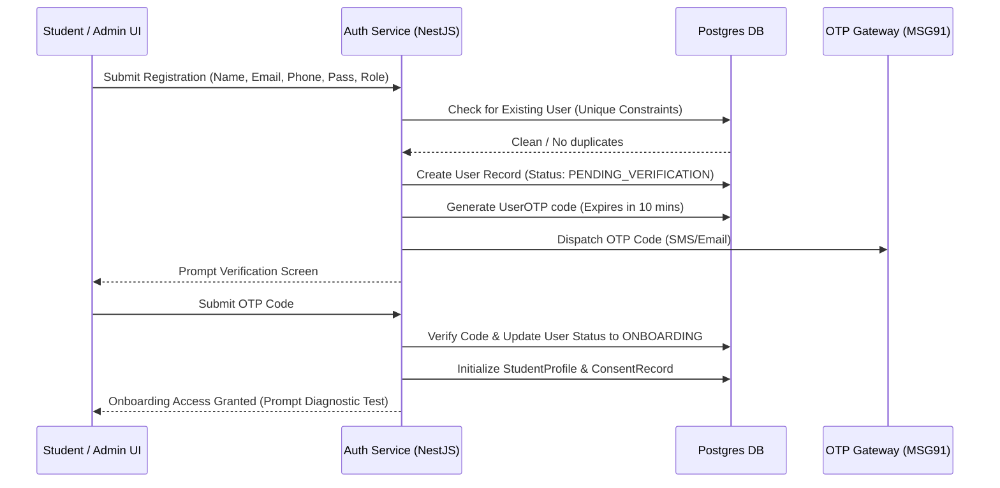
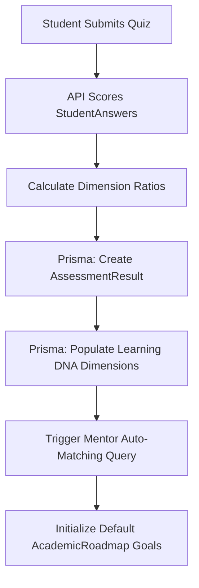
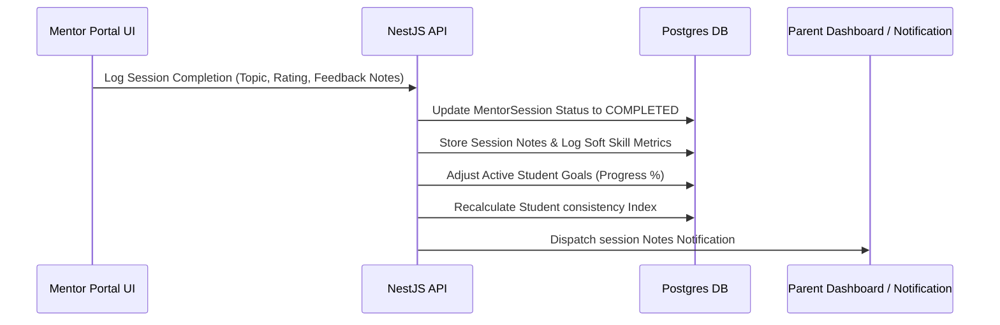
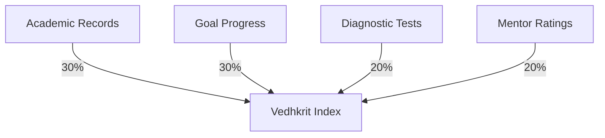
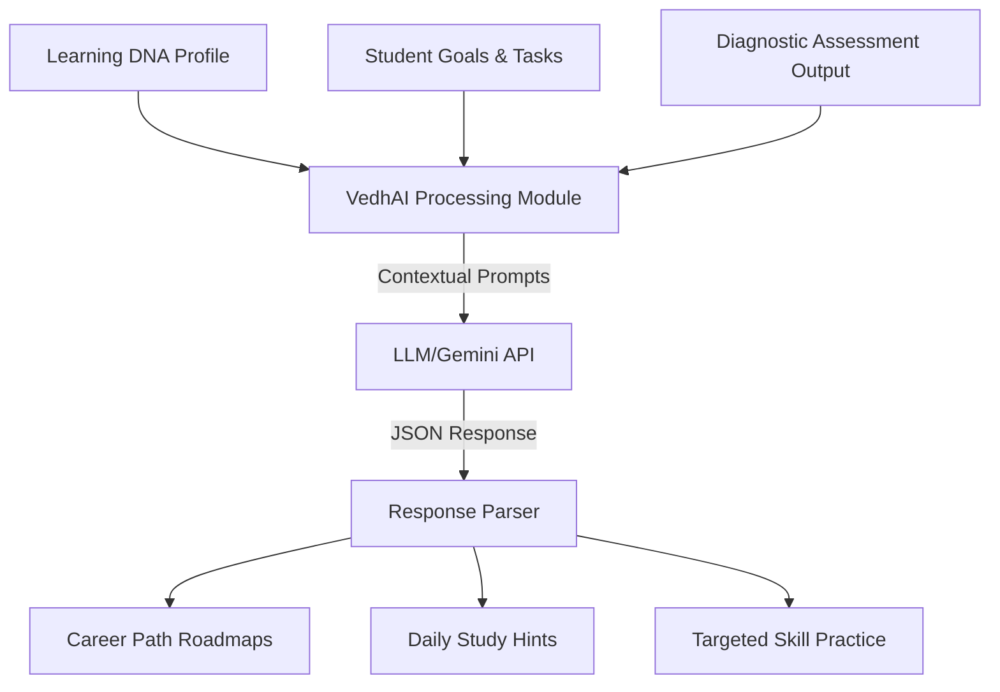

# Vedhkrit Learner Development OS: Core Business Workflows

This document outlines the operational pipelines, calculation models, and logic sequences of the key business workflows in **Vedhkrit — India's AI-Powered Learner Development Operating System**.

---

## 1. Student Registration & Onboarding Workflow

This workflow maps the pathway of a student from account creation to mentor allocation.



### Functional Breakdown
1. **Account Creation:** Registrations occur via `/register` (public frontend) and are parsed by `/auth/register` (NestJS). A unique bcrypt password hash is generated.
2. **OTP Dispatch:** The backend issues a 6-digit random code stored in the `UserOTP` model, triggering the SMS gateway (MSG91).
3. **Profile Instantiation:** Upon verification, the `User` status shifts to `ACTIVE`. A blank `StudentProfile` and default telemetry `ConsentRecord` parameters are generated in the database.

---

## 2. Assessment Finish & Learning DNA Generation

This workflow details how interest/aptitude responses translate into a capability footprint.



### Functional Breakdown
1. **Grading & Scoring:** When a diagnostic test completes, the frontend submits the payload containing chosen choices to the `/assessments/submit` backend endpoint.
2. **Dimension Logic:** Each question maps to specific dimensions (e.g., Analytical, Problem Solving, Spatial, Verbal). Ratios are calculated based on correct answers and question difficulty tags.
3. **Database Capture:** The results are saved under the `AssessmentResult` model, updating the `dimensions` JSON payload.
4. **Learning DNA Update:** These dimensions directly initialize the student's dynamic profile.

---

## 3. Post-Mentor Session Progress Pipeline

What happens immediately after a mentor session is logged:



### Functional Breakdown
1. **Session Logging:** The mentor completes the session review form in `/dashboard/mentor/sessions`, posting data (topic, rating, milestones updated, qualitative feedback notes) to the backend.
2. **Goal Progress Update:** Any active student `Goal` linked to the session topic has its progress value recalculated (e.g., incremented by 15%).
3. **Data Propagation:** Session logs update the `MentorSession` model in PostgreSQL, triggering recalculation of the student's soft skill indexes.

---

## 4. The Vedhkrit Index Calculation Engine

The **Vedhkrit Index** is a single, dynamic metrics index (0 to 100) representing a student's holistic growth. It is updated automatically upon database changes.

### Weighted Calculation Model

$$\text{Vedhkrit Index} = (W_A \times A) + (W_C \times C) + (W_I \times I) + (W_M \times M)$$

Where:
* **$A$ = Academic Component (30% Weight / $W_A = 0.30$):** Derived from cumulative averages in `AcademicRecord` records across school subjects.
* **$C$ = Consistency & Task Compliance (30% Weight / $W_C = 0.30$):** Based on daily goals met and homework completion ratios.
* **$I$ = Capability Diagnostics (20% Weight / $W_I = 0.20$):** Dynamic dimension rankings calculated from diagnostic tests (`AssessmentResult`).
* **$M$ = Mentor Advisory Index (20% Weight / $W_M = 0.20$):** Qualitative ratings logged by mentors during live sessions.



---

## 5. Parent Notification Triggers

Notifications are dispatched to parents via web sockets (live dashboard logs) and SMS (MSG91 integration) based on specific event hooks:

| Event Hook | Trigger Condition | Dispatch Type | Payload |
| :--- | :--- | :--- | :--- |
| **Attendance Drop** | Weekly attendance slips below 90% | SMS / Dashboard | Alert warning with immediate mentor-booking link. |
| **Grades Red-Zone** | Academic score falls below department threshold (D/E Grade) | SMS / Dashboard | Notification showing subject gaps and tutoring resources. |
| **Session Scheduled** | Mentor locks in upcoming session | Web Socket | Calendar invite card with link. |
| **Growth Report Issued**| Monthly index calculation completes | Email / SMS | Download link to PDF report. |
| **Goal Completed** | Student completes academic roadmap goal | Dashboard | Achievement badge showcase. |

---

## 6. Report Generation Pipeline

Monthly growth reports are compiled and published for students and parents.

```
+-------------------------------------------------------+
|  1. Cron Trigger (1st of every month at 00:00)         |
+-------------------------------------------------------+
                           |
                           v
+-------------------------------------------------------+
|  2. Query database for last 30 days of:                |
|     - Academic records, Goals, Session feedback logs  |
+-------------------------------------------------------+
                           |
                           v
+-------------------------------------------------------+
|  3. Render HTML template using dynamic index data     |
+-------------------------------------------------------+
                           |
                           v
+-------------------------------------------------------+
|  4. Generate PDF binary (headless Chrome/Puppeteer)   |
+-------------------------------------------------------+
                           |
                           v
+-------------------------------------------------------+
|  5. Store PDF file in secure Cloud Object Storage     |
+-------------------------------------------------------+
                           |
                           v
+-------------------------------------------------------+
|  6. Write download link to DB & dispatch notification |
+-------------------------------------------------------+
```

---

## 7. AI Recommendation Logic (VedhAI Engine)

How the **VedhAI Engine** generates career roadmaps and learning advice:



### Recommendation Variables
* **Primary Inputs:**
  * Student capability profile scores (Leadership, Innovation, consistency).
  * Explicitly selected career goals (e.g. Artificial Intelligence Specialist, Aeronautical Engineer).
  * Academic weakness tags compiled from teacher reports.
* **Processing Step:** The LLM prompt combines these parameters, instructing the engine to generate structured milestones.
* **Output:** Updates the student's `Goal` lists and populates career roadmap metrics directly in the student dashboard.
