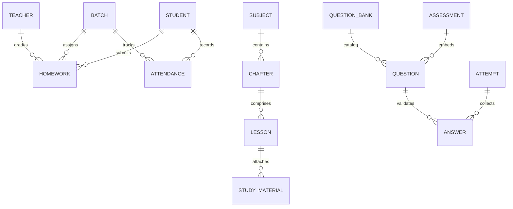
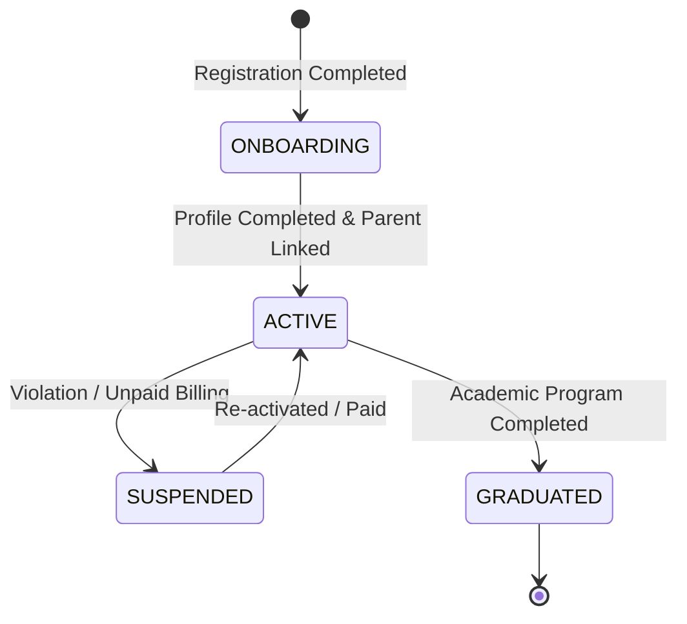
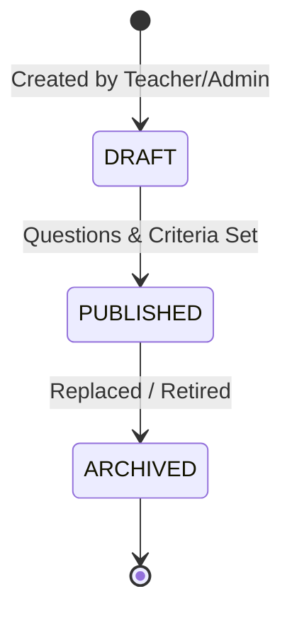
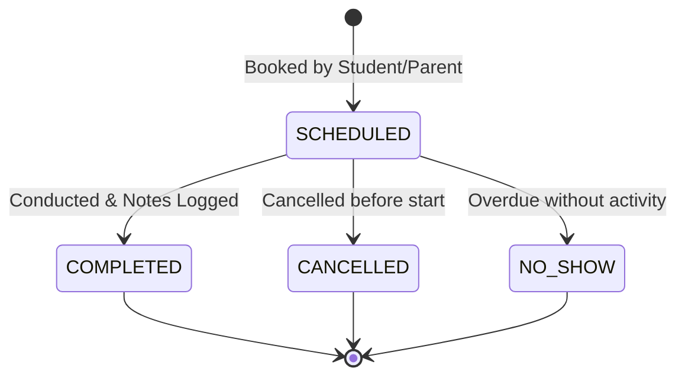
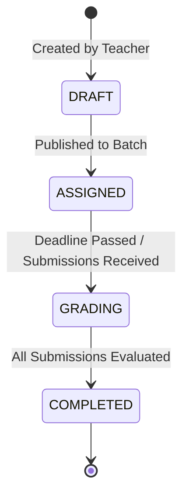
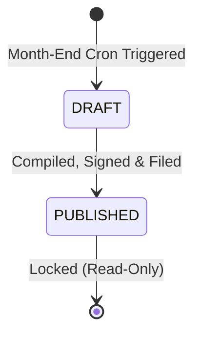
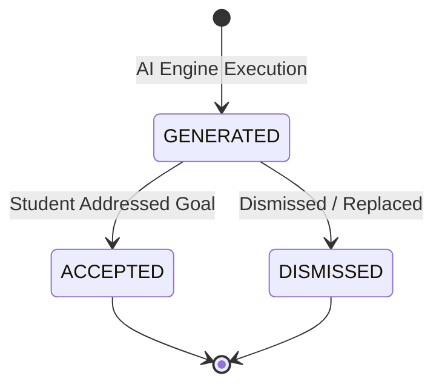
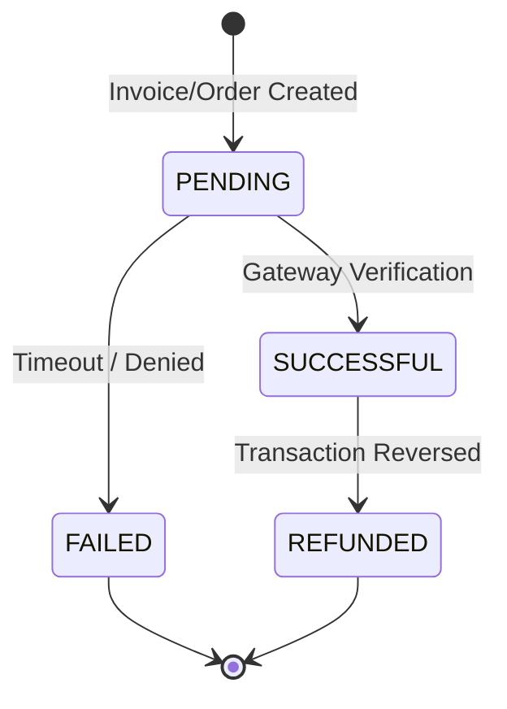
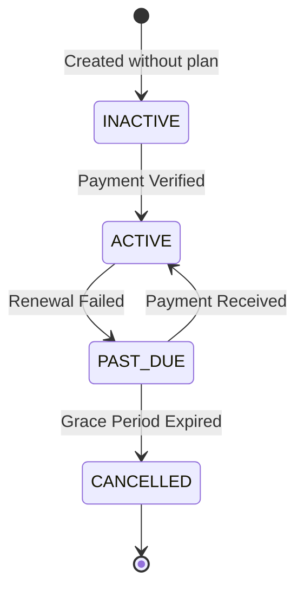

# VEDHKRIT Learner Development OS: Master Business Domain Model

This document serves as the master business blueprint for the **Vedhkrit Learner Development Operating System**. It defines the core business philosophy, domain boundaries (bounded contexts), business entities, relationships, domain events, domain services, business rules, entity lifecycles, Domain-Driven Design (DDD) patterns, and future scaling paradigms of the platform.

---

## 1. Core Philosophy

### Business Philosophy
Traditional EdTech platforms treat education as a transactional system focused on distributing content, hosting courses, and calculating grades. They operate on a **Course-Centric** model, where learning is bound by structured timeframes, standard curriculums, and generic assessments. 

Vedhkrit is built on a **Learner-Centric** business philosophy. It views learning not as a series of modules to complete, but as a continuous, lifelong evolutionary journey of capability development. The core premise is that every child possesses a unique developmental trajectory. The role of an operating system for learning is to discover, map, cultivate, and showcase this individuality.

### Why the Platform Revolves Around a Learner instead of Courses
Courses are static, standardized, and temporary. A learner is dynamic, individualized, and permanent. By centering the ecosystem on the **Learner**, Vedhkrit:
1. **Prioritizes Capabilities over Content:** Focuses on the acquisition of transferable soft skills (Leadership, Consistency, Innovation, Communication) and cognitive capabilities rather than pure rote memorization of subject-specific data.
2. **Maintains Longitudinal Growth Records:** Aggregates telemetry across multiple academic years, school changes, and extracurricular activities to provide a single source of truth for the learner's developmental history.
3. **Supports Non-Linear Progress:** Enables students to explore diverse career paths, change directions, and learn at their own cognitive speed without being restricted by rigid year-long course boundaries.

### The Concept of Learning DNA
The **Learning DNA** is the core multidimensional profile containing the student's capability blueprint. It is a live, dynamic representation of a learner's potential and achievements, structured around four primary pillars:
* **Academic Aptitude:** Quantitative indexing of cognitive performance, conceptual clarity, and subject mastery.
* **Core Capabilities (SLEC):** Soft skill indicators measuring **S**ocial & Emotional intelligence, **L**eadership, **E**xecution consistency, and **C**reative/Cognitive adaptability.
* **Learning Style & Cognitive Profile:** Psychometric and diagnostic patterns defining how the student absorbs information (e.g., Visual, Kinesthetic, Auditory) and how they approach problem-solving.
* **Futuristic Career Blueprint:** Interactive career mappings, milestones met, and verified digital portfolio evidence.

### The Concept of Vedhkrit Index
The **Vedhkrit Index** is a single, normalized, real-time score (0 to 100) representing a student's holistic growth. Rather than a static grade point average, it combines academic outcomes with behavioral and mentor-evaluated developmental checkpoints. 
The calculation model is weighted:
* **Academic Component (30%):** Derived from cumulative averages in academic coursework.
* **Consistency & Task Compliance (30%):** Based on daily goal progression, homework submission ratios, and schedule punctuality.
* **Capability Diagnostics (20%):** Calculated from interest-aptitude diagnostics and psychometric assessments.
* **Mentor Advisory Index (20%):** Based on qualitative and quantitative reviews logged by the assigned industry mentor.

### Relationship Between Assessment, Mentoring, Academics, Parents, and AI
The Vedhkrit ecosystem operates as a closed-loop cybernetic feedback system:
1. **Academics** supply the structured daily environment where core knowledge is absorbed and attendance/performance telemetry is logged.
2. **Assessments** (diagnostic tests, weekly quizzes, and gamified challenges) feed raw data into the **Learning DNA Engine**, identifying gaps, interests, and developmental milestones.
3. **AI (VedhAI Engine)** continuously analyzes the Learning DNA to generate personalized study recommendations, identify at-risk students, and draft tailored career roadmaps.
4. **Mentors** leverage these AI insights to guide the learner during 1:1 sessions, validating soft skills, adjusting goal trajectories, and offering human-centric career guidance.
5. **Parents** act as the primary support layer, receiving real-time dashboard logs, reviewing monthly reports, backing payments/memberships, and collaborating with mentors to reinforce developmental goals.

```
       +---------------------------------------------+
       |                  ACADEMICS                  |
       |  (Daily Instruction & Performance Logs)     |
       +---------------------------------------------+
                              |
                              v (Performance Telemetry)
       +---------------------------------------------+
       |                 ASSESSMENTS                 |
       |  (Weekly Quizzes & Diagnostic Evaluation)   |
       +---------------------------------------------+
                              |
                              v (Cognitive/Aptitude Data)
       +---------------------------------------------+
       |                LEARNING DNA                 |
       |  (Holistic Developmental Capability Map)    |
       +---------------------------------------------+
            ^                                   ^
            | (AI Recommendations)              | (Notes & Verification)
            v                                   v
+-----------------------+              +-----------------------+
|      VEDHAI COACH     |              |     HUMAN MENTORS     |
| (Personalized Study & |              | (1:1 Advisory, Soft   |
| Career Roadmapping)   |              | Skill Validation)     |
+-----------------------+              +-----------------------+
            \                                   /
             \                                 /
              v                               v
       +---------------------------------------------+
       |                   PARENTS                   |
       |  (Real-Time Analytics, Support & Funding)   |
       +---------------------------------------------+
```

---

## 2. Domain Boundaries

We separate the system into thirteen distinct **Bounded Contexts** to maintain separation of concerns and establish clean integration points.

```
+---------------------------------------------------------------------------------------------------+
|                                       VEDHKRIT MONOREPO OS                                        |
+---------------------------------------------------------------------------------------------------+
|  +--------------------+  +----------------------+  +---------------------+  +------------------+  |
|  |   Authentication   |  |   Organization Mgmt  |  |    Academic Mgmt    |  |Assessment Engine |  |
|  +--------------------+  +----------------------+  +---------------------+  +------------------+  |
|  +--------------------+  +----------------------+  +---------------------+  +------------------+  |
|  |   Growth Engine    |  |   Learning DNA Mgmt  |  |   Mentoring Engine  |  |  Career Engine   |  |
|  +--------------------+  +----------------------+  +---------------------+  +------------------+  |
|  +--------------------+  +----------------------+  +---------------------+  +------------------+  |
|  | Notification Mgmt  |  |      AI Engine       |  |  Reporting Service  |  |  Payments & Billing| |
|  +--------------------+  +----------------------+  +---------------------+  +------------------+  |
|  +--------------------+                                                                           |
|  |     CMS Engine     |                                                                           |
|  +--------------------+                                                                           |
+---------------------------------------------------------------------------------------------------+
```

### 1. Authentication (Identity & Access Management)
* **Responsibility:** Handles user registration, multi-factor authentication, single-sign-on (SSO), OTP verification, password hashing, session management, and Role-Based Access Control (RBAC).
* **Boundaries:** Exposes user identities and permissions to all other bounded contexts. Does not contain profiles (e.g., student grades or mentor reviews).

### 2. Organization Management
* **Responsibility:** Models multi-tenant structures including Franchise Networks, School Groups, individual Schools, Campuses, Departments, and active Academic Years.
* **Boundaries:** Governs institutional enrollment, licensing scopes, and administrative rights.

### 3. Academic Management
* **Responsibility:** Tracks structural academic divisions: Classes, Sections, Batches, Subjects, Chapters, Lessons, Homework assignments, and student Attendance.
* **Boundaries:** Houses standard educational parameters and logs daily academic telemetry.

### 4. Assessment Engine
* **Responsibility:** Configures and runs tests. Manages the Question Bank, Questions (with cognitive/difficulty tags), Attempts, Answers, and immediate scoring.
* **Boundaries:** Processes the raw inputs from quizzes and produces standard numeric or psychometric assessment outcomes.

### 5. Growth Engine
* **Responsibility:** Orchestrates student developmental milestones. Manages active Goals, Badges, Certificates, and SLEC activities (Social, Leadership, Execution, Creative).
* **Boundaries:** Translates behavior and assessment outcomes into structural milestones and gamified rewards.

### 6. Learning DNA Engine
* **Responsibility:** Calculates and maintains the student's dynamic Learning DNA profile, including soft-skill indicators, cognitive preferences, and the overall Vedhkrit Index.
* **Boundaries:** The central telemetry aggregate of the platform. Consumes data points from Assessments, Academics, and Mentoring to compute indices.

### 7. Mentoring Engine
* **Responsibility:** Coordinates interactions between students and industry mentors. Handles Mentor Profiles, Session Scheduling, 1:1 Live Calls, feedback logging, and mentorship feedback workflows.
* **Boundaries:** Captures human advisory insights and bridges them back into the Growth and DNA engines.

### 8. Career Engine
* **Responsibility:** Models futuristic Career profiles, Career Roadmaps (milestones, qualifications, industries), and keeps track of student Career Explorations.
* **Boundaries:** Integrates with the AI Engine to map the student's current Learning DNA against industry profiles.

### 9. Notification Engine
* **Responsibility:** Dispatches transactional and behavioral alerts across SMS (MSG91), Email, Web Sockets, and Push Notifications to parents, students, teachers, and mentors.
* **Boundaries:** A pure communication utility triggered by events across the platform.

### 10. AI Engine (VedhAI)
* **Responsibility:** Houses machine learning pipelines, LLM prompts (Gemini API), student diagnostic parsing, contextual study tips generation, and automated portfolio grading.
* **Boundaries:** Processes data asynchronously. Reads DNA and goals to feed back recommendations.

### 11. Reporting Engine
* **Responsibility:** Compiles multi-tenant, immutable reports (Monthly Student Growth Reports, Department Performance Reports, Campus Attendance Audits) and converts them into secure PDF binaries.
* **Boundaries:** Reconciles month-end telemetry into read-only files saved in cloud object storage.

### 12. Payments & Billing
* **Responsibility:** Governs platform pricing plans, multi-tenant school subscriptions, parent memberships, transactions (Razorpay integration), invoices, and billing lifecycle hooks.
* **Boundaries:** Restricts portal access based on subscription or payment status.

### 13. CMS (Content Management System)
* **Responsibility:** Controls dynamic landing pages, marketing layouts, Center of Excellence details, SLEC studio definitions, and informational pages.
* **Boundaries:** Provides structural website content without handling student-specific operational data.

---

## 3. Core Business Entities

For every business entity within the Vedhkrit domain model, we outline its operational context:

---

### User
* **Purpose:** Represents any authenticated actor accessing the platform.
* **Description:** Contains core security credentials, contact identifiers, authentication role, and account status.
* **Owner:** Authentication Domain.
* **Lifecycle:** `PENDING_VERIFICATION` $\rightarrow$ `ONBOARDING` $\rightarrow$ `ACTIVE` $\leftrightarrow$ `SUSPENDED`.
* **Relationships:** Has one Student, Parent, Teacher, Mentor, or School Admin profile. Generates UserOTPs, Sessions, and AuditLogs.
* **Events Produced:** `UserRegistered`, `UserLoggedIn`, `UserPasswordResetRequest`, `UserSuspended`.
* **Events Consumed:** None.
* **Business Rules:**
  * Must have a globally unique Email Address.
  * Must verify their phone number/email via OTP before transitioning to `ACTIVE`.
* **Statuses:** `PENDING_VERIFICATION`, `ONBOARDING`, `PENDING_APPROVAL`, `ACTIVE`, `SUSPENDED`.
* **Required Permissions:** System Admin (Read/Write all), Owner (Read/Write self).
* **Expected APIs:** `POST /auth/register`, `POST /auth/login`, `POST /auth/verify-otp`, `PUT /users/:id/status`.

---

### Organization
* **Purpose:** Represents the top-level business client (e.g., a franchise group or trust).
* **Description:** Tenant root containing multiple schools, license agreements, and global configurations.
* **Owner:** Organization Domain.
* **Lifecycle:** `LEAD` $\rightarrow$ `ACTIVE` $\rightarrow$ `OVERDUE` $\rightarrow$ `TERMINATED`.
* **Relationships:** Has many Schools. Linked to Billing Profile.
* **Events Produced:** `OrganizationOnboarded`, `OrganizationLicenseExpired`.
* **Events Consumed:** `PaymentSuccessful`.
* **Business Rules:**
  * Must have at least one designated Organization Administrator.
* **Statuses:** `LEAD`, `ACTIVE`, `INACTIVE`, `SUSPENDED`.
* **Required Permissions:** Super Admin.
* **Expected APIs:** `POST /orgs`, `GET /orgs/:id`, `PUT /orgs/:id/license`.

---

### School
* **Purpose:** Represents an individual physical or virtual educational institution.
* **Description:** Represents a school operating under an Organization, containing campuses, departments, and cohorts.
* **Owner:** Organization Domain.
* **Lifecycle:** `PENDING_SETUP` $\rightarrow$ `ACTIVE` $\rightarrow$ `SUSPENDED`.
* **Relationships:** Belongs to one Organization. Has many Campuses, Teachers, and Students.
* **Events Produced:** `SchoolRegistered`, `SchoolSuspended`.
* **Events Consumed:** None.
* **Business Rules:**
  * Must register a valid educational board affiliation (e.g., CBSE, ICSE, IB, State Board).
* **Statuses:** `PENDING_REVIEW`, `ACTIVE`, `SUSPENDED`.
* **Required Permissions:** Super Admin, Org Admin.
* **Expected APIs:** `POST /schools`, `GET /schools/:id`, `PUT /schools/:id/board`.

---

### Campus
* **Purpose:** Identifies a specific physical branch of a school.
* **Description:** Houses physical resources (e.g., SLEC studios) and localized academic cohorts.
* **Owner:** Organization Domain.
* **Lifecycle:** `ACTIVE` $\rightarrow$ `INACTIVE`.
* **Relationships:** Belongs to a School. Has many Batches, SLEC Studios, and Classrooms.
* **Events Produced:** `CampusCreated`, `CampusClosed`.
* **Events Consumed:** None.
* **Business Rules:**
  * Must inherit the licensing and terms of the parent School.
* **Statuses:** `ACTIVE`, `INACTIVE`.
* **Required Permissions:** School Admin.
* **Expected APIs:** `POST /campuses`, `GET /campuses/:id`.

---

### Academic Year
* **Purpose:** Defines the active fiscal and operational calendar of a school.
* **Description:** Governs the timeframe (e.g., June 2026 to April 2027) during which classes are run and grades are calculated.
* **Owner:** Academic Domain.
* **Lifecycle:** `UPCOMING` $\rightarrow$ `ACTIVE` $\rightarrow$ `ARCHIVED`.
* **Relationships:** Belongs to a School. Links to Batches and AcademicRecords.
* **Events Produced:** `AcademicYearStarted`, `AcademicYearEnded`.
* **Events Consumed:** None.
* **Business Rules:**
  * Only one Academic Year can be marked as `ACTIVE` per School at any given date.
* **Statuses:** `UPCOMING`, `ACTIVE`, `ARCHIVED`.
* **Required Permissions:** School Admin.
* **Expected APIs:** `POST /academic-years`, `PUT /academic-years/:id/activate`.

---

### Class
* **Purpose:** Represents an educational level or grade standard.
* **Description:** Establishes the curriculum scope (e.g., "Grade 10").
* **Owner:** Academic Domain.
* **Lifecycle:** `ACTIVE` $\rightarrow$ `DEPRECATED`.
* **Relationships:** Belongs to a School/Campus. Contains multiple Sections and Batches.
* **Events Produced:** `ClassCreated`.
* **Events Consumed:** None.
* **Business Rules:**
  * Must have a defined code representing the age-group tier.
* **Statuses:** `ACTIVE`, `DEPRECATED`.
* **Required Permissions:** School Admin.
* **Expected APIs:** `POST /classes`, `GET /classes`.

---

### Section
* **Purpose:** Sub-division of a Class standard.
* **Description:** Represents a logical grouping of students under a grade standard (e.g., "Grade 10 - Section A").
* **Owner:** Academic Domain.
* **Lifecycle:** `ACTIVE` $\rightarrow$ `INACTIVE`.
* **Relationships:** Belongs to a Class. Has many Students. Linked to a Class Teacher.
* **Events Produced:** `SectionCreated`.
* **Events Consumed:** None.
* **Business Rules:**
  * Section name must be unique within its parent Class.
* **Statuses:** `ACTIVE`, `INACTIVE`.
* **Required Permissions:** School Admin.
* **Expected APIs:** `POST /sections`, `GET /sections/:id`.

---

### Batch
* **Purpose:** Represents a concrete group of students tracking through an Academic Year.
* **Description:** Connects a Class, Section, and Academic Year with assigned students and teachers.
* **Owner:** Academic Domain.
* **Lifecycle:** `ACTIVE` $\rightarrow$ `COMPLETED` $\rightarrow$ `ARCHIVED`.
* **Relationships:** Links Class, Section, and Academic Year. Contains many Students.
* **Events Produced:** `BatchFormed`, `BatchGraduated`.
* **Events Consumed:** None.
* **Business Rules:**
  * A Student must belong to exactly one active Batch at any given time.
* **Statuses:** `ACTIVE`, `COMPLETED`, `ARCHIVED`.
* **Required Permissions:** School Admin.
* **Expected APIs:** `POST /batches`, `POST /batches/:id/assign-students`.

---

### Student
* **Purpose:** The core subject of the entire platform.
* **Description:** Houses the profile, demographics, metrics, and academic history of a learner.
* **Owner:** Student Domain.
* **Lifecycle:** `ONBOARDING` $\rightarrow$ `ACTIVE` $\rightarrow$ `GRADUATED` $\leftrightarrow$ `SUSPENDED`.
* **Relationships:** Linked to a User. Has one Parent, one Learning DNA, one Membership. Belongs to a Batch. Has many Goals, MentorSessions, Badges, and PortfolioItems.
* **Events Produced:** `StudentRegistered`, `StudentOnboarded`, `StudentMovedBatch`.
* **Events Consumed:** `UserOTPVerified`, `AssessmentCompleted`, `MentorSessionCompleted`.
* **Business Rules:**
  * Must have a linked Parent Profile before transitioning from `ONBOARDING` to `ACTIVE`.
* **Statuses:** `ONBOARDING`, `ACTIVE`, `SUSPENDED`, `GRADUATED`.
* **Required Permissions:** Student (self), Parent (linked children), Teacher/Mentor (assigned students), School Admin.
* **Expected APIs:** `POST /students`, `GET /students/:id`, `GET /students/:id/dna`, `PUT /students/:id/batch`.

---

### Parent
* **Purpose:** The primary supporting actor responsible for monitoring and funding the student's path.
* **Description:** Coordinates communications, approves consents, and manages billing transactions for their children.
* **Owner:** Parent Domain.
* **Lifecycle:** `ACTIVE` $\rightarrow$ `INACTIVE`.
* **Relationships:** Linked to a User. Has many Students (children). Handles Billing/Invoices.
* **Events Produced:** `ParentLinkedToStudent`, `ConsentGranted`.
* **Events Consumed:** `StudentRegistered`, `AttendanceDropAlert`, `GradesRedZoneAlert`.
* **Business Rules:**
  * A Parent must have a verified phone number for emergency/billing notifications.
* **Statuses:** `ACTIVE`, `INACTIVE`.
* **Required Permissions:** Parent (self), School Admin.
* **Expected APIs:** `GET /parents/:id/children`, `POST /parents/link-child`.

---

### Teacher
* **Purpose:** Handles academic instruction and logs day-to-day classroom telemetry.
* **Description:** Represents an academic instructor teaching specific subjects to school cohorts.
* **Owner:** Academic Domain.
* **Lifecycle:** `PENDING_APPROVAL` $\rightarrow$ `ACTIVE` $\rightarrow$ `INACTIVE`.
* **Relationships:** Linked to a User. Assigned to teach Subjects in Batches. Marks Homework and Attendance.
* **Events Produced:** `TeacherAssignedToBatch`, `HomeworkAssigned`, `AttendanceMarked`.
* **Events Consumed:** None.
* **Business Rules:**
  * Can only access gradebooks and attendance sheets for Batches where they are explicitly assigned.
* **Statuses:** `PENDING_APPROVAL`, `ACTIVE`, `INACTIVE`.
* **Required Permissions:** School Admin, Teacher (self).
* **Expected APIs:** `GET /teachers/:id/schedule`, `POST /teachers/assign-subject`.

---

### Mentor
* **Purpose:** Guides students in career planning, soft skills development, and portfolio building.
* **Description:** Represents an industry professional conducting 1:1 sessions and validation.
* **Owner:** Mentoring Domain.
* **Lifecycle:** `PENDING_APPROVAL` $\rightarrow$ `ACTIVE` $\rightarrow$ `INACTIVE`.
* **Relationships:** Linked to a User. Has many assigned Students. Conducts MentorSessions.
* **Events Produced:** `MentorSessionFeedbackLogged`, `MentorSessionScheduled`.
* **Events Consumed:** `GoalCompleted`.
* **Business Rules:**
  * Must be approved by a Super Admin or School Admin before matching with students.
* **Statuses:** `PENDING_APPROVAL`, `ACTIVE`, `INACTIVE`.
* **Required Permissions:** Super Admin, School Admin, Mentor (self).
* **Expected APIs:** `GET /mentors/:id/students`, `POST /mentors/:id/reviews`.

---

### Subject
* **Purpose:** Represents an academic discipline (e.g., Mathematics, physics).
* **Description:** A curriculum topic containing chapters and lessons.
* **Owner:** Academic Domain.
* **Lifecycle:** `ACTIVE` $\rightarrow$ `DEPRECATED`.
* **Relationships:** Belongs to a Class. Contains Chapters. Taught by Teachers.
* **Events Produced:** `SubjectCreated`.
* **Events Consumed:** None.
* **Business Rules:**
  * Must have a unique subject code within a Class.
* **Statuses:** `ACTIVE`, `DEPRECATED`.
* **Required Permissions:** School Admin.
* **Expected APIs:** `POST /subjects`, `GET /subjects`.

---

### Chapter
* **Purpose:** A structured division of a Subject.
* **Description:** Represents a specific unit of curriculum syllabus.
* **Owner:** Academic Domain.
* **Lifecycle:** `ACTIVE` $\rightarrow$ `DEPRECATED`.
* **Relationships:** Belongs to a Subject. Contains Lessons.
* **Events Produced:** `ChapterCreated`.
* **Events Consumed:** None.
* **Business Rules:**
  * Must have an ordered sequence index.
* **Statuses:** `ACTIVE`, `DEPRECATED`.
* **Required Permissions:** School Admin, Teacher.
* **Expected APIs:** `POST /chapters`, `GET /chapters?subjectId=...`.

---

### Lesson
* **Purpose:** The smallest instructional unit in the academic system.
* **Description:** Represents a specific topic taught in a single lecture, containing study materials.
* **Owner:** Academic Domain.
* **Lifecycle:** `DRAFT` $\rightarrow$ `PUBLISHED` $\rightarrow$ `DEPRECATED`.
* **Relationships:** Belongs to a Chapter. Has many StudyMaterials.
* **Events Produced:** `LessonCompleted`.
* **Events Consumed:** None.
* **Business Rules:**
  * Requires a title, sequence index, and estimated study duration.
* **Statuses:** `DRAFT`, `PUBLISHED`, `DEPRECATED`.
* **Required Permissions:** School Admin, Teacher.
* **Expected APIs:** `POST /lessons`, `PUT /lessons/:id/publish`.

---

### Homework
* **Purpose:** Out-of-classroom learning tasks assigned to verify comprehension.
* **Description:** Tasks assigned by teachers with deadlines, grading weights, and submission portals.
* **Owner:** Academic Domain.
* **Lifecycle:** `DRAFT` $\rightarrow$ `ASSIGNED` $\rightarrow$ `GRADING` $\rightarrow$ `COMPLETED`.
* **Relationships:** Created by a Teacher for a Batch. Solved by Students.
* **Events Produced:** `HomeworkAssigned`, `HomeworkSubmitted`, `HomeworkGraded`.
* **Events Consumed:** `HomeworkSubmitted`.
* **Business Rules:**
  * Late submissions must trigger automatic alerts to parents if configuration dictates.
* **Statuses:** `DRAFT`, `ASSIGNED`, `GRADING`, `COMPLETED`.
* **Required Permissions:** Teacher, Student (to submit), Parent (to view).
* **Expected APIs:** `POST /homework`, `POST /homework/:id/submit`, `POST /homework/:id/grade`.

---

### Attendance
* **Purpose:** Logs student presence for a specific day or lesson.
* **Description:** Daily record of presence, absence, or tardiness.
* **Owner:** Academic Domain.
* **Lifecycle:** `LOGGED`.
* **Relationships:** Linked to a Student and Batch. Loged by a Teacher.
* **Events Produced:** `AttendanceMarked`, `AttendanceDeficitFlagged`.
* **Events Consumed:** None.
* **Business Rules:**
  * Consecutive absences (e.g., 3 days) must trigger immediate automated parent warnings.
* **Statuses:** `PRESENT`, `ABSENT`, `LATE`, `EXCUSED`.
* **Required Permissions:** Teacher, School Admin.
* **Expected APIs:** `POST /attendance/batch`, `GET /attendance/student/:id`.

---

### Assessment
* **Purpose:** Represents an evaluation activity.
* **Description:** Quizzes, tests, or diagnostic instruments mapping to cognitive categories and difficulty scales.
* **Owner:** Assessment Domain.
* **Lifecycle:** `DRAFT` $\rightarrow$ `PUBLISHED` $\rightarrow$ `ARCHIVED`.
* **Relationships:** Contains Questions. Taken by Students.
* **Events Produced:** `AssessmentPublished`.
* **Events Consumed:** None.
* **Business Rules:**
  * Must have at least one question and a defined scoring rubrics before publishing.
* **Statuses:** `DRAFT`, `PUBLISHED`, `ARCHIVED`.
* **Required Permissions:** Teacher, School Admin, Super Admin.
* **Expected APIs:** `POST /assessments`, `GET /assessments/:id`, `PUT /assessments/:id/publish`.

---

### Question Bank
* **Purpose:** Categorized repository of evaluation questions.
* **Description:** Logical collection of questions organized by Subject, Class, Chapter, or SLEC category.
* **Owner:** Assessment Domain.
* **Lifecycle:** `ACTIVE` $\rightarrow$ `DEPRECATED`.
* **Relationships:** Contains Questions. Used to generate Assessments.
* **Events Produced:** `QuestionBankCreated`.
* **Events Consumed:** None.
* **Business Rules:**
  * Access can be restricted by campus or organization.
* **Statuses:** `ACTIVE`, `DEPRECATED`.
* **Required Permissions:** School Admin, Teacher, Super Admin.
* **Expected APIs:** `POST /question-banks`, `GET /question-banks`.

---

### Question
* **Purpose:** An individual challenge item inside a Question Bank.
* **Description:** Details text, rich media, option matrices, correct answer key, cognitive level, and difficulty rating.
* **Owner:** Assessment Domain.
* **Lifecycle:** `DRAFT` $\rightarrow$ `ACTIVE` $\rightarrow$ `INACTIVE`.
* **Relationships:** Belongs to a Question Bank. Used in Assessments. Answers mapped in StudentAnswers.
* **Events Produced:** `QuestionCreated`.
* **Events Consumed:** None.
* **Business Rules:**
  * Must map to at least one capability dimension (e.g., Analytical, Leadership).
* **Statuses:** `DRAFT`, `ACTIVE`, `INACTIVE`.
* **Required Permissions:** Teacher, School Admin, Super Admin.
* **Expected APIs:** `POST /questions`, `PUT /questions/:id`.

---

### Attempt
* **Purpose:** Tracks a student's session taking an Assessment.
* **Description:** Captures start time, current progress, duration, ip telemetry, and final submission state.
* **Owner:** Assessment Domain.
* **Lifecycle:** `IN_PROGRESS` $\rightarrow$ `SUBMITTED` $\rightarrow$ `EVALUATED`.
* **Relationships:** Student takes Assessment. Generates StudentAnswers and AssessmentResult.
* **Events Produced:** `AttemptStarted`, `AttemptSubmitted`.
* **Events Consumed:** None.
* **Business Rules:**
  * An attempt cannot be modified after status transitions to `SUBMITTED`.
* **Statuses:** `IN_PROGRESS`, `SUBMITTED`, `EVALUATED`.
* **Required Permissions:** Student (to take), Teacher/System (to evaluate).
* **Expected APIs:** `POST /attempts/start`, `POST /attempts/:id/submit`.

---

### Answer
* **Purpose:** The student response to a specific question inside an attempt.
* **Description:** Stores chosen option, text, or coordinates, along with correction validation status.
* **Owner:** Assessment Domain.
* **Lifecycle:** `SAVED` $\rightarrow$ `EVALUATED`.
* **Relationships:** Belongs to an Attempt. Refers to a Question.
* **Events Produced:** `AnswerLogged`.
* **Events Consumed:** None.
* **Business Rules:**
  * Must be marked correct/incorrect instantly if the question has a deterministic key.
* **Statuses:** `SAVED`, `CORRECT`, `INCORRECT`.
* **Required Permissions:** Student (self).
* **Expected APIs:** `POST /attempts/:attemptId/answers`.

---

### Assessment Result
* **Purpose:** The final graded output of an Assessment Attempt.
* **Description:** Represents total score, percentage, and multidimensional skill rating scores.
* **Owner:** Assessment Domain.
* **Lifecycle:** `DRAFT` $\rightarrow$ `RELEASED`.
* **Relationships:** Generated from an Attempt. Belongs to Student. Updates Learning DNA.
* **Events Produced:** `AssessmentCompleted`.
* **Events Consumed:** `AttemptSubmitted`.
* **Business Rules:**
  * Triggers immediate update to student's Learning DNA upon transition to `RELEASED`.
* **Statuses:** `DRAFT`, `RELEASED`.
* **Required Permissions:** Teacher (to grade/release), Student (to view).
* **Expected APIs:** `GET /assessment-results/:id`, `POST /assessment-results/:id/release`.

---

### Learning DNA
* **Purpose:** The core, dynamic capabilities repository of the student.
* **Description:** Aggregates multi-dimensional indicators (Leadership, Innovation, consistency, communication) derived from metrics.
* **Owner:** Learning DNA Domain.
* **Lifecycle:** `INITIALIZED` $\rightarrow$ `ACTIVE`.
* **Relationships:** Belongs to exactly one Student. Consumes AssessmentResults and Mentor ratings.
* **Events Produced:** `LearningDNAUpdated`.
* **Events Consumed:** `AssessmentCompleted`, `MentorSessionCompleted`.
* **Business Rules:**
  * Cannot be deleted. Must recalculate its indices whenever new source metrics are processed.
* **Statuses:** `INITIALIZED`, `ACTIVE`.
* **Required Permissions:** Student, Parent, Mentor, School Admin.
* **Expected APIs:** `GET /students/:studentId/dna`, `POST /students/:studentId/dna/recalculate`.

---

### Vedhkrit Index
* **Purpose:** The single metric of student growth progress.
* **Description:** Real-time computed double value (0 to 100) aggregating Academics, Consistency, Diagnostics, and Mentoring.
* **Owner:** Learning DNA Domain.
* **Lifecycle:** `CALCULATED`.
* **Relationships:** Belongs to a Student's Learning DNA.
* **Events Produced:** `VedhkritIndexUpdated`.
* **Events Consumed:** `LearningDNAUpdated`, `AttendanceMarked`, `MentorSessionCompleted`.
* **Business Rules:**
  * Computed via a standard weighted mathematical model. Should keep historical values for trend charts.
* **Statuses:** `CURRENT`.
* **Required Permissions:** Student, Parent, School Admin.
* **Expected APIs:** `GET /students/:studentId/index-history`.

---

### Growth Record
* **Purpose:** Tracks student milestone achievement logs.
* **Description:** Chronological timeline of badges earned, certifications, level achievements, and public works.
* **Owner:** Growth Domain.
* **Lifecycle:** `ACTIVE`.
* **Relationships:** Belongs to Student. Aggregates Badges and Certificates.
* **Events Produced:** `GrowthRecordUpdated`.
* **Events Consumed:** `GoalCompleted`, `BadgeEarned`, `CertificateIssued`.
* **Business Rules:**
  * Represents an immutable historical timeline of verified student milestones.
* **Statuses:** `ACTIVE`.
* **Required Permissions:** Student, Parent, Mentor, School Admin.
* **Expected APIs:** `GET /students/:studentId/timeline`.

---

### Goal
* **Purpose:** A structured objective assigned to or set by the student.
* **Description:** Short or long term targets containing descriptions, deadlines, progress tracking %, and task listings.
* **Owner:** Growth Domain.
* **Lifecycle:** `DRAFT` $\rightarrow$ `ACTIVE` $\rightarrow$ `COMPLETED` $\leftrightarrow$ `AT_RISK` / `PAUSED`.
* **Relationships:** Assigned to a Student. Created by Mentor, Teacher, or Student.
* **Events Produced:** `GoalCreated`, `GoalProgressUpdated`, `GoalCompleted`.
* **Events Consumed:** `HomeworkSubmitted`, `MentorSessionCompleted`.
* **Business Rules:**
  * Goal progress defaults to 0% and is locked to a maximum of 100%.
* **Statuses:** `DRAFT`, `ACTIVE`, `AT_RISK`, `PAUSED`, `COMPLETED`.
* **Required Permissions:** Student, Mentor (to create/edit), Parent (to view).
* **Expected APIs:** `POST /goals`, `PATCH /goals/:id/progress`, `PUT /goals/:id/status`.

---

### Mentor Session
* **Purpose:** Coordinates a 1:1 advisory interaction.
* **Description:** Booking details, scheduled time, meeting links, attendance logs, and mentor session feedback notes.
* **Owner:** Mentoring Domain.
* **Lifecycle:** `SCHEDULED` $\rightarrow$ `COMPLETED` / `CANCELLED` / `NO_SHOW`.
* **Relationships:** Arranged between a Student and a Mentor. Produces notes and soft-skill ratings.
* **Events Produced:** `MentorSessionScheduled`, `MentorSessionCompleted`, `MentorSessionCancelled`.
* **Events Consumed:** None.
* **Business Rules:**
  * Can only be marked `COMPLETED` after the scheduled start time, requiring logged mentor review notes.
* **Statuses:** `SCHEDULED`, `COMPLETED`, `CANCELLED`, `NO_SHOW`.
* **Required Permissions:** Mentor, Student, Parent.
* **Expected APIs:** `POST /mentor-sessions`, `PUT /mentor-sessions/:id/complete`.

---

### Recommendation
* **Purpose:** AI-generated developmental guidance.
* **Description:** Contains context-specific guidance, suggested careers, courses, study tasks, and next-step actions.
* **Owner:** AI Domain.
* **Lifecycle:** `GENERATED` $\rightarrow$ `DISMISSED` / `ACCEPTED`.
* **Relationships:** Targeting a Student. Generated by the AI Engine.
* **Events Produced:** `RecommendationGenerated`, `RecommendationActioned`.
* **Events Consumed:** `LearningDNAUpdated`.
* **Business Rules:**
  * Must be marked invalid or regenerated if the underlying Learning DNA changes significantly.
* **Statuses:** `GENERATED`, `DISMISSED`, `ACCEPTED`.
* **Required Permissions:** Student, Parent, Mentor.
* **Expected APIs:** `GET /students/:studentId/recommendations`, `PUT /recommendations/:id/status`.

---

### Career
* **Purpose:** Represents a defined professional pathway in the platform database.
* **Description:** Details description, trends, required qualifications, soft-skills requirements, and salary forecasts for modern careers.
* **Owner:** Career Domain.
* **Lifecycle:** `ACTIVE` $\rightarrow$ `DEPRECATED`.
* **Relationships:** Part of the platform knowledge base. Maps to CareerRoadmaps. Recommended to Students.
* **Events Produced:** `CareerProfileCreated`.
* **Events Consumed:** None.
* **Business Rules:**
  * Must have a defined tag listing indicating its compatibility with student SLEC dimensions.
* **Statuses:** `ACTIVE`, `DEPRECATED`.
* **Required Permissions:** Super Admin.
* **Expected APIs:** `POST /careers`, `GET /careers`.

---

### Career Roadmap
* **Purpose:** The step-by-step pathway a student follows to prepare for a Career.
* **Description:** Sequence of milestones, academic targets, recommended projects, skills, and portfolio items.
* **Owner:** Career Domain.
* **Lifecycle:** `DRAFT` $\rightarrow$ `ACTIVE`.
* **Relationships:** Belongs to a Student for a specific Career. Contains Goals.
* **Events Produced:** `CareerRoadmapActivated`, `CareerRoadmapCompleted`.
* **Events Consumed:** `GoalCompleted`.
* **Business Rules:**
  * Activating a roadmap automatically populates matching Goals in the student's task manager.
* **Statuses:** `DRAFT`, `ACTIVE`, `COMPLETED`.
* **Required Permissions:** Student, Mentor.
* **Expected APIs:** `POST /roadmaps/activate`, `GET /roadmaps/student/:id`.

---

### Study Material
* **Purpose:** Educational resources curated for lessons or recommendations.
* **Description:** PDF links, videos, interactive models, or articles categorized by chapter/subject.
* **Owner:** CMS Domain.
* **Lifecycle:** `DRAFT` $\rightarrow$ `PUBLISHED` $\rightarrow$ `ARCHIVED`.
* **Relationships:** Attached to Lessons. Recommended by AI.
* **Events Produced:** `StudyMaterialAdded`.
* **Events Consumed:** None.
* **Business Rules:**
  * Must contain validated metadata indicating target class grade and complexity.
* **Statuses:** `DRAFT`, `PUBLISHED`, `ARCHIVED`.
* **Required Permissions:** Teacher, School Admin, Super Admin.
* **Expected APIs:** `POST /study-materials`, `GET /study-materials/:id`.

---

### Certificate
* **Purpose:** Formal verification of milestone completion.
* **Description:** A cryptographically signed record verifying that a student completed a course, roadmap, or project.
* **Owner:** Growth Domain.
* **Lifecycle:** `ISSUED` $\rightarrow$ `REVOKED`.
* **Relationships:** Issued to a Student. Linked to a completed Career Roadmap or Research Project.
* **Events Produced:** `CertificateIssued`, `CertificateRevoked`.
* **Events Consumed:** None.
* **Business Rules:**
  * Must contain a hash verify ID checkable on the public marketing sitemap.
* **Statuses:** `ISSUED`, `REVOKED`.
* **Required Permissions:** School Admin, Super Admin.
* **Expected APIs:** `POST /certificates/issue`, `GET /certificates/verify/:hash`.

---

### Badge
* **Purpose:** Visual gamified micro-credentials.
* **Description:** Rewards for daily compliance, streak retention, high test scores, or soft skill validation.
* **Owner:** Growth Domain.
* **Lifecycle:** `EARNED`.
* **Relationships:** Earned by a Student. Displayed in Portfolio.
* **Events Produced:** `BadgeEarned`.
* **Events Consumed:** `GoalCompleted`, `AssessmentCompleted`.
* **Business Rules:**
  * Awarded automatically by the Growth Engine based on criteria matching rules.
* **Statuses:** `EARNED`.
* **Required Permissions:** System, Student (to view).
* **Expected APIs:** `GET /students/:studentId/badges`.

---

### Report
* **Purpose:** Structured, time-bound progress reviews.
* **Description:** Consolidated performance overview, mentor feedback summaries, and index charts for a month or term.
* **Owner:** Reporting Domain.
* **Lifecycle:** `DRAFT` $\rightarrow$ `PUBLISHED`.
* **Relationships:** Compiled for a Student. Shared with Parents.
* **Events Produced:** `ReportGenerated`, `ReportPublished`.
* **Events Consumed:** None.
* **Business Rules:**
  * Automatically calculated on the 1st of every month. Marked immutable and cannot be updated after transition to `PUBLISHED`.
* **Statuses:** `DRAFT`, `PUBLISHED`.
* **Required Permissions:** System (to generate), Parent, Student.
* **Expected APIs:** `GET /reports/student/:studentId`, `POST /reports/publish`.

---

### Notification
* **Purpose:** Communication alerts.
* **Description:** Message details, channels (SMS, Email, Push, WebSocket), and read/unread flags.
* **Owner:** Notification Domain.
* **Lifecycle:** `QUEUED` $\rightarrow$ `SENT` $\rightarrow$ `READ` / `FAILED`.
* **Relationships:** Target User. Triggered by platform events.
* **Events Produced:** `NotificationSent`, `NotificationRead`.
* **Events Consumed:** Any system-wide trigger.
* **Business Rules:**
  * Immediate SMS triggers are reserved for critical flags (e.g., Attendance slips below 90% threshold).
* **Statuses:** `QUEUED`, `SENT`, `READ`, `FAILED`.
* **Required Permissions:** User (to read self).
* **Expected APIs:** `GET /notifications`, `PUT /notifications/:id/read`.

---

### Conversation
* **Purpose:** Chat threads.
* **Description:** Thread container holding messages between two or more system participants.
* **Owner:** Notification Domain.
* **Lifecycle:** `ACTIVE` $\rightarrow$ `ARCHIVED`.
* **Relationships:** Between Users (Student-Mentor, Parent-Mentor, Student-VedhAI). Contains Messages.
* **Events Produced:** `ConversationStarted`.
* **Events Consumed:** None.
* **Business Rules:**
  * Group configurations must adhere to institutional boundaries (e.g., parent cannot message random student).
* **Statuses:** `ACTIVE`, `ARCHIVED`.
* **Required Permissions:** Conversation Members.
* **Expected APIs:** `POST /conversations`, `GET /conversations`.

---

### Message
* **Purpose:** Text/media entries in chat.
* **Description:** Individual post containing text content, attachments, timestamp, and sender information.
* **Owner:** Notification Domain.
* **Lifecycle:** `SENT` $\rightarrow$ `DELIVERED` $\rightarrow$ `READ`.
* **Relationships:** Belongs to a Conversation. Authored by a User.
* **Events Produced:** `MessageSent`.
* **Events Consumed:** None.
* **Business Rules:**
  * Text content must pass automatic profanity filtering.
* **Statuses:** `SENT`, `DELIVERED`, `READ`.
* **Required Permissions:** Conversation Members.
* **Expected APIs:** `POST /conversations/:id/messages`, `GET /conversations/:id/messages`.

---

### Payment
* **Purpose:** Financial transaction tracker.
* **Description:** Details amount, currency, order/payment transaction hashes, status, and raw gateway logs.
* **Owner:** Payments Domain.
* **Lifecycle:** `PENDING` $\rightarrow$ `SUCCESS` / `FAILED` / `REFUNDED`.
* **Relationships:** Triggered by Parent or Org Admin. Pays for a Membership or Subscription.
* **Events Produced:** `PaymentInitiated`, `PaymentSuccessful`, `PaymentFailed`.
* **Events Consumed:** None.
* **Business Rules:**
  * All transaction details must be written immutably.
* **Statuses:** `PENDING`, `SUCCESSFUL`, `FAILED`, `REFUNDED`.
* **Required Permissions:** Payee, Super Admin.
* **Expected APIs:** `POST /payments/create-order`, `POST /payments/webhook`.

---

### Membership
* **Purpose:** Governs student portal licensing terms.
* **Description:** Defines subscription pricing plan, start date, expiration date, and current active status.
* **Owner:** Payments Domain.
* **Lifecycle:** `INACTIVE` $\rightarrow$ `ACTIVE` $\rightarrow$ `PAST_DUE` $\rightarrow$ `CANCELLED`.
* **Relationships:** Links Student to PricingPlan. Maintained by Parent payments.
* **Events Produced:** `MembershipActivated`, `MembershipExpired`, `MembershipPastDue`.
* **Events Consumed:** `PaymentSuccessful`.
* **Business Rules:**
  * Active membership status is required for student access to mentorship booking and AI dashboards.
* **Statuses:** `INACTIVE`, `ACTIVE`, `PAST_DUE`, `CANCELLED`.
* **Required Permissions:** Parent, Student, Super Admin.
* **Expected APIs:** `GET /memberships/student/:id`, `POST /memberships/subscribe`.

---

### Invoice
* **Purpose:** Official tax billing statement.
* **Description:** PDF document summarizing billing details, transaction context, amounts, and tax breakdowns.
* **Owner:** Payments Domain.
* **Lifecycle:** `DRAFT` $\rightarrow$ `ISSUED` $\rightarrow$ `PAID` / `VOID`.
* **Relationships:** Belongs to Parent or Organization. Generated from Payment.
* **Events Produced:** `InvoiceIssued`, `InvoicePaid`.
* **Events Consumed:** `PaymentSuccessful`.
* **Business Rules:**
  * Invoice details are strictly read-only and static once transition to `ISSUED` occurs.
* **Statuses:** `DRAFT`, `ISSUED`, `PAID`, `VOID`.
* **Required Permissions:** Payee, Super Admin.
* **Expected APIs:** `GET /invoices/:id`.

---

### Audit Log
* **Purpose:** Security access control trails.
* **Description:** Immutable record of operational changes (IP, endpoint path, target entity ID, actor, timestamp).
* **Owner:** Authentication Domain.
* **Lifecycle:** `RECORDED`.
* **Relationships:** Linked to User (actor).
* **Events Produced:** None.
* **Events Consumed:** None.
* **Business Rules:**
  * Audit records cannot be modified or deleted by any user, including Super Admins.
* **Statuses:** `RECORDED`.
* **Required Permissions:** Super Admin.
* **Expected APIs:** `GET /audit-logs`.

---

### Announcement
* **Purpose:** Global information announcements.
* **Description:** Bulletin board posts broadcasted to specific classes, schools, or the entire organization.
* **Owner:** CMS Domain.
* **Lifecycle:** `DRAFT` $\rightarrow$ `PUBLISHED` $\rightarrow$ `ARCHIVED`.
* **Relationships:** Created by School/Super Admins. Targeting specific Roles/Batches.
* **Events Produced:** `AnnouncementPublished`.
* **Events Consumed:** None.
* **Business Rules:**
  * Must have a start date and optional end date defining display visibility.
* **Statuses:** `DRAFT`, `PUBLISHED`, `ARCHIVED`.
* **Required Permissions:** School Admin, Super Admin.
* **Expected APIs:** `POST /announcements`, `GET /announcements/active`.

---

### Calendar Event
* **Purpose:** Schedule entries.
* **Description:** Generic calendar object mapping start time, end time, location, title, and invitee checklist.
* **Owner:** CMS Domain.
* **Lifecycle:** `SCHEDULED` $\rightarrow$ `CANCELLED`.
* **Relationships:** Linked to Users. Maps MentorSessions and LiveClasses.
* **Events Produced:** `CalendarEventScheduled`.
* **Events Consumed:** `MentorSessionScheduled`, `LiveClassScheduled`.
* **Business Rules:**
  * Must prevent double-booking of a single User at overlapping time windows.
* **Statuses:** `SCHEDULED`, `CANCELLED`.
* **Required Permissions:** Invitee, Creator.
* **Expected APIs:** `POST /calendar/events`, `GET /calendar/schedule`.

---

### Live Class
* **Purpose:** Real-time online academic lectures.
* **Description:** Connects teacher and batch for virtual education sessions, holding stream credentials.
* **Owner:** Academic Domain.
* **Lifecycle:** `SCHEDULED` $\rightarrow$ `LIVE` $\rightarrow$ `COMPLETED` / `CANCELLED`.
* **Relationships:** Conducted by Teacher. Attended by Batch. Creates Recording.
* **Events Produced:** `LiveClassStarted`, `LiveClassCompleted`.
* **Events Consumed:** None.
* **Business Rules:**
  * Can only be launched by the assigned Teacher or an Admin.
* **Statuses:** `SCHEDULED`, `LIVE`, `COMPLETED`, `CANCELLED`.
* **Required Permissions:** Teacher, Students in Batch.
* **Expected APIs:** `POST /live-classes`, `PUT /live-classes/:id/start`.

---

### Recording
* **Purpose:** Archive database of completed live sessions.
* **Description:** Direct link to video storage files with metadata (topic, duration, file size).
* **Owner:** Academic Domain.
* **Lifecycle:** `PROCESSING` $\rightarrow$ `AVAILABLE`.
* **Relationships:** Produced from Live Class. Linked to Batch.
* **Events Produced:** `RecordingAvailable`.
* **Events Consumed:** `LiveClassCompleted`.
* **Business Rules:**
  * Must require verification of active student consent records if student audio/video was captured.
* **Statuses:** `PROCESSING`, `AVAILABLE`.
* **Required Permissions:** Batch Students, Teacher, School Admin.
* **Expected APIs:** `GET /recordings?batchId=...`.

---

### SLEC Activity
* **Purpose:** Extra-curricular capability engagement logs.
* **Description:** Sports, leadership activities, writing, art, and debate activities contributing to soft skills.
* **Owner:** Growth Domain.
* **Lifecycle:** `DRAFT` $\rightarrow$ `ONGOING` $\rightarrow$ `COMPLETED`.
* **Relationships:** Student takes part. Monitored by Mentor or SLEC Director. Updates Learning DNA.
* **Events Produced:** `SLECActivityCompleted`.
* **Events Consumed:** None.
* **Business Rules:**
  * Must map specifically to the four SLEC dimensions (Social, Leadership, Execution, Creative).
* **Statuses:** `DRAFT`, `ONGOING`, `COMPLETED`.
* **Required Permissions:** Student, Mentor.
* **Expected APIs:** `POST /slec-activities`, `PUT /slec-activities/:id/complete`.

---

### Research Project
* **Purpose:** Advanced student capability showcase.
* **Description:** Long-form project reports, literature reviews, or science experiments.
* **Owner:** Growth Domain.
* **Lifecycle:** `PROPOSAL` $\rightarrow$ `IN_PROGRESS` $\rightarrow$ `SUBMITTED` $\rightarrow$ `VERIFIED`.
* **Relationships:** Student executes. Supervised by Mentor or Teacher.
* **Events Produced:** `ResearchProjectSubmitted`, `ResearchProjectVerified`.
* **Events Consumed:** None.
* **Business Rules:**
  * Requires explicit mentor sign-off before transitioning to `VERIFIED` and adding to student's portfolio.
* **Statuses:** `PROPOSAL`, `IN_PROGRESS`, `SUBMITTED`, `VERIFIED`.
* **Required Permissions:** Student, Mentor, Teacher.
* **Expected APIs:** `POST /research-projects`, `PUT /research-projects/:id/verify`.

---

### Innovation Challenge
* **Purpose:** Competitive cohort challenge events.
* **Description:** Hackathons, science fairs, or innovation prompts sponsored by schools or organizations.
* **Owner:** Growth Domain.
* **Lifecycle:** `UPCOMING` $\rightarrow$ `ACTIVE` $\rightarrow$ `EVALUATION` $\rightarrow$ `COMPLETED`.
* **Relationships:** Organization creates. Students join as individuals/teams.
* **Events Produced:** `ChallengeStarted`, `ChallengeWinnersDeclared`.
* **Events Consumed:** None.
* **Business Rules:**
  * Challenge submissions must be automatically indexed in participating students' portfolios.
* **Statuses:** `UPCOMING`, `ACTIVE`, `EVALUATION`, `COMPLETED`.
* **Required Permissions:** School/Super Admin, Student (to enter).
* **Expected APIs:** `POST /challenges`, `POST /challenges/:id/submit`.

---

### Portfolio Item
* **Purpose:** Verifiable student accomplishments showcase.
* **Description:** Clean portfolio link detailing description, verified badges, research papers, and certificates.
* **Owner:** Growth Domain.
* **Lifecycle:** `PRIVATE` $\rightarrow$ `PUBLIC`.
* **Relationships:** Belongs to Student. Links to certificates, badges, and project files.
* **Events Produced:** `PortfolioPublished`.
* **Events Consumed:** `CertificateIssued`, `BadgeEarned`.
* **Business Rules:**
  * Public access requires explicitly granted parent telemetry/sharing consent.
* **Statuses:** `PRIVATE`, `PUBLIC`.
* **Required Permissions:** Student, Parent.
* **Expected APIs:** `GET /portfolio/student/:studentId`, `PUT /portfolio/:id/visibility`.

---

### Consent Record
* **Purpose:** Telemetry privacy control regulations.
* **Description:** Explicit opt-in flags for sensitive data tracking (e.g., Audio, Video, Eye-gaze, Public profiles).
* **Owner:** Student Domain.
* **Lifecycle:** `GRANTED` $\rightarrow$ `REVOKED`.
* **Relationships:** Student profile context. Signed by Parent.
* **Events Produced:** `ConsentGranted`, `ConsentRevoked`.
* **Events Consumed:** None.
* **Business Rules:**
  * Recording sessions or eye-gaze diagnostic assessments must check active consent record before execution.
* **Statuses:** `GRANTED`, `REVOKED`.
* **Required Permissions:** Parent, School Admin.
* **Expected APIs:** `POST /consent/update`, `GET /consent/student/:studentId`.

---

### SLEC Studio
* **Purpose:** Physical learning spaces inside Campuses.
* **Description:** Labs specializing in hands-on capability exploration (e.g., Robotics Lab, Debate Club, Visual Art Studio).
* **Owner:** Organization Domain.
* **Lifecycle:** `ACTIVE` $\rightarrow$ `INACTIVE`.
* **Relationships:** Located in Campus. Hosts SLEC Activities.
* **Events Produced:** `SLECStudioOpened`, `SLECStudioClosed`.
* **Events Consumed:** None.
* **Business Rules:**
  * Studio operations must align with the corresponding SLEC Lab curriculum framework.
* **Statuses:** `ACTIVE`, `INACTIVE`.
* **Required Permissions:** School Admin.
* **Expected APIs:** `POST /slec-studios`, `GET /slec-studios`.

---

### SLEC Lab
* **Purpose:** Curriculum definitions for extra-curricular development.
* **Description:** Educational frameworks defining activities, skill mappings, and outcomes for SLEC Studios.
* **Owner:** CMS Domain.
* **Lifecycle:** `ACTIVE` $\rightarrow$ `DEPRECATED`.
* **Relationships:** Part of the platform's core library. Used by SLEC Studios.
* **Events Produced:** `SLECClassroomModuleAdded`.
* **Events Consumed:** None.
* **Business Rules:**
  * Must explicitly map activities to defined soft-skill indexes.
* **Statuses:** `ACTIVE`, `DEPRECATED`.
* **Required Permissions:** Super Admin.
* **Expected APIs:** `POST /slec-labs`, `GET /slec-labs`.

---

### Center of Excellence (COE)
* **Purpose:** Advanced specialization divisions.
* **Description:** Special programs focused on specific industries or domains (e.g., COE for AI & Robotics, COE for Aerospace).
* **Owner:** Organization Domain.
* **Lifecycle:** `ACTIVE` $\rightarrow$ `INACTIVE`.
* **Relationships:** Hosted at a School level. Mentors students under specialized Research Projects.
* **Events Produced:** `COEEstablished`.
* **Events Consumed:** None.
* **Business Rules:**
  * Requires a minimum number of qualified mentors assigned before activation.
* **Statuses:** `ACTIVE`, `INACTIVE`.
* **Required Permissions:** Super Admin.
* **Expected APIs:** `POST /coes`, `GET /coes`.

---

## 4. Relationships

The business domain relationships map how these entities collaborate. The diagrams utilize business cardinality notation (rather than Prisma mapping syntax).

### Operational Core Relationship Diagram (Schools, Cohorts, and Users)

```mermaid
erDiagram
    ORGANIZATION ||--o{ SCHOOL : owns
    SCHOOL ||--o{ CAMPUS : has
    SCHOOL ||--o{ ACADEMIC_YEAR : configures
    CAMPUS ||--o{ BATCH : hosts
    ACADEMIC_YEAR ||--o{ BATCH : contains
    CLASS ||--o{ SECTION : defines
    CLASS ||--o{ BATCH : templates
    SECTION ||--o{ BATCH : partitions
    
    USER ||--o| STUDENT : acts_as
    USER ||--o| PARENT : acts_as
    USER ||--o| MENTOR : acts_as
    USER ||--o| TEACHER : acts_as

    PARENT ||--o{ STUDENT : sponsors
    BATCH ||--o{ STUDENT : groups
    TEACHER ||--o{ BATCH : instructs
```

### Learning DNA & Growth Engine Diagram

```mermaid
erDiagram
    STUDENT ||--|| LEARNING_DNA : possesses
    LEARNING_DNA ||--|| VEDHKRIT_INDEX : measures
    STUDENT ||--|| MEMBERSHIP : holds
    STUDENT ||--|| PORTFOLIO_ITEM : publishes
    STUDENT ||--o{ ATTEMPT : takes
    ATTEMPT ||--|| ASSESSMENT_RESULT : produces
    ASSESSMENT_RESULT ||--|> LEARNING_DNA : updates
    
    STUDENT ||--o{ GOAL : pursues
    STUDENT ||--o{ BADGE : earns
    STUDENT ||--o{ CERTIFICATE : receives
    STUDENT ||--o{ SLEC_ACTIVITY : participates
    STUDENT ||--o{ RESEARCH_PROJECT : writes
    
    MENTOR ||--o{ MENTOR_SESSION : guides
    STUDENT ||--o{ MENTOR_SESSION : attends
    MENTOR_SESSION ||--|> VEDHKRIT_INDEX : recalculates
```

### Academics & Assessment Details



---

## 5. Business Events

These events are generated within Bounded Contexts, publishing states across the event bus:

| Event Name | Producer (Bounded Context) | Consumers (Bounded Contexts) | Payload Structure | Business Impact |
| :--- | :--- | :--- | :--- | :--- |
| **`StudentRegistered`** | Authentication | Organization, Payments, Notification | `{ userId, email, schoolId, classId, registrationTimestamp }` | Creates profile stubs, sends parent invite, checks billing requirements. |
| **`AssessmentCompleted`** | Assessment Engine | Learning DNA, Growth, Notification | `{ attemptId, studentId, assessmentId, overallScore, dimensionScores: { analytical: 80, leadership: 70 } }` | Updates soft-skill matrix, awards milestone badges, notifies parents of diagnostic results. |
| **`HomeworkSubmitted`** | Academic Management | Notification, Growth | `{ homeworkId, studentId, submissionId, timestamp }` | Logs completion timestamps, increments student Consistency Index. |
| **`AttendanceMarked`** | Academic Management | Notification, Learning DNA | `{ studentId, batchId, date, status: ABSENT/PRESENT }` | Recalculates consistency factors, triggers SMS alerts if safety thresholds are crossed. |
| **`MentorSessionCompleted`** | Mentoring Engine | Learning DNA, Growth, Notification | `{ sessionId, studentId, mentorId, topic, scores: { communication: 90 }, feedbackNotes }` | Updates mentor ratings, adjusts active Goal completion rates, dispatches session reports to parents. |
| **`GoalCompleted`** | Growth Engine | Career, Notification | `{ goalId, studentId, title, roadmapId }` | Validates Career Roadmap milestone completion, notifies student and mentor, awards badges. |
| **`ReportGenerated`** | Reporting Engine | Notification, Payments | `{ reportId, studentId, period: "2026-07", downloadUrl }` | Stores static PDF progress data, sends mobile notifications to parents. |
| **`PaymentSuccessful`** | Payments & Billing | Authentication, Organization, Notification | `{ transactionId, parentId, amount, planId, invoiceId }` | Extends membership terms, updates user access states, emails invoices. |
| **`CertificateIssued`** | Growth Engine | CMS, Notification | `{ certificateId, studentId, title, verificationUrl }` | Registers record in verification database, publishes credential to student portfolio. |
| **`CareerUpdated`** | Career Engine | AI Engine, Notification | `{ studentId, activeCareerId, milestonesRemaining }` | Requests updated roadmap parameters from VedhAI Engine. |
| **`LearningDNAUpdated`** | Learning DNA Engine | AI Engine, Reporting | `{ studentId, updatedDimensions: { leadership: 85 }, timestamp }` | Prompts new study advice, updates the historical Vedhkrit Index. |
| **`VedhkritIndexUpdated`** | Learning DNA Engine | Notification, Reporting | `{ studentId, newIndexValue: 74.5, delta: +2.1 }` | Dispatches progress milestone notices to parent dashboard. |
| **`RecommendationGenerated`** | AI Engine | Notification, Growth | `{ recommendationId, studentId, type, content: "Focus on Robotics" }` | Pushes suggestions to student dashboard workspace. |
| **`NotificationSent`** | Notification Engine | None | `{ notificationId, userId, channel: SMS, timestamp }` | Logs audit records for billing/telemetry verification. |

---

## 6. Domain Services

These services coordinate actions across aggregates and bounded contexts:

### 1. Authentication Service
* **Responsibility:** Validates credentials, issues JWT/Refresh tokens, registers users, audits access logins.
* **Interactions:** Triggers `StudentRegistered` and `UserOTP` verifications.

### 2. Student Service
* **Responsibility:** Manages student profile states, addresses parent linking, processes telemetry consent forms.
* **Interactions:** Consults Parent Service to establish links; monitors inputs from Academic Management.

### 3. Parent Service
* **Responsibility:** Controls child linking keys, coordinates notifications preferences, views transaction records.
* **Interactions:** Queries Payments Domain for active memberships.

### 4. Teacher Service
* **Responsibility:** Maintains teacher batch logs, subjects mapping checklists, department assignments.
* **Interactions:** Interfaces with Academic Management to check scheduling constraints.

### 5. Mentor Service
* **Responsibility:** Manages mentor onboarding checklists, schedules sessions, assigns expertise parameters.
* **Interactions:** Integrates with Calendar Service to prevent scheduling overlaps.

### 6. Assessment Service
* **Responsibility:** Compiles random/fixed assessments from question databases, checks attempt timelines, grades entries.
* **Interactions:** Dispatches results payload to Learning DNA Engine.

### 7. Growth Engine
* **Responsibility:** Checks badge allocations, monitors goal state transitions, verifies research project sign-offs.
* **Interactions:** Consumes events from Assessment and Mentoring to compute achievements.

### 8. Learning DNA Engine
* **Responsibility:** Recomputes raw dimension matrices, processes historical trends, adjusts the Vedhkrit Index.
* **Interactions:** Consumes assessment outputs, logs, and homework submissions to update DNA records.

### 9. VedhAI Engine
* **Responsibility:** Houses machine learning pipelines, LLM prompts (Gemini API), student diagnostic parsing, contextual study tips generation, and automated portfolio grading.
* **Interactions:** Analyzes DNA states to feed Recommendation Engine.

### 10. Recommendation Engine
* **Responsibility:** Files and displays active student developmental advice, career mappings, and next-action targets.
* **Interactions:** Feeds AI outcomes into the Growth domain.

### 11. Reporting Service
* **Responsibility:** Triggers monthly cron routines, compiles PDF assets, handles cloud storage links.
* **Interactions:** Consumes data across all domains to generate immutable progress records.

### 12. Notification Service
* **Responsibility:** Interfaces with external SMS gateways (MSG91), SMTP email APIs, and WebSocket hubs.
* **Interactions:** Dispatches messages when triggered by system events.

### 13. Calendar Service
* **Responsibility:** Resolves schedules, maintains invite state logs, updates external cal invites (ICS format).
* **Interactions:** Coordinates scheduling within Mentoring and Academics.

### 14. Payment Service
* **Responsibility:** Interfaces with payment gateways, processes webhooks, logs invoices, manages membership limits.
* **Interactions:** Controls student access states inside Authentication.

### 15. Analytics Service
* **Responsibility:** Processes telemetry metrics, handles student activity metrics, tracks cohort averages.
* **Interactions:** Queries across all active database entities to produce administrative charts.

---

## 7. Business Rules

The business rules governing the Vedhkrit platform enforce domain integrity:

```
+-----------------------------------------------------------------------------------------------+
|                                      CORE BUSINESS RULES                                      |
+-----------------------------------------------------------------------------------------------+
|  1. BATCH CARDINALITY   : One Student belongs to exactly ONE active Batch at any given time.   |
|  2. MULTI-CHILD PARENT  : A Parent can manage multiple Students (children).                   |
|  3. LEARNING DNA UNITY  : Every Student must possess exactly ONE Learning DNA profile.        |
|  4. TELEMETRY COUPLING  : Every completed Assessment must trigger a DNA recalculation.        |
|  5. INDEX RECONCILIATION: Mentor Session evaluations must immediately recalculate the Index.  |
|  6. REPORT IMMUTABILITY : Generated reports are locked and cannot be updated after publication.|
|  7. ROLE BOUNDARIES     : Only School Admins can create Classes/Sections/Batches.             |
|  8. PRIVACY ENFORCEMENT : Telemetry consent is checked before recording audio/video streams.  |
+-----------------------------------------------------------------------------------------------+
```

1. **Batch Cardinality:** A Student must belong to exactly one active Batch per Academic Year. A Student cannot be assigned to multiple Classes or Sections simultaneously.
2. **Multi-Child Parent:** A Parent can manage multiple Students (children), accessing their distinct profiles from a single credentials workspace.
3. **Learning DNA Unity:** Every Student must possess exactly one Learning DNA profile. The system cannot create a StudentProfile without initializing its corresponding Learning DNA.
4. **Telemetry Coupling:** Every completed Assessment must trigger a recalculation of the student's Learning DNA. Results cannot remain disconnected from the core profile.
5. **Index Reconciliation:** Mentor Session evaluations must immediately trigger a recalculation of the student's soft skill indexes and the overall Vedhkrit Index.
6. **Report Immutability:** Generated reports are locked and cannot be modified after publication. Errors require issuing a correction log entry rather than modifying the published file.
7. **Role Boundaries:** Only School Admins can create Classes, Sections, and Batches. Teachers are restricted to grading, logging attendance, and managing homework.
8. **Privacy Enforcement:** Recording sessions or capturing telemetry (e.g., eye-gaze data) requires checking active consent record flags.

---

## 8. Lifecycle Diagrams

These state diagrams represent the transitions of key platform entities:

### Student Profile Lifecycle


### Assessment Lifecycle


### Mentor Session Lifecycle


### Homework Lifecycle


### Report Lifecycle


### Recommendation Lifecycle


### Payment Lifecycle


### Membership Lifecycle


---

## 9. Domain-Driven Design (DDD) Suggestions

To construct a highly maintainable and clean architecture, we apply Domain-Driven Design principles:

### Aggregates & Entities

```
+--------------------------------------------------------------------+
|                         STUDENT AGGREGATE                          |
|                                                                    |
|  [StudentProfile (Root)]                                           |
|       |                                                            |
|       +--- [Learning DNA (Entity)]                                 |
|       |         |                                                  |
|       |         +--- [Vedhkrit Index (Entity)]                     |
|       |                                                            |
|       +--- [Consent Record (Entity)]                               |
|       |                                                            |
|       +--- [Goals (Entity Collection)]                             |
+--------------------------------------------------------------------+
```

* **Student Aggregate:**
  * **Aggregate Root:** `StudentProfile`
  * **Internal Entities:** `Learning DNA`, `Vedhkrit Index`, `Consent Record`, `Goal`
  * **Value Objects:** `EmailAddress`, `PhoneNumber`, `DimensionMatrix`
* **Assessment Aggregate:**
  * **Aggregate Root:** `Assessment`
  * **Internal Entities:** `Question`, `Attempt`, `Answer`
  * **Value Objects:** `CognitiveWeight`, `OptionMatrix`
* **Organization Aggregate:**
  * **Aggregate Root:** `Organization`
  * **Internal Entities:** `School`, `Campus`, `Batch`
  * **Value Objects:** `LicenseCode`, `BoardAffiliation`
* **Mentor Session Aggregate:**
  * **Aggregate Root:** `MentorSession`
  * **Internal Entities:** `SessionNotes`, `RatingVerification`
  * **Value Objects:** `MeetingLink`, `TimeRange`

### Value Objects
* **`EmailAddress`:** Implements string formatting and domain checks. Immutable.
* **`PhoneNumber`:** Implements international formatting standards.
* **`Score`:** Validates floating-point bounds (0.0 to 100.0).
* **`DimensionMatrix`:** Represents capability scores mapping to SLEC coordinates.
* **`Money`:** Encapsulates numeric amount and currency codes.

### Repositories
* **`StudentRepository`:** Manages student profiles and updates corresponding Learning DNA.
* **`AssessmentRepository`:** Handles questions and compiles diagnostic outputs.
* **`OrganizationRepository`:** Handles school structures and department allocations.
* **`MentorSessionRepository`:** Tracks scheduled bookings and session completions.

### Factories
* **`LearningDNAFactory`:** Generates clean Learning DNA records mapping to student demographic diagnostics.
* **`StudentFactory`:** Handles student profile setup, ensuring parent and consent models are established.

### Domain Events
* **`LearningDNAUpdated`:** Published whenever dimension weights are recomputed.
* **`StudentMovedBatch`:** Triggered when student rosters are modified.
* **`MentorSessionNotesLogged`:** Captures advisory notes.

### Specifications
* **`IsEligibleForMentorSession`:** Checks parent consent flags, current membership, and slot availability.
* **`IsAcademicYearActive`:** Checks that the target date range is active.

### Policies
* **`DNAAutomaticUpdatePolicy`:** Governs recomputations when new academic/assessment records are saved.
* **`AccessControlPolicy`:** Manages multi-tenant privacy boundaries.

---

## 10. Future Scalability

The domain model is designed to scale horizontally across users, structures, and regions:

### Scaling Telemetry & Volume
* **100 Schools (10,000 Students):** Simple relational transaction indexing in Postgres handles this without complex scaling rules.
* **1,000 Schools (100,000 Students):** Requires separating telemetry writes from reporting engines using Event Sourcing or CQRS (Command Query Responsibility Segregation). Real-time index re-computations transition to asynchronous queue workers.
* **1 Million Students:** The database utilizes sharding patterns keyed by `OrganizationId`. Write paths rely on distributed message queues (e.g., Kafka) to balance load during high-concurrency exams.

### Multi-Tenancy & Franchise Models
* **Franchise Networks:** The `Organization` is modeled as a nested hierarchical structure:
  ```
  [Global Brand / Trust (Top Org)]
      ├── [Regional Franchise Group A]
      │       ├── [School Campus 1]
      │       └── [School Campus 2]
      └── [Regional Franchise Group B]
              └── [School Campus 3]
  ```
  Billing configurations, licensing permissions, and default curricula inherit down the hierarchy, while access controls maintain separation of tenant data.

### International & Localization Support
* **Multi-Language Curriculums:** Content objects (e.g., `Subject`, `Chapter`, `Lesson`, `Question`) support localization mapping schemas:
  ```json
  {
    "title": {
      "en": "Introduction to Geometry",
      "hi": "ज्यामिति का परिचय",
      "ta": "வடிவியல் அறிமுகம்"
    }
  }
  ```
* **Local School Boards:** The core `School` model decouples standard grading systems (e.g., CGPA, Percentage, Letter Grade scales) using a Strategy Pattern to format outcomes.

### Integration & offline Capability
* **AI Agents Integration:** The structured JSON schema of the `Learning DNA` allows AI engines to process recommendations without parsing unformatted text.
* **Offline Operations:** The application can run offline using LocalStorage syncing:
  ```
  [Client LocalStorage (Offline Cache)] 
         ├── Syncs Attendance Logs
         ├── Syncs Completed Offline Quizzes
         └── Syncs Goal Checklists
  
  [Network Connection Re-established]
         └── Dispatches Events to Platform Sync Gateway
  ```
  Conflicts are resolved on the server using Vector Clock timestamps.
