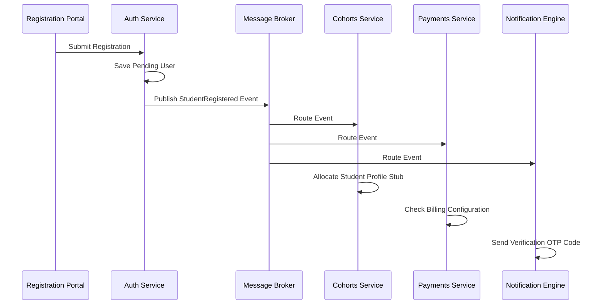
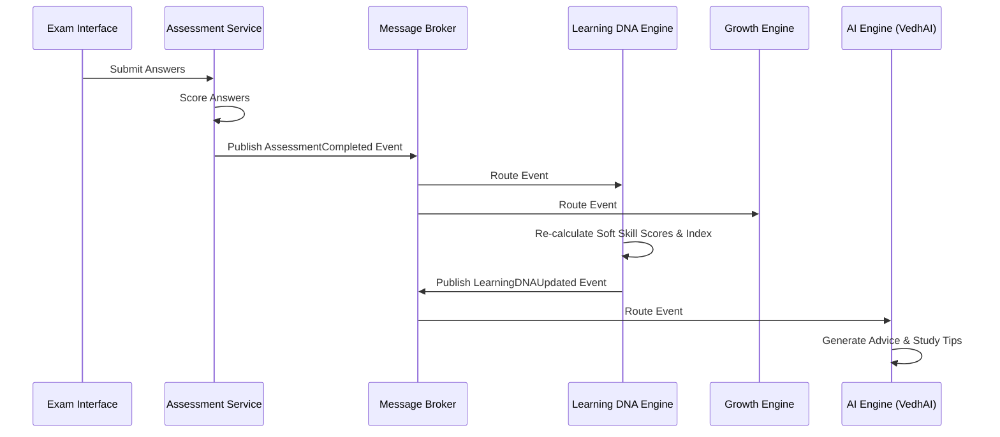
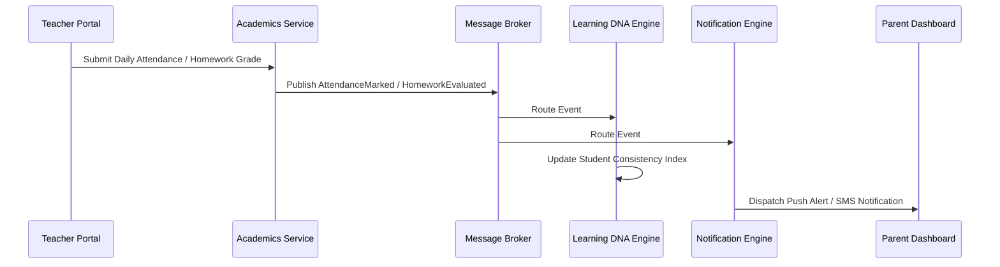
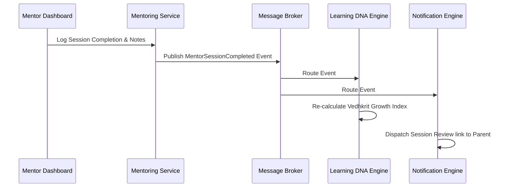
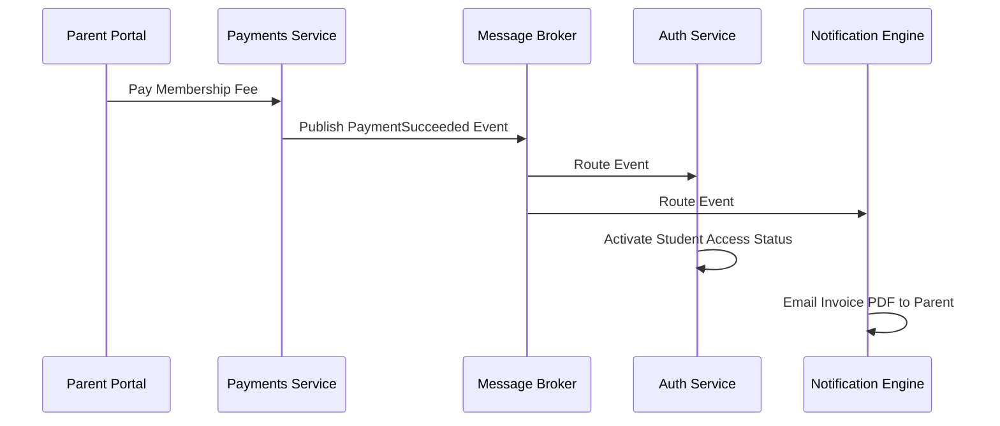
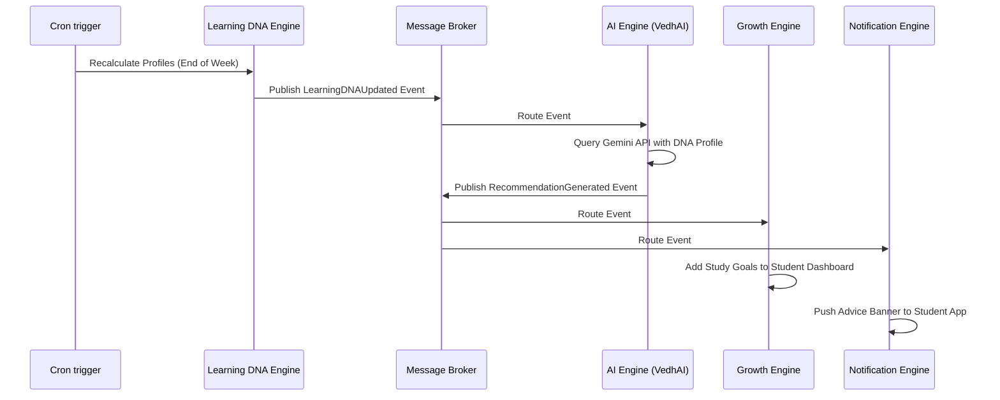
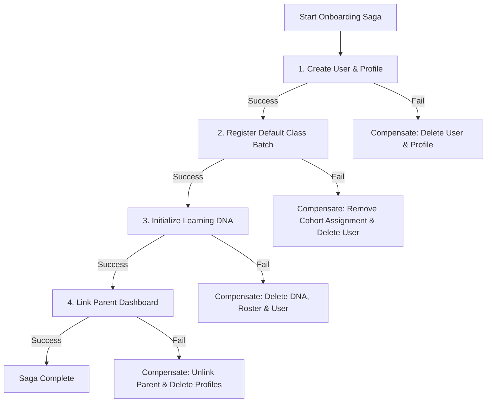
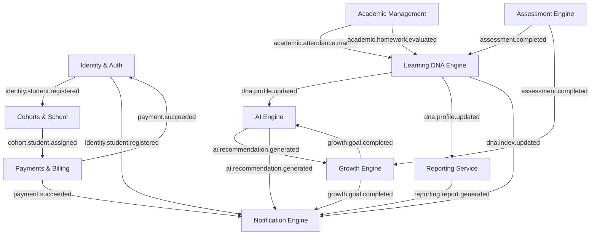

# VEDHKRIT Learner Development OS: Event Catalog

This document serves as the master blueprint for the **Event-Driven Architecture (EDA)** of the Vedhkrit Learner Development Operating System. It defines the messaging patterns, event catalogue, payload standards, event topologies, background jobs, saga transactions, and observability systems of the platform.

---

## 1. Event-Driven Philosophy

### Why Vedhkrit Uses Events
Traditional request-response (HTTP REST) architectures create tight coupling between services. If the Student Portal API directly calls the SMS service, the payment gateway, and the PDF generator synchronously, a failure in the PDF generator will crash the student registration flow.

Vedhkrit uses an **Asynchronous Event-Driven Architecture** to achieve:
1. **Loose Service Coupling:** Bounded contexts communicate by publishing events to a central broker. The publisher does not know or care who consumes the event.
2. **High Fault Tolerance:** If the Notification service goes offline, the Payments service continues processing transactions. Notifications are queued and sent when the service recovers.
3. **Improved API Responsiveness:** Heavy computations (such as AI profile evaluations or PDF compilation) are handled asynchronously, keeping user-facing APIs fast.
4. **Independent Scalability:** Queue workers can be scaled independently during high-traffic events (e.g., during exam seasons or payment cycles).

### Architecture Command vs. Event vs. Query vs. Saga
We establish clear distinctions between distributed systems patterns:

* **Command:** A request to execute a state change. It has a single receiver, is named in the imperative tense (`RegisterStudentCommand`), can be rejected by validation guards, and is typically synchronous.
* **Event:** A record of a state change that has already occurred. It is named in the past tense (`StudentRegistered`), can have multiple consumers, cannot be rejected, and is processed asynchronously.
* **Query:** A request to read data without side effects.
* **Saga:** A design pattern that coordinates a sequence of transactions across multiple bounded contexts to maintain consistency without locking database rows.

### Eventual Consistency
Instead of using two-phase commits to ensure all databases update simultaneously, Vedhkrit uses **Eventual Consistency**. When a state change occurs in one service (e.g., a payment succeeds), other services are updated asynchronously via event handlers. Databases align within milliseconds, maintaining system availability during network partitions.

---

## 2. Event Taxonomy

Events are categorized into taxonomies that align with platform bounded contexts:

* **Identity Events (`identity.*`):** Governs user security states (logins, registrations, password resets).
* **Organization Events (`org.*`):** Covers structural configurations (school registrations, campus licensing changes).
* **Academic Events (`academic.*`):** Daily classroom activities (attendance logging, homework assignments).
* **Assessment Events (`assessment.*`):** Testing cycles (test starts, item logs, completions).
* **Learning DNA Events (`dna.*`):** Changes to student capability maps and growth indexes.
* **Growth Events (`growth.*`):** Milestone completions (goals, portfolios, badges).
* **Mentoring Events (`mentoring.*`):** Coordinates 1:1 sessions and mentor notes.
* **Career Events (`career.*`):** Selection and progression along career roadmaps.
* **Communication Events (`communication.*`):** Live chat logs and user messages.
* **Notification Events (`notification.*`):** Dispatched alerts (SMS, email, push).
* **Payment Events (`payment.*`):** Subscription billing and transaction updates.
* **Reporting Events (`reporting.*`):** Consolidated report compilation.
* **AI Events (`ai.*`):** Prompt calculations and recommendations.
* **Administration Events (`admin.*`):** System configuration modifications and audit trails.

---

## 3. Event Catalog

This catalog details the events flowing across the Vedhkrit platform:

---

### `StudentRegistered`
* **Producer:** Identity Domain (Authentication service).
* **Consumers:** School Management, Payments, Notification.
* **Priority:** High.
* **Retry Policy:** Exponential Backoff: initial interval 2s, backoff multiplier 2, max retries 5.
* **Queue:** `identity.student-registered.queue`
* **Dead Letter Queue:** `identity.student-registered.dlq`
* **Business Impact:** Allocates student profile stubs, prompts parent verification links, and checks billing statuses.

---

### `AssessmentCompleted`
* **Producer:** Assessment Engine.
* **Consumers:** Learning DNA Engine, Growth Engine, Notification.
* **Priority:** High.
* **Retry Policy:** Exponential Backoff: initial 5s, multiplier 2, max retries 3.
* **Queue:** `assessment.completed.queue`
* **Dead Letter Queue:** `assessment.completed.dlq`
* **Business Impact:** Triggers immediate recalculation of capability matrices and alerts parents of diagnostic results.

---

### `HomeworkSubmitted`
* **Producer:** Academic Management.
* **Consumers:** Growth Engine, Notification (Teacher Alert).
* **Priority:** Medium.
* **Retry Policy:** Linear Backoff: interval 10s, max retries 3.
* **Queue:** `academic.homework-submitted.queue`
* **Dead Letter Queue:** `academic.homework-submitted.dlq`
* **Business Impact:** Registers completion timestamps and updates the student Consistency Index.

---

### `HomeworkEvaluated`
* **Producer:** Academic Management.
* **Consumers:** Learning DNA Engine, Notification (Parent/Student Alert).
* **Priority:** Medium.
* **Retry Policy:** Linear Backoff: interval 10s, max retries 3.
* **Queue:** `academic.homework-evaluated.queue`
* **Dead Letter Queue:** `academic.homework-evaluated.dlq`
* **Business Impact:** Integrates scores into the student's academic index and notifies the student.

---

### `AttendanceMarked`
* **Producer:** Academic Management.
* **Consumers:** Learning DNA Engine, Notification (Parent Alert).
* **Priority:** High.
* **Retry Policy:** Exponential Backoff: initial 2s, multiplier 2, max retries 4.
* **Queue:** `academic.attendance-marked.queue`
* **Dead Letter Queue:** `academic.attendance-marked.dlq`
* **Business Impact:** Logs daily presence and alerts parents to absences.

---

### `AttendanceThresholdReached`
* **Producer:** Learning DNA Engine.
* **Consumers:** Notification Engine (SMS Alert).
* **Priority:** High.
* **Retry Policy:** Exponential Backoff: initial 1s, multiplier 2, max retries 5.
* **Queue:** `dna.attendance-warning.queue`
* **Dead Letter Queue:** `dna.attendance-warning.dlq`
* **Business Impact:** Triggers an immediate SMS alert to parents warning of potential academic issues.

---

### `GoalCompleted`
* **Producer:** Growth Engine.
* **Consumers:** Career Engine, AI Engine, Notification.
* **Priority:** Medium.
* **Retry Policy:** Linear Backoff: interval 15s, max retries 3.
* **Queue:** `growth.goal-completed.queue`
* **Dead Letter Queue:** `growth.goal-completed.dlq`
* **Business Impact:** Updates career roadmap progress and awards milestone badges.

---

### `MentorAssigned`
* **Producer:** Mentoring Engine.
* **Consumers:** Calendar Service, Notification.
* **Priority:** Medium.
* **Retry Policy:** Linear Backoff: interval 5s, max retries 3.
* **Queue:** `mentoring.mentor-assigned.queue`
* **Dead Letter Queue:** `mentoring.mentor-assigned.dlq`
* **Business Impact:** Establishes communication channels and calendars between the mentor and student.

---

### `MentorSessionCompleted`
* **Producer:** Mentoring Engine.
* **Consumers:** Learning DNA Engine, Growth Engine, Notification.
* **Priority:** High.
* **Retry Policy:** Exponential Backoff: initial 3s, multiplier 2, max retries 4.
* **Queue:** `mentoring.session-completed.queue`
* **Dead Letter Queue:** `mentoring.session-completed.dlq`
* **Business Impact:** Updates the student's soft skill scores and triggers mentor-evaluation reviews.

---

### `LearningDNAUpdated`
* **Producer:** Learning DNA Engine.
* **Consumers:** AI Engine, Reporting Service.
* **Priority:** Medium.
* **Retry Policy:** Linear Backoff: interval 30s, max retries 3.
* **Queue:** `dna.updated.queue`
* **Dead Letter Queue:** `dna.updated.dlq`
* **Business Impact:** Triggers updates to career suggestions and study tips based on the student's new capabilities profile.

---

### `VedhkritIndexUpdated`
* **Producer:** Learning DNA Engine.
* **Consumers:** Notification Engine, Growth Engine.
* **Priority:** Medium.
* **Retry Policy:** Linear Backoff: interval 10s, max retries 3.
* **Queue:** `dna.index-updated.queue`
* **Dead Letter Queue:** `dna.index-updated.dlq`
* **Business Impact:** Updates growth benchmarks and publishes score charts to parent portals.

---

### `RecommendationGenerated`
* **Producer:** AI Engine.
* **Consumers:** Growth Engine, Notification.
* **Priority:** Low.
* **Retry Policy:** Linear Backoff: interval 60s, max retries 2.
* **Queue:** `ai.recommendation-generated.queue`
* **Dead Letter Queue:** `ai.recommendation-generated.dlq`
* **Business Impact:** Pushes personalized goals and study hints directly to the student dashboard.

---

### `CareerSelected`
* **Producer:** Career Engine.
* **Consumers:** AI Engine, Mentoring Engine.
* **Priority:** Medium.
* **Retry Policy:** Linear Backoff: interval 5s, max retries 3.
* **Queue:** `career.selected.queue`
* **Dead Letter Queue:** `career.selected.dlq`
* **Business Impact:** Generates the student's career preparation goals.

---

### `ReportGenerated`
* **Producer:** Reporting Service.
* **Consumers:** Notification Engine, Payments Domain.
* **Priority:** Medium.
* **Retry Policy:** Exponential Backoff: initial 10s, multiplier 2, max retries 3.
* **Queue:** `reporting.generated.queue`
* **Dead Letter Queue:** `reporting.generated.dlq`
* **Business Impact:** Files progress report PDF binaries and alerts parents.

---

### `PaymentSucceeded`
* **Producer:** Payments Domain.
* **Consumers:** Authentication, Organization, Notification.
* **Priority:** High.
* **Retry Policy:** Exponential Backoff: initial 2s, multiplier 2, max retries 5.
* **Queue:** `payment.succeeded.queue`
* **Dead Letter Queue:** `payment.succeeded.dlq`
* **Business Impact:** Extends access licenses, emails invoices, and updates membership metrics.

---

### `InvoiceGenerated`
* **Producer:** Payments Domain.
* **Consumers:** Notification Engine.
* **Priority:** Medium.
* **Retry Policy:** Linear Backoff: interval 10s, max retries 3.
* **Queue:** `payment.invoice-generated.queue`
* **Dead Letter Queue:** `payment.invoice-generated.dlq`
* **Business Impact:** Emails billing records to the parent.

---

### `NotificationSent`
* **Producer:** Notification Engine.
* **Consumers:** Administration (Audit Logger).
* **Priority:** Low.
* **Retry Policy:** Linear Backoff: interval 120s, max retries 2.
* **Queue:** `notification.sent.queue`
* **Dead Letter Queue:** `notification.sent.dlq`
* **Business Impact:** Records communication traces in the audit database.

---

### `FeatureFlagChanged`
* **Producer:** Administration Domain.
* **Consumers:** Authentication, CMS.
* **Priority:** High.
* **Retry Policy:** Exponential Backoff: initial 1s, multiplier 2, max retries 5.
* **Queue:** `admin.feature-flag-changed.queue`
* **Dead Letter Queue:** `admin.feature-flag-changed.dlq`
* **Business Impact:** Updates user access configurations and UI views instantly.

---

## 4. Event Payload Contracts

All event payloads follow a standardized JSON envelope structure with versioning metadata:

```json
{
  "eventId": "evt-7f8a9b0c-1d2e-3f4a-5b6c-7d8e9f0a1b2c",
  "eventVersion": "1.0.0",
  "timestamp": "2026-07-19T20:12:15Z",
  "actor": "usr-8a5f3d2e-4b6c-8d9e-1f2a-3b4c5d6e7f8a",
  "tenant": "org-9c8b7a6f-5d4c-3b2a-1f0e-9d8c7b6a5f4e",
  "correlationId": "corr-3d2e1f0e-9d8c-7b6a-5f4e-3d2e1f0e9d8c",
  "data": {}
}
```

### Event Payload Examples

#### `StudentRegistered` (Version 1.0.0)
```json
{
  "eventId": "evt-342a781b-56cd-48ef-9ab0-1234567890ab",
  "eventVersion": "1.0.0",
  "timestamp": "2026-07-19T20:12:15Z",
  "actor": "usr-8a5f3d2e-4b6c-8d9e-1f2a-3b4c5d6e7f8a",
  "tenant": "org-9c8b7a6f-5d4c-3b2a-1f0e-9d8c7b6a5f4e",
  "correlationId": "corr-550e8400-e29b-41d4-a716-446655440000",
  "data": {
    "studentId": "std-4a5e6d7c-8b9a-0f1e-2d3c-4b5a6f7e8d9c",
    "name": "Sarthak Sonawane",
    "email": "sarthak@vedhkrit.com",
    "schoolId": "sch-0f1e2d3c-4b5a-6f7e-8d9c-0b1a2e3d4c5b",
    "classId": "cls-9a8b7c6d-5e4f-3a2b-1c0d-9e8f7a6b5c4d",
    "registeredAt": "2026-07-19T20:12:10Z"
  }
}
```

#### `AssessmentCompleted` (Version 1.1.0)
```json
{
  "eventId": "evt-871b23cf-12da-4b67-a89f-2345678901cd",
  "eventVersion": "1.1.0",
  "timestamp": "2026-07-19T20:30:00Z",
  "actor": "usr-8a5f3d2e-4b6c-8d9e-1f2a-3b4c5d6e7f8a",
  "tenant": "org-9c8b7a6f-5d4c-3b2a-1f0e-9d8c7b6a5f4e",
  "correlationId": "corr-880f9400-e29b-41d4-a716-446655441111",
  "data": {
    "attemptId": "att-2b3c4d5e-6f7a-8b9c-0d1e-2f3a4b5c6d7e",
    "studentId": "std-4a5e6d7c-8b9a-0f1e-2d3c-4b5a6f7e8d9c",
    "assessmentId": "asm-1a2b3c4d-5e6f-7a8b-9c0d-1e2f3a4b5c6d",
    "overallScore": 84.5,
    "dimensionScores": {
      "analytical": 88.0,
      "problemSolving": 82.5,
      "leadership": 78.0,
      "communication": 90.0
    }
  }
}
```

#### `PaymentSucceeded` (Version 1.0.0)
```json
{
  "eventId": "evt-991f23ab-12da-4b67-a89f-2345678902ee",
  "eventVersion": "1.0.0",
  "timestamp": "2026-07-19T20:45:00Z",
  "actor": "usr-3d2e1f0e-9d8c-7b6a-5f4e-3d2e1f0e9d8c",
  "tenant": "org-9c8b7a6f-5d4c-3b2a-1f0e-9d8c7b6a5f4e",
  "correlationId": "corr-990f9400-e29b-41d4-a716-446655442222",
  "data": {
    "parentId": "prt-3d2e1f0e-9d8c-7b6a-5f4e-3d2e1f0e9d8c",
    "transactionId": "txn-5b6c7d8e-9f0a-1b2c-3d4e-5f6a7b8c9d0e",
    "orderId": "order_Fh3k9Sdfj2k",
    "amount": 4999.00,
    "currency": "INR",
    "membershipPlanId": "plan-basic-annual",
    "activationPeriod": {
      "startsAt": "2026-07-19T20:45:00Z",
      "expiresAt": "2027-07-19T20:45:00Z"
    }
  }
}
```

---

## 5. Event Flow Diagrams

These diagrams show the flow of events across platform services for core workflows:

### Student Registration Flow


### Assessment Completion Flow


### Homework & Attendance Alerts


### Mentoring Sessions


### Billing & Report Operations


### AI Recommendation Loop


---

## 6. Event Bus Design

Vedhkrit uses a hybrid message broker architecture combining **RabbitMQ** and **Apache Kafka** to handle transactional messaging and high-throughput telemetry data pipelines:

```
                                  +-----------------------+
                                  |     RABBITMQ BUS      |
                                  |                       |
                                  |   [Exchange (Topic)]  |
                                  |       /       \       |
                                  |  (Route)     (Route)  |
                                  |     /           \     |
                                  |  [Queue]     [Queue]  |
                                  +-----------------------+
                                              |
                                              v (Telemetry Data)
+-----------------------+         +-----------------------+
|   STUDENT TELEMETRY   | ------> |      KAFKA TOPIC      |
|  (Clickstream Logs)   |         |                       |
|                       |         | [Partition] [Partition]|
+-----------------------+         +-----------------------+
                                              |
                                              v
                                  +-----------------------+
                                  |     VEDHAI ENGINE     |
                                  | (Batch Analysis Model)|
                                  +-----------------------+
```

### Broker Roles
* **RabbitMQ (AMQP):** Primarily coordinates platform transactions and commands (e.g., student registrations, payments, notifications). Enables flexible routing using topics, headers, and dead letter queues.
* **Apache Kafka:** Processes high-throughput student telemetry data (e.g., system interactions, clickstream telemetry, testing response timings). Telemetry data is streamed directly to partitions for batch analysis by the AI engine.

### RabbitMQ Exchange Design
The system uses a **Topic Exchange** named `vedhkrit.topic.exchange`. This exchange uses routing keys to deliver events to specific queues:

```
[vedhkrit.topic.exchange]
    ├── routing_key: "identity.student.registered"  ---> Queue: `identity.student-registered.queue`
    ├── routing_key: "assessment.completed"          ---> Queue: `assessment.completed.queue`
    └── routing_key: "payment.succeeded"             ---> Queue: `payment.succeeded.queue`
```

### Retry Topology and Dead Letter Queues (DLQs)
To handle transient message processing failures (e.g., SMTP server timeouts), queues route messages through a retry mechanism:

1. A message in a queue (e.g., `notification.send.queue`) fails processing due to a network timeout.
2. The message is republished to the **Retry Exchange** (`vedhkrit.retry.exchange`) with a Time-To-Live (TTL) header (e.g., 5000ms).
3. The message is held in the **Retry Queue** (`notification.send.retry.queue`) for the duration of the TTL.
4. Once the TTL expires, the message is routed back to the main queue (`notification.send.queue`) for reprocessing.
5. If a message fails processing more than the maximum retry limit (e.g., 5 times), it is sent to the **Dead Letter Exchange** (`vedhkrit.dlq.exchange`) and stored in the **Dead Letter Queue** (`notification.send.dlq`) for manual review.

---

## 7. Background Jobs

Asynchronous processes and background workers handle system maintenance and asynchronous tasks:

```
+---------------------------------------------------------------------------------------------------+
|                                       ASYNCHRONOUS WORKERS                                        |
+---------------------------------------------------------------------------------------------------+
|  +--------------------+  +----------------------+  +---------------------+  +------------------+  |
|  |     CRON JOBS      |  |  AI COACH WORKERS    |  |  PDF GENERATORS     |  | ALERT DISPATCHERS|  |
|  |                    |  |                      |  |                     |  |                  |  |
|  | - Index recalculate|  | - Parse DNA Profiles |  | - Puppeteer Reports |  | - Email Client   |  |
|  | - Expired licenses |  | - Generate Study tips|  | - Tax Invoice PDF   |  | - SMS Gateway    |  |
|  | - Monthly clean-out|  | - Portfolio reviews  |  | - Certificate print |  | - Mobile Push API|  |
|  +--------------------+  +----------------------+  +---------------------+  +------------------+  |
+---------------------------------------------------------------------------------------------------+
```

### 1. Cron & Scheduled Jobs
* **Vedhkrit Index Recalculator:** Runs daily at midnight to calculate updated indexes and store historical data.
* **License Check out:** Runs daily to identify expired organization licenses and lock access status.
* **Monthly clean-out:** Runs on the 1st of every month to process and cache monthly metrics.

### 2. AI Workers
* Consumes events on `ai.analysis-queue` to generate personalized study tips and recommendations using LLMs.
* Evaluates portfolio project submissions and flags AI policy violations.

### 3. PDF Workers
* Consumes events on `pdf-report-queue` to render monthly reports using headless Chrome (Puppeteer).
* Compiles student certificate and invoice PDFs, storing them in cloud storage.

### 4. Notification Workers
* Consumes events on `notification-queue` to send email notifications, SMS alerts (MSG91), and mobile push alerts.

---

## 8. Sagas

Complex, multi-service transactions use the **Saga Pattern** with a workflow coordinator to manage transactional states across contexts:

### Student Onboarding Saga
Ensures a student profile is configured completely during enrollment:



#### Steps and Compensations
1. **Create User & Profile:** Registers credentials in Authentication.
   * *Compensating Action:* Deletes the created User and Profile database records.
2. **Register Default Class Batch:** Assigns the student to a default classroom batch in School Management.
   * *Compensating Action:* Removes the student roster from the batch database and deletes the User.
3. **Initialize Learning DNA:** Generates a default DNA profile in the Learning DNA Engine.
   * *Compensating Action:* Deletes the DNA profile record, batch roster, and User.
4. **Link Parent Dashboard:** Establishes parent access links.
   * *Compensating Action:* Unlinks parent access permissions and deletes the DNA, roster, and User records.

### Payment Billing Saga
Manages membership registrations and access activation:
1. **Initialize Razorpay Transaction:** Registers an order log in Payments.
   * *Compensating Action:* Marks the transaction as `FAILED` and cancels the billing request.
2. **Charge Account:** Captures transaction confirmation via webhook.
   * *Compensating Action:* Initiates a refund request to Razorpay.
3. **Extend Membership:** Updates active access expiration dates.
   * *Compensating Action:* Deactivates membership and refunds the payment.
4. **Activate Portal Access:** Transitions the user status to `ACTIVE` in Authentication.
   * *Compensating Action:* Reverts the user status to `INACTIVE`, cancels the membership extension, and refunds the payment.

---

## 9. Observability

To monitor and debug transactions flowing across asynchronous services, the platform uses distributed tracing and structured logging:

### Correlation IDs
Every transaction starts with a unique `correlationId` generated at the API Gateway. This ID is passed through the headers of all downstream HTTP calls, queue messages, and event payloads.

### Distributed Tracing (OpenTelemetry)
Services publish tracing data to an APM tool (e.g., Jaeger) to visualize request paths:

```
[API Gateway: /attempts/:id/submit]  (Duration: 45ms)
   └── [Assessment Service: Submit]  (Duration: 30ms)
         └── [Publish Event: AssessmentCompleted] (Queue Delay: 5ms)
               ├── [Learning DNA Service: Recalculate] (Duration: 120ms)
               └── [Notification Service: Send SMS] (Duration: 85ms)
```

### Logging & Metrics
* **Structured Logs:** All services log in JSON format, capturing `timestamp`, `service`, `correlationId`, `level`, and `message` parameters.
* **System Metrics:** Prometheus metrics track queue depth, message processing latency, and dead letter queue error rates.
* **Alert Notifications:** Integrates alerts with Slack and PagerDuty to notify developers when dead letter queues receive messages.

---

## 10. Final Event Architecture

This diagram shows how events connect Bounded Contexts across the platform:


