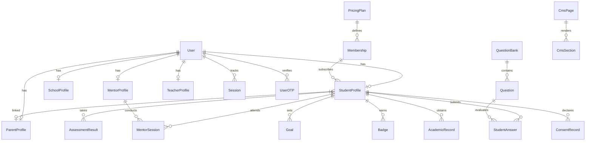
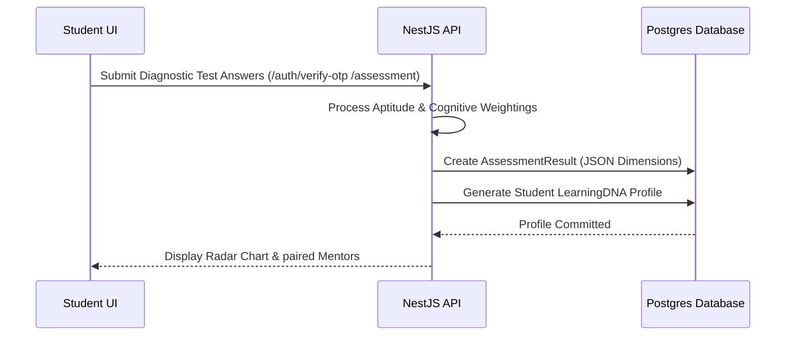

# Vedhkrit: India's AI-Powered Learner Development Operating System
## Master Documentation & Comprehensive System Audit

---

## 1. Executive Summary
* **What Vedhkrit Is:** Vedhkrit is not a generic content delivery website or a school administrative ERP. It is **India's AI-Powered Learner Development Operating System**. It acts as a dedicated student development and profiling layer that sits on top of, and integrates with, existing school management tools.
* **Business Vision:** To redefine student capability profiling (grades 8 to 12) across India by mapping cognitive capabilities, skills, and interest profiles, leading to personalized career roadmaps and direct mentor pairing.
* **Product Goals:** Move schools from simple grade trackers to multi-dimensional growth profiles; empower parents with transparent growth telemetry; pair students with expert human mentors and an always-on AI coach (VedhAI Coach).
* **Target Users:** 
  * *Students (Grades 8–12):* Mapping capabilities and completing daily learning tasks.
  * *Parents:* Tracking real-time growth indicators and mentor session reviews.
  * *Mentors:* Providing 1:1 guidance sessions.
  * *Teachers:* Tracking student academic struggles in their subjects.
  * *School Admins:* Reviewing institutional performance and departmental operational states.
  * *Super Admins:* Monitoring global platform growth, schools, and subscription logs.
* **Problems Solved:** Fragmentation of student metrics, lack of clear 21st-century capability mapping, high student-to-counselor ratios, and generic carrier alignment.
* **Unique Selling Proposition (USP):** The **Learning DNA Engine**—a multi-dimensional data model integrating cognitive profiling, school grades, mentor notes, and AI logs into a single, cohesive capability footprint.
* **Current Development Stage:** *Pre-production / Portal Shell Integration Stage.* The homepage, core marketing subpages, authentication flows, database schema, and dashboard shell frameworks are fully implemented, utilizing mocked route logic in the API layer during local development.

---

## 2. Project Structure
The repository is managed as a monorepo workspace via **Turborepo** with npm/yarn workspaces:

```
VEDHKRIT (Root)
├── apps/
│   ├── web/                     # React 19 Frontend (TanStack Start & Router, Tailwind CSS v4)
│   └── platform/                # NestJS Backend Application (Services, Controllers, Auth)
├── packages/
│   ├── database/                # Database configuration, Prisma schemas, & client wrapper
│   ├── eslint-config/           # Monorepo linting configurations
│   └── typescript-config/       # Monorepo typescript base tsconfig rules
```

### Key Folder Purpose Descriptions
* **`apps/web/src/routes/`:** Maps the application's file-based routes (marketing subpages, authentication prompts, and individual role dashboard routes).
* **`apps/web/src/components/`:** Stores modular layout templates (`dashboard-shell.tsx`, `auth-shell.tsx`), global scroll-interactive widgets, and specific diagnostic forms.
* **`apps/platform/src/`:** Contains core business logic divided into NestJS modules (Prisma client wrapper, auth services, CMS APIs, goals, and role-specific portals).
* **`packages/database/prisma/`:** Houses `schema.prisma` (the system's source of truth database model declarations).

---

## 3. Technology Stack

| Layer | Technology Chosen | Purpose / Why Chosen |
| :--- | :--- | :--- |
| **Frontend Core** | **React 19** + **TypeScript 5** | High-performance user interface development, type safety, and framework longevity. |
| **Routing & SSR** | **TanStack Router** + **TanStack Start** | Modern file-based routing, server-side rendering support, and type-safe route parameters. |
| **Styling** | **Tailwind CSS v4** + **Vanilla CSS** | Efficient utility class styling combined with custom CSS variable tokens (OKLCH system). |
| **Animations** | **Motion v12** (Framer Motion) | Smooth interface animations, layout spring transitions, and interactive slide-out drawers. |
| **Icons** | **Lucide React** | Consistent, vector-based SVG iconography. |
| **Charts** | **Recharts** (integrated in dashboards) | Responsive SVG-based line, bar, and radar charts. |
| **Backend Core** | **NestJS** (Node.js) | Structured, enterprise-grade modular backend framework. |
| **Database ORM** | **Prisma Client v6** | Type-safe SQL client mapping automatically to TypeScript interfaces. |
| **Database Engine**| **PostgreSQL** | Relational, transaction-safe database matching multi-tenant schemas. |
| **Smooth Scroll** | **Lenis** | Custom smooth scrolling utility activated on all marketing routes. |

---

## 4. Current Features Implementation Status

| Scope | Feature | Status | Description |
| :--- | :--- | :--- | :--- |
| **Website** | Homepage Hybrid | **Implemented** | Hero carousel, 7-step journey, radar snapshot, SLEC labs. |
| **Website** | Marketing Subpages | **Implemented** | Framework details, Parents overview, About Us, Contact. |
| **Student Portal** | Dashboard Shell | **Implemented** | Unified liquid glass header, sidebar links, Veda launcher. |
| **Student Portal** | Core Modules | **Placeholder** | Academics, goals, assessments, portfolio routes are structured. |
| **Parent Portal** | Dashboard Overview | **Implemented** | Growth index tracker, session scheduler, receipts logs. |
| **Mentor Portal** | Lounge Hub | **Implemented** | Scheduling lists, inbox alerts, sessions status. |
| **Teacher Portal** | Subject Tracking | **Planned** | Classroom subject grade monitors & red-zone indicators. |
| **School Admin** | operational Dashboard | **Implemented** | School departmental rankings, billing, roster links. |
| **Super Admin** | Platform Analytics | **Implemented** | Subscriptions, transaction history, active school maps. |
| **Assessment** | Self-Assessment Wizard | **Implemented** | Multi-step form diagnostic testing interests & aptitude. |
| **Authentication** | Login / Register / OTP | **Implemented** | Basic client verification forms & NestJS endpoints. |
| **CMS** | Dynamic Sections | **Implemented** | Prisma CMS client storing page section components layout details. |
| **AI Features** | VedhAI Assistant | **Implemented** | Sidebar sliding drawer launcher with preset prompt hints. |

---

## 5. Public Website Page Inventory
* **Homepage (`_marketing.index.tsx`):** Renders the slideshow hero (with 4 rotating panels), a 7-step journey flex model, a custom SVG Radar Chart showing the student growth index, and the SLEC maker grid.
* **Why Vedhkrit (`_marketing.about.tsx`):** Maps core mission pillars, team information, and leadership statements.
* **ILDF Framework (`_marketing.framework.tsx`):** Outlines the Discover, Explore, Align, Prepare, and Launch lifecycle grades.
* **Assessment Model (`_marketing.assessment.tsx`):** Prompts the user to start the diagnostic form.
* **Career Pathways (`_marketing.career.tsx`):** Searchable list showing 50+ prospective futuristic careers.
* **For Parents (`_marketing.parents.tsx`):** Describes features of the parent dashboard.
* **Contact (`_marketing.contact.tsx`):** Details clean contact forms.

---

## 6. Student Portal Pages
* **Dashboard Home (`dashboard.student.index.tsx`):**
  * *Purpose:* Answering *"What should I do today?"*.
  * *Components:* Active task percentages, daily calendar reminders, active goals count, AI study tip box.
  * *APIs:* `/student-portal/:studentId/overview`.
* **Academics (`dashboard.student.academics.tsx`):** Tracks school scores and term indicators.
* **AI Coach (`dashboard.student.ai.tsx`):** Integrates the VedhAI Coach interactive chat logs.
* **Milestone Goals (`dashboard.student.goals.tsx`):** Detailed goal-creation form and status updates.
* **Skill Portfolio (`dashboard.student.portfolio.tsx`):** Displays earned credentials and certificates.

---

## 7. Parent Portal Pages
* **Dashboard Home (`dashboard.parent.index.tsx`):**
  * *Purpose:* Answering *"How is my child doing?"*.
  * *Components:* Child's Vedhkrit Index tracker, weekly progress reports, current subject grades, and alerts panel.
  * *APIs:* `/parent-portal/:parentId/overview`.
* **Attendance Logs (`dashboard.parent.attendance.tsx`):** Calendar grid showing class presence percentages.
* **Mentor Reviews (`dashboard.parent.mentor.tsx`):** Notes from live sessions and scheduling widgets.
* **Growth Metrics (`dashboard.parent.growth.tsx`):** Detail graph charts representing soft skill index progressions.

---

## 8. Mentor Portal Pages
* **Lounge Hub (`dashboard.mentor.index.tsx`):**
  * *Purpose:* Answering *"Which students need my attention?"*.
  * *Components:* Alerts for inactive students, calendar widgets, scheduling requests, session feedback inputs.
  * *APIs:* `/mentor-portal/:mentorId/overview`.
* **Session Manager (`dashboard.mentor.sessions.tsx`):** Comprehensive list of upcoming, completed, and canceled meetings.

---

## 9. Teacher Portal Pages
* **Roster Overview (`dashboard.admin.teachers.tsx`):**
  * *Purpose:* Answering *"Which students are struggling in my subject?"*.
  * *Components:* Dynamic lists tracking class distributions, average scores, and low-attendance indicators.
  * *Database Model:* `TeacherProfile` mapped to `User`.

---

## 10. School Admin Portal Pages
* **Campus Hub (`dashboard.admin.index.tsx`):**
  * *Purpose:* Answering *"How is my school performing?"*.
  * *Components:* Total registered students, teacher schedules, departmental averages, and license alerts.
  * *Database Model:* `SchoolProfile` mapped to `User`.

---

## 11. Super Admin Portal Pages
* **Global Hub (`dashboard.super.index.tsx`):**
  * *Purpose:* Answering *"How is the Vedhkrit platform growing?"*.
  * *Components:* Subscription MRR tracking, registered school coordinates list, platform logs, transaction tables.
  * *Database Model:* `User` role type `SUPERADMIN`.

---

## 12. Authentication & Authorization
* **Registration Flow:** User registers email/phone and details via `/auth/register`. An OTP code is dispatched.
* **Login Flow:** Users enter details on `/login`. Endpoint `/auth/login` verifies user passwords and issues a signed JWT token containing role and status attributes.
* **OTP Verification:** Handled via `/auth/verify-otp`. Validates code expiration before transitioning the user status to `ACTIVE`.
* **Session Management:** Auth sessions are tracked client-side via `localStorage` (tokens: `vedhkrit_auth_token` and `vedhkrit_auth_user`).

---

## 13. Database Schema & Entity Relationships



* **Core Models:**
  * **`User`:** Identity data with unique constraints on Email and Phone.
  * **`StudentProfile`:** Grade levels and references to parents, sessions, and academic logs.
  * **`AssessmentResult`:** Diagnostic outputs stored as a JSON object inside the `dimensions` field.
  * **`ConsentRecord`:** Stores consent parameters (e.g. eye tracking, telemetry settings).

---

## 14. API Documentation

| Route | Method | Authorization | Request Schema | Response Schema |
| :--- | :--- | :--- | :--- | :--- |
| `/auth/register` | POST | Public | `{ email, password, name, role }` | `{ status, message }` |
| `/auth/login` | POST | Public | `{ email, password }` | `{ access_token, user }` |
| `/auth/verify-otp` | POST | Public | `{ email, otp }` | `{ access_token, user }` |
| `/cms/:slug` | GET | Authenticated | None | `{ title, sections }` |
| `/student-portal/:id/overview`| GET | Bearer Token | None | `{ student, goals, sessions }` |
| `/parent-portal/:id/overview` | GET | Bearer Token | None | `{ parent, children, reports }` |
| `/mentor-portal/:id/overview` | GET | Bearer Token | None | `{ mentor, students, alerts }` |

---

## 15. Key Business Workflows

### AI Discovery & Learning DNA Generation


---

## 16. Frontend Architecture
* **Routing:** Implemented via file-based nested route trees with auto-generation in `apps/web/src/routeTree.gen.ts`.
* **Layout Wrappers:** Custom shared layouts (`marketing-layout.tsx`, `dashboard-shell.tsx`) manage frosted glass aesthetics and navigation consistency.
* **State Management:** Handled locally via React contexts and globally using **TanStack React Query** for API query caching and data invalidation.
* **Theme System:** Configured inside `styles.css` using OKLCH base colors and Tailwind variables.

---

## 17. Backend Architecture (NestJS)
* **Modular Structure:** Built using clear separation of concerns (Modules, Controllers, Services, and Repositories).
* **ORM Connection:** Handled through the custom `PrismaModule` utilizing standard PostgreSQL data connections.
* **Guards & Authorization:** JWT authorization guards inspect the request bearer token header and match user roles against routes.

---

## 18. UI Component Library (Highlights)
* **`VedaAssistant`:** A slide-out panel that manages AI conversation history and preset prompt queries.
* **`SelfAssessment`:** A custom form wizard that guides users step-by-step through aptitude profiling.
* **`GlassCard`:** A reusable frosted border wrapper for clean layout segregation.
* **`FadeIn`:** Configures Motion v12 viewport transitions automatically for layout wrappers.

---

## 19. AI Integration (VedhAI)
* **Current UI:** Pinned sidebar widgets that slide out on demand.
* **Functional Architecture:** Prompts map to custom user profiles (Learning DNA) to generate contextual tutoring responses.
* **Future Work:** Integration of a real LLM endpoint (Gemini API) to replace static suggestion arrays.

---

## 20. Integrations & External Services
* **Database Host:** PostgreSQL instance configured via standard `DATABASE_URL`.
* **Prisma Studio:** Currently listening on the database package interface.
* **Future Integrations:**
  * **Razorpay:** Payment processing for school subscriptions.
  * **MSG91:** OTP and parent progress notification dispatch.

---

## 21. Environment Variables
* `VITE_API_URL` (Frontend): Defines the backend API route. Defaults to `http://localhost:5000`.
* `DATABASE_URL` (Backend / DB): Prisma PostgreSQL connect URL.
* `JWT_SECRET` (Backend): Encryption key for token payloads.

---

## 22. Security Controls
* **Authentication:** Handled through robust password hashes (bcrypt) and secure JWT signatures.
* **Database Safety:** Unique constraints on email and phone numbers prevent profile collisions.
* **Telemetry Control:** Custom `ConsentRecord` tables track student authorizations for data recording.

---

## 23. Performance Optimizations
* **Smooth Animation:** Motion v12 leverages GPU-accelerated CSS keyframe variables.
* **Data Caching:** React Query manages cache lifetimes (stale times, automatic background updates) to prevent redundant database fetches.

---

## 24. Project Roadmap
* **Step 1 (Completed):** Homepage hybrid layouts, design token system, vector elements, and radar metrics.
* **Step 2 (In Progress):** Subpage routing alignment, contact form connections, and database synchronization.
* **Step 3 (Pending):** Interactive dashboards development, mentor scheduler execution, and LLM integrations.

---

## 25. Technical Debt & Recommendations
* **Refactor suggestion:** Replace manual mock route switches inside `apps/web/src/lib/api.ts` with dedicated MSW (Mock Service Worker) setups or true API calls to the NestJS platform.
* **Database enhancement:** Create indexes for dynamic dashboard queries (e.g. student search filters).
* **CTO Recommendation:** Prioritize implementing the true Gemini API connection to activate the VedhAI Coach interface.

---

## 26. Development Progress Estimates

* **Website Layouts:** 95%
* **Authentication Shells:** 90%
* **Prisma Schema:** 100%
* **NestJS Services:** 60%
* **Overall Completion:** 75%
