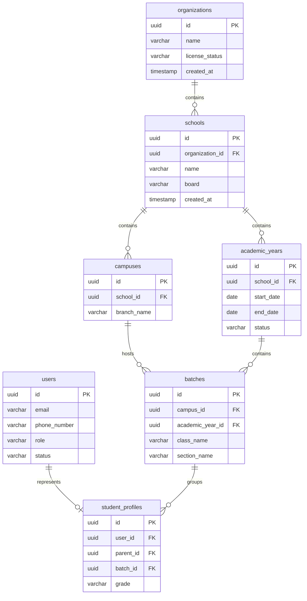
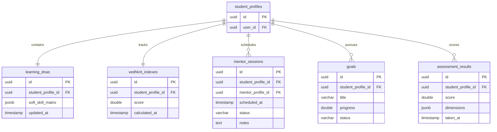

# VEDHKRIT Learner Development OS: Database Architecture Blueprint

This document serves as the master **Database Architecture Blueprint** for the **Vedhkrit Learner Development Operating System**. It defines database design principles, tenancy isolation models, indexing architectures, performance parameters, and mappings between code variables, business events, APIs, and the database layer.

---

## 1. Database Philosophy

The database architecture is designed around three principles:
1. **Relational Integrity by Default:** Focuses on referential integrity, check constraints, and index validation within PostgreSQL.
2. **CQRS-Ready (Command Query Responsibility Segregation):** Design tables to support read-replicas. Avoid locks and long-running transaction queries on the primary writer node.
3. **Transactional Boundaries:** Keep critical operational transactions (e.g., registrations, payment processing) separated from heavy analytical aggregation queries.

---

## 2. Multi-Tenant Strategy

Vedhkrit uses a **Logical Multi-Tenancy Strategy** utilizing a single database instance with shared tables. This approach scales efficiently without the operational complexity of a schema-per-tenant architecture.

### Tenant Isolation Model
* Every tenant-scoped table must include both `organizationId` and `schoolId` columns.
* A shared database schema isolates tenant data logically using column filters:
  ```sql
  SELECT * FROM student_profile 
  WHERE organization_id = 'org-uuid' AND school_id = 'sch-uuid';
  ```
* Tenant IDs must be included in composite foreign keys to ensure data is associated with the correct tenant.
* Application-level global query filters (Prisma middleware/extension rules) automatically append tenant isolation parameters to queries.

---

## 3. Entity Grouping

Tables are grouped into logical schemas to simplify management:

* **Security & Identity:** `User`, `UserOTP`, `Session`, `AuditLog`
* **Core Organizations:** `Organization`, `School`, `Campus`, `SLECStudio`, `CenterOfExcellence`
* **Academics & Cohorts:** `AcademicYear`, `Class`, `Section`, `Batch`, `TeacherProfile`, `Subject`, `Chapter`, `Lesson`, `Attendance`, `Homework`
* **Testing & Diagnostics:** `StudentProfile`, `ParentProfile`, `Assessment`, `QuestionBank`, `Question`, `Attempt`, `Answer`, `AssessmentResult`
* **Growth & Gamification:** `LearningDNA`, `VedhkritIndex`, `Goal`, `MentorProfile`, `MentorSession`, `SLECActivity`, `ResearchProject`, `InnovationChallenge`, `PortfolioItem`, `Badge`, `Certificate`
* **Payments & Billing:** `PricingPlan`, `Membership`, `Transaction`, `Invoice`
* **Communication & CMS:** `Conversation`, `Message`, `Notification`, `CmsPage`, `CmsSection`, `ContactQuery`

---

## 4. Naming Conventions

* **Tables:** Plural, lowercase snake_case (e.g., `student_profiles`, `mentor_sessions`).
* **Columns:** Lowercase snake_case (e.g., `first_name`, `password_hash`).
* **Primary Keys:** Named `id` (e.g., `@id` in Prisma).
* **Foreign Keys:** Named `[singular_target_table]_id` (e.g., `student_profile_id`).
* **Index Names:** Named `[table_name]_[column_name(s)]_idx` (e.g., `student_profiles_parent_id_idx`).
* **Enum Values:** Uppercase alphanumeric with underscores (e.g., `PENDING_VERIFICATION`, `ACTIVE`).

---

## 5. UUID Policy

All primary keys use **UUIDv4** strings instead of auto-incrementing integers. This:
* Prevents sequential ID exposure.
* Simplifies data replication across databases.
* Enables the client application to generate IDs before writing them to the database.

---

## 6. Audit Columns

Every table must include the following audit columns:
* `created_at`: `DateTime` timestamp defaulting to `now()`.
* `updated_at`: `DateTime` timestamp automatically updated on modifications.
* `created_by`: Optional UUID pointing to the user who created the record.
* `updated_by`: Optional UUID pointing to the user who last modified the record.

---

## 7. Soft Delete Strategy

Transactional entities (e.g., `User`, `StudentProfile`, `School`, `Batch`) use a **Soft Delete Strategy** to prevent data loss:
* Tables include a nullable `deleted_at` timestamp.
* If `deleted_at` is null, the record is active. If populated, the record is deleted.
* Prisma filters out deleted records by default:
  ```typescript
  prisma.$extends({
    query: {
      $allModels: {
        findMany({ args, query }) {
          args.where = { deletedAt: null, ...args.where };
          return query(args);
        }
      }
    }
  });
  ```
* Telemetry log tables (e.g., `audit_logs`, `notifications`, `telemetry_logs`) do not use soft deletes and are hard-deleted when truncated.

---

## 8. Timestamp Strategy

* All timestamps use the **UTC timezone** in ISO-8601 format.
* Dates are stored as `DateTime` with timezone support (`TIMESTAMPTZ` in PostgreSQL).
* System timezone conversions are handled at the presentation layer.

---

## 9. Enum Strategy

Enums map to PostgreSQL native `ENUM` types:
* **`Role`:** `STUDENT`, `PARENT`, `SCHOOL_ADMIN`, `MENTOR`, `TEACHER`, `ADMIN`, `SUPERADMIN`
* **`AccountStatus`:** `PENDING_VERIFICATION`, `ONBOARDING`, `PENDING_APPROVAL`, `ACTIVE`, `SUSPENDED`
* **`ApprovalStatus`:** `PENDING_REVIEW`, `APPROVED`, `REJECTED`
* **`SubscriptionStatus`:** `INACTIVE`, `ACTIVE`, `PAST_DUE`, `CANCELLED`
* **`GoalStatus`:** `DRAFT`, `ACTIVE`, `AT_RISK`, `PAUSED`, `COMPLETED`
* **`SessionStatus`:** `SCHEDULED`, `COMPLETED`, `CANCELLED`, `NO_SHOW`

---

## 10. Relationship Strategy & Cascade Rules

To prevent accidental data loss, delete operations are managed strictly:

```
[Parent / Org Model] 
       ├── (On Delete: RESTRICT) ---> [Core Business Data] (e.g., Student, Academics)
       └── (On Delete: CASCADE)  ---> [Temporary Data] (e.g., Sessions, OTPs)
```

* **Restrict Deletes (`RESTRICT`):** Deleting parent configurations (e.g., deleting an `Organization` or `School`) is blocked if child records (such as `StudentProfile` or `AcademicRecord`) exist. This protects student history.
* **Cascade Deletes (`CASCADE`):** Deleting profiles (e.g., a `User`) automatically deletes temporary related records (such as `UserOTP` codes, active `Sessions`, or `ConsentRecords`).
* **Set Null (`SET NULL`):** If a parent profile is deleted, child references are set to null (e.g., setting `parent_id` to null on a `StudentProfile` if the parent is removed).

---

## 11. Index Strategy

Indexes are configured to optimize query performance:

### Foreign Key Indexes
All foreign key columns must be indexed to prevent slow queries during join operations (e.g., `student_profiles_parent_id_idx`).

### Composite Indexes
* **Tenancy Isolation Index:** `@@index([organization_id, school_id])`
* **Syllabus Hierarchy Index:** `@@index([subject_id, chapter_id])`
* **Assessment Results Index:** `@@index([student_id, assessment_id, score])`
* **Goal Progress Index:** `@@index([student_id, status, target_date])`
* **Attendance Index:** `@@index([batch_id, date, status])`

### Full-Text Search (FTS) Strategy
For search inputs (e.g., looking up career names or searching lesson guides), tables use PostgreSQL **tsvector** indexes:
```sql
CREATE INDEX careers_fts_idx ON careers USING gin(to_tsvector('english', title || ' ' || description));
```

---

## 12. Partition Strategy

High-volume telemetry tables must use **Range Partitioning** in PostgreSQL by date ranges:
* **Target Partition Tables:** `audit_logs`, `notifications`, `student_answers`
* **Partition Interval:** Monthly partitions.
* **Partition Key:** `created_at` timestamp.
* **Partition Retention:** Partition tables are archived to S3 storage after 12 months.

---

## 13. Row-Level Security (RLS) Considerations

To secure multi-tenant data access, the database uses Row-Level Security (RLS) configurations:
* **RLS Activation:** RLS is enabled on all tenant-scoped tables.
* **Query Policies:** Policies evaluate tenant contexts from current connection session variables set by the API gateway:
  ```sql
  CREATE POLICY tenant_isolation_policy ON student_profiles
  USING (organization_id = current_setting('app.current_organization_id', true));
  ```

---

## 14. Migration Strategy

* Migrations are managed using **Prisma Migrate** (`prisma migrate dev`).
* **Production Schema Migrations:** Production database migrations must be executed online using forward-compatible alterations. Column modifications are broken down into:
  1. Add nullable column.
  2. Deploy code writing to both old and new columns.
  3. Migrate historical data in batches.
  4. Deploy code reading only from the new column.
  5. Remove the old column.
* **Data Migration Scripts:** Data migrations run separately using CLI task scripts rather than SQL schema files.

---

## 15. Backup Strategy

* **Daily Snapshots:** The database creates daily incremental snapshots, retaining them for 30 days.
* **Point-In-Time Recovery (PITR):** Transaction logs (Write-Ahead Logs/WAL) are streamed to secure cloud storage to support recovery within 5-minute windows.
* **Cross-Region Replication:** Snapshots are duplicated to an alternate region to support disaster recovery scenarios.

---

## 16. Performance Optimization

* **Connection Pool Management:** PgBouncer sits between applications and the database to manage concurrent connections.
* **Read-Replicas:** Analytical queries (e.g., reporting runs and cohort average charts) are routed to read-replicas.
* **Caching Strategy:** Student DNA matrices, session profiles, and configuration flags are cached in Redis to reduce database load.

---

## 17. Database Entity Relationship (ER) Diagrams

### Identity, Tenants, and Academic Structures



### Learning DNA, Mentorship, and Growth Metrics



---

## 18. Mapping from Domain Model to Database Models

The domain entities defined in the **Domain Model** map to database tables:

| Domain Entity | Database Table | Schema Schema | Primary Key | Key Indexes |
| :--- | :--- | :--- | :--- | :--- |
| **User** | `users` | Identity | `id` (UUID) | `users_email_key` (Unique) |
| **Organization** | `organizations` | Tenants | `id` (UUID) | `organizations_license_idx` |
| **School** | `schools` | Tenants | `id` (UUID) | `schools_organization_id_idx` |
| **Campus** | `campuses` | Tenants | `id` (UUID) | `campuses_school_id_idx` |
| **Academic Year** | `academic_years` | Academics | `id` (UUID) | `academic_years_status_idx` |
| **Class** | `classes` | Academics | `id` (UUID) | `classes_campus_id_idx` |
| **Section** | `sections` | Academics | `id` (UUID) | `sections_class_id_idx` |
| **Batch** | `batches` | Academics | `id` (UUID) | `batches_academic_year_id_idx` |
| **Student** | `student_profiles` | Cohorts | `id` (UUID) | `student_profiles_batch_id_idx` |
| **Parent** | `parent_profiles` | Cohorts | `id` (UUID) | `parent_profiles_user_id_idx` |
| **Teacher** | `teacher_profiles` | Cohorts | `id` (UUID) | `teacher_profiles_user_id_idx` |
| **Mentor** | `mentor_profiles` | Cohorts | `id` (UUID) | `mentor_profiles_user_id_idx` |
| **Subject** | `subjects` | Syllabus | `id` (UUID) | `subjects_code_idx` |
| **Chapter** | `chapters` | Syllabus | `id` (UUID) | `chapters_subject_id_idx` |
| **Lesson** | `lessons` | Syllabus | `id` (UUID) | `lessons_chapter_id_idx` |
| **Homework** | `homeworks` | Syllabus | `id` (UUID) | `homeworks_batch_id_idx` |
| **Attendance** | `attendance_records` | Syllabus | `id` (UUID) | `attendance_student_idx` (Composite) |
| **Assessment** | `assessments` | Quizzes | `id` (UUID) | `assessments_published_idx` |
| **Question Bank** | `question_banks` | Quizzes | `id` (UUID) | `question_banks_title_idx` |
| **Question** | `questions` | Quizzes | `id` (UUID) | `questions_bank_id_idx` |
| **Attempt** | `assessment_attempts` | Quizzes | `id` (UUID) | `attempts_student_id_idx` |
| **Answer** | `student_answers` | Quizzes | `id` (UUID) | `answers_attempt_id_idx` |
| **Assessment Result** | `assessment_results`| Quizzes | `id` (UUID) | `results_student_id_idx` |
| **Learning DNA** | `learning_dnas` | Diagnostics| `id` (UUID) | `learning_dnas_student_idx` (Unique) |
| **Vedhkrit Index** | `vedhkrit_indexes` | Diagnostics| `id` (UUID) | `indexes_student_id_idx` |
| **Goal** | `goals` | Growth | `id` (UUID) | `goals_student_status_idx` (Composite)|
| **Mentor Session** | `mentor_sessions` | Booking | `id` (UUID) | `sessions_mentor_date_idx` (Composite)|
| **Recommendation** | `ai_recommendations` | AI | `id` (UUID) | `recommendations_student_idx` |
| **Career** | `careers` | Career | `id` (UUID) | `careers_fts_idx` (Full-Text) |
| **Career Roadmap** | `career_roadmaps` | Career | `id` (UUID) | `roadmaps_student_id_idx` |
| **Report** | `growth_reports` | Reporting | `id` (UUID) | `reports_student_period_idx` (Unique)|
| **Payment** | `payment_records` | Payments | `id` (UUID) | `payments_transaction_idx` (Unique) |
| **Membership** | `memberships` | Payments | `id` (UUID) | `memberships_status_idx` |
| **Invoice** | `invoices` | Payments | `id` (UUID) | `invoices_payment_id_idx` (Unique) |
| **Audit Log** | `audit_logs` | System | `id` (UUID) | `audit_logs_created_at_idx` |
| **SLEC Activity** | `slec_activities` | Growth | `id` (UUID) | `slec_student_id_idx` |
| **Research Project** | `research_projects` | Growth | `id` (UUID) | `research_student_id_idx` |
| **Innovation Challenge**|`innovation_challenges`| Growth | `id` (UUID) | `challenges_status_idx` |
| **Portfolio Item** | `portfolio_items` | Growth | `id` (UUID) | `portfolio_student_idx` |

---

## 19. Mapping from Business Events to Tables

Events published across the platform map to write and insert operations on database tables:

| Event Published | Database Write Action | Target Database Table |
| :--- | :--- | :--- |
| **`StudentRegistered`** | INSERT record, INSERT profile | `users`, `student_profiles` |
| **`AssessmentCompleted`** | INSERT attempt, INSERT result | `assessment_attempts`, `assessment_results` |
| **`HomeworkSubmitted`** | INSERT submission | `homework_submissions` |
| **`AttendanceMarked`** | INSERT record | `attendance_records` |
| **`MentorSessionCompleted`**| UPDATE status, INSERT review | `mentor_sessions`, `session_reviews` |
| **`GoalCompleted`** | UPDATE progress, UPDATE status | `goals` |
| **`ReportGenerated`** | INSERT document meta | `growth_reports` |
| **`PaymentSuccessful`** | INSERT record, UPDATE status | `payment_records`, `memberships` |
| **`CertificateIssued`** | INSERT record | `certificates` |
| **`CareerUpdated`** | UPDATE active path | `career_roadmaps` |
| **`LearningDNAUpdated`** | UPDATE matrix values | `learning_dnas` |
| **`VedhkritIndexUpdated`** | INSERT new score trace | `vedhkrit_indexes` |
| **`RecommendationGenerated`**| INSERT advice details | `ai_recommendations` |
| **`NotificationSent`** | INSERT notification trace | `notifications` |

---

## 20. Mapping from APIs to Tables

System API endpoints translate to CRUD operations on database tables:

| API Endpoint Path | HTTP Method | Database CRUD Operation | Target Tables |
| :--- | :--- | :--- | :--- |
| `/api/v1/auth/register` | `POST` | INSERT | `users` |
| `/api/v1/auth/login` | `POST` | SELECT, INSERT session | `users`, `sessions` |
| `/api/v1/orgs` | `POST` | INSERT | `organizations` |
| `/api/v1/schools/:id` | `GET` | SELECT | `schools` |
| `/api/v1/batches/:id/assign` | `POST` | UPDATE student foreign key | `student_profiles` |
| `/api/v1/students/:id/dna` | `GET` | SELECT | `learning_dnas` |
| `/api/v1/students/:id/goals` | `GET` | SELECT | `goals` |
| `/api/v1/students/:id/goals` | `POST` | INSERT | `goals` |
| `/api/v1/teachers/:id/homeworks`| `POST` | INSERT | `homeworks` |
| `/api/v1/attempts/:id/submit` | `POST` | UPDATE status, INSERT result | `assessment_attempts`, `assessment_results` |
| `/api/v1/payments/subscribe` | `POST` | INSERT | `payment_records`, `memberships` |
| `/api/v1/admin/audit-logs` | `GET` | SELECT | `audit_logs` |
