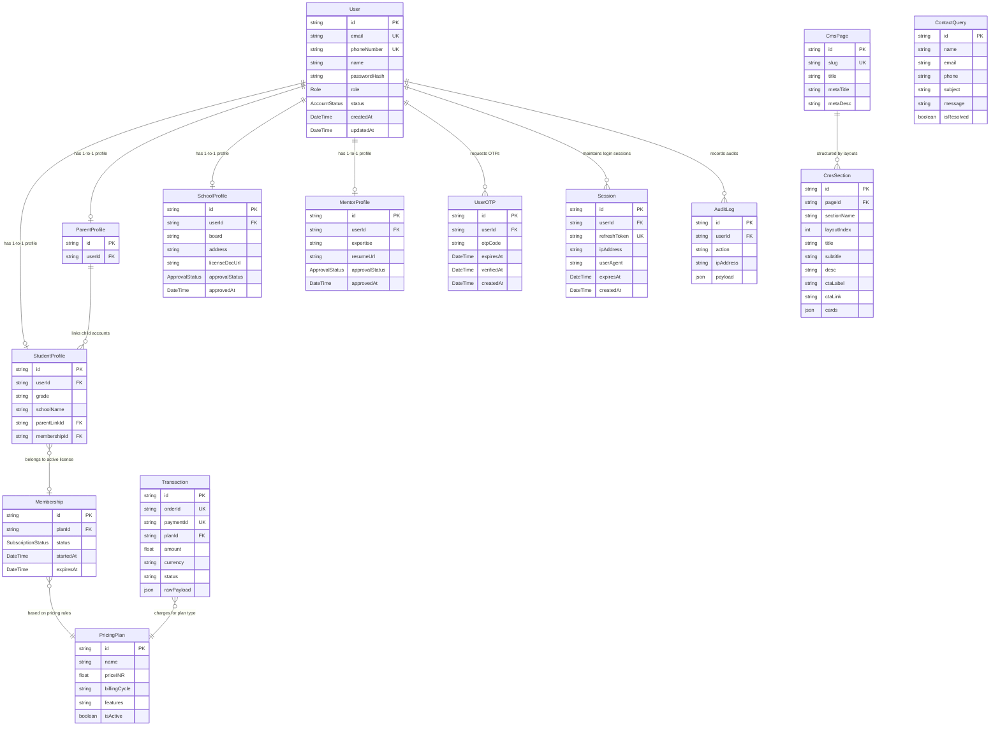

# Database Schema & Entity-Relationship (ER) Diagrams

This document outlines the database structure and relational models defined inside our Prisma configurations.

---

## 1. Entity-Relationship Diagram (Mermaid)

The relations, keys, and cardinalities are mapped in the following diagram:

---

## 2. Table Cardinality Specifications

* **User Profiles (1:1):** Every `StudentProfile`, `ParentProfile`, `SchoolProfile`, and `MentorProfile` maps back to exactly one parent record in the `User` table via the `userId` field. This ensures credentials, status codes, and security settings are centralized.
* **Parent-Child Link (1:N):** A `ParentProfile` can link to multiple `StudentProfile` accounts (supporting parents with multiple children), while each student profile connects to at most one parent manager.
* **OTP & Sessions logs (1:N):** An active user account can trigger multiple login sessions or verification OTP records over time, cleared periodically via database cleanup crons.
* **Page Layout Blocks (1:N):** A `CmsPage` (e.g. `slug = "homepage"`) holds multiple `CmsSection` layouts representing headers, timelines, and sliders, sorted dynamically by their `layoutIndex`.

---

## 3. Recommended Performance Indexes

To guarantee high speeds when serving up to 5,000 requests per second, the database creates the following composite indexes:

1. **`UserOTP` lookup:** Index on `[userId]` for fast lookup during verification.
2. **`Session` verification:** Index on `[userId, refreshToken]` to validate session integrity.
3. **`StudentProfile` linkage queries:** Index on `[parentLinkId]` to render parent dashboards.
4. **`Transaction` lookup:** Index on `[orderId]` and `[paymentId]` to ensure payments verification can validate signatures immediately.
