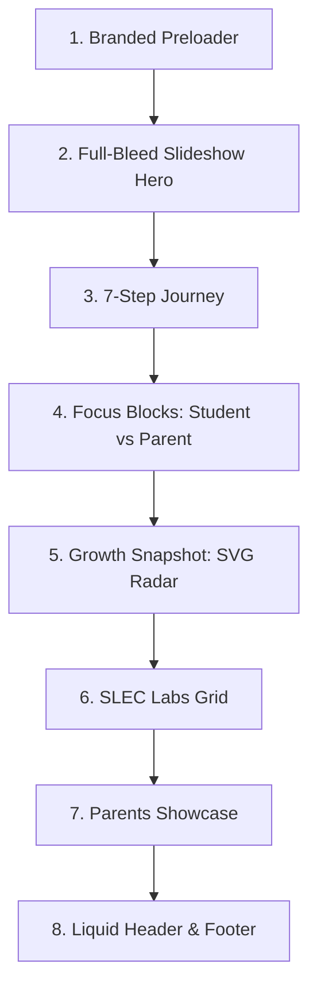

# VEDHKRIT Platform Walkthrough & Interactive Demo Guide

This document provides a comprehensive guide for demonstrating the **Vedhkrit Learner Development Platform**. It covers all public-facing marketing pages, the student and parent portal features, admin tools, and the underlying design systems.

---

## 🧭 Table of Contents
1. [Pre-Demo Preparation Checklist](#1-pre-demo-preparation-checklist)
2. [Section-by-Section Homepage Walkthrough](#2-section-by-section-homepage-walkthrough)
3. [Subpages & Diagnostic Assessment Walkthrough](#3-subpages--diagnostic-assessment-walkthrough)
4. [Dashboard & Portal Workflows](#4-dashboard--portal-workflows)
5. [Interactive Demo Script & Talking Points](#5-interactive-demo-script--talking-points)

---

## 1. Pre-Demo Preparation Checklist

Before initiating a live presentation or recording a platform walkthrough, complete the following setup steps:

### ⚙️ Environment Setup
1. **Launch the Monorepo:** Ensure your Turborepo workspaces are running in development mode.
   ```bash
   npm run dev
   ```
2. **Access Links:**
   * **Public Website / Portals (TanStack Router):** `http://localhost:8080` (or active Vite server port).
   * **Back-office Cohort/Admin Server (NestJS):** `http://localhost:5000` (or NestJS environment port).
3. **Reset State:** Clear browser cookies or open an Incognito tab to experience the **Branded Preloader** and clean onboarding routing correctly.
4. **Resolution Testing:** 
   * Pre-load on both standard desktop viewports (e.g. `1920x1080`) and toggle mobile inspection viewports (e.g. `375x812` - iPhone X/12) to showcase responsive fluid scaling.

---

## 2. Section-by-Section Homepage Walkthrough

The homepage hybrid interface (`_marketing.index.tsx`) acts as the main marketing node. Below is the breakdown of its visual and structural components:



### ⏳ A. Branded Preloader (`<Preloader />`)
* **Visual Presentation:** A minimalist white full-screen mask containing an outer pulsing gradient glow, a circular animated border, and a central static brand logo featuring a deep navy `'V'`.
* **Motion Choreography:** Under the hood, Motion scales a linear progress bar from `0%` to `100%` in 1.5 seconds.
* **Developer Insight:** Restricts viewport interaction during initial bundle loading or server-side hydration, then fades out smoothly to present the hero page.

### 🖼️ B. Full-Bleed Slideshow Hero
* **Background Banners:** Transitions dynamically between 4 curated banner images representing active classrooms, student interaction, SLEC Growth Studios, and technology tracks.
* **Overlays for High Contrast:**
  * **Desktop Layout:** Uses a left-to-right fade (`from-black/90 via-black/60 to-transparent`) so text on the left stays sharp while the bright images on the right remain visible.
  * **Mobile Layout:** Employs a bottom-to-top vertical overlay (`from-black/90 via-black/80 via-45% to-transparent`) aligning text to the bottom.
* **Layout Grid Rules:** Height is fixed at `h-[calc(100dvh-56px)]`. Content sits in the bottom-left half (`lg:max-w-[50%]`) with the top 25% kept clear to showcase the backgrounds.

### 🗺️ C. The 7-Step Journey
* **Desktop Layout:** Rendered as a horizontal flex-grid displaying 7 consecutive steps (Discover, Understand, Improve, Practice, Experience, Master, Lead). Thin horizontal connector lines link cards, reflecting the learner lifecycle.
* **Mobile Layout:** Fluidly scales down into a horizontal sliding panel with snap-scroll configuration, allowing touchscreen swipe gestures without breaking grid lines.

### 👥 D. Focus Blocks (Student & Parent Roles)
* **Design Pattern:** Double high-contrast card blocks side-by-side. 
* **Visuals:** Uses glassmorphism backgrounds combined with brand icons. Contains direct button CTAs mapping to registration path configurations (`/register`).

### 📊 E. Growth Snapshot (Interactive SVG Radar Chart)
* **SVG Radar Matrix:** Renders a 5-axis polygon mapping strengths (Academic, Communication, Consistency, Innovation, and Leadership).
* **Scroll Animation:** Triggers on entry via `useInView` and coordinates scale metrics using a smooth spring solver.
* **Metric Badges:** Surmounted by 4 interactive statistics containers outlining test-scores, learning style (e.g. Visual Learner), and career fields.

### 🏢 F. SLEC Labs Grid
* **Visual Architecture:** 6-card flex grid presenting physical learning spaces (Maker Lab, Career Council Lounge, Global Studies, AI & Tech Studio, etc.).
* **Interactions:** Cards scale and zoom internally (`hover:scale-105 transition-transform duration-500`) with smooth gradient borders.

### 📱 G. Parents Showcase
* **Floating Phone Mockup:** A vertical mobile frame mockup representing the parent tracking interface (Attendance percentage, "On Track" assignment statuses, and Growth indexes) that moves with a floating animation.
* **Testimonial Grid:** Shows parent ratings and testimonials.

### ⚙️ H. Scroll-Interactive Widgets
* **Docked Chatbot Sidebar:** The Veda study bot shifts from a simple bubble to a pinned right-hand tab (`ASK VEDA` text with pushpin icon) once the user scrolls past the hero section. Clicking it slides out a full-height notebook-themed chat drawer.
* **Scroll-Stop Go To Top:** The back-to-top arrow button hides while scrolling is active to avoid cluttering the view. A debounce listener displays it 800ms after scrolling stops.

---

## 3. Subpages & Diagnostic Assessment Walkthrough

These pages extend marketing propositions and capture key customer data:

| Page Route | File Path | Key Presentation Concept |
| :--- | :--- | :--- |
| **Why Vedhkrit** | `_marketing.about.tsx` | Visual company history, values, and leadership profiles styled with clean background decorators. |
| **ILDF Framework** | `_marketing.framework.tsx` | Explanation of the Integrated Learner Development Framework using modular timeline grids. |
| **SLEC Studio Labs** | `_marketing.slec.tsx` | Expanded pages detailing structural SLEC classrooms, physical schedules, and center setups. |
| **Career Pathways** | `_marketing.career.tsx` | An interactive dashboard featuring 10+ student identities (AI Engineer, Climate Innovator, Space Scientist) with search filtering. |
| **Contact Form** | `_marketing.contact.tsx` | A card-based inquiry form with validation schemas, inputs, and a custom map coordinate block. |
| **AI Assessment** | `_marketing.assessment.tsx` | Overview of the cognitive assessment model showing diagnostic reports. |
| **Diagnostic Test** | `assessments.tsx` | The actual multi-step student evaluation portal running active timer indicators and progress counts. |

---

## 4. Dashboard & Portal Workflows

The platform supports specialized portals for different roles, utilizing the shared dashboard shell layout:

```
[DashboardShell]
   ├── Sidebar Navigation (Collapsible, Active Highlighting)
   ├── Liquid Header (Profile dropdown, notifications toggle)
   └── Main Viewport (App-ready, constrained padding, responsive)
```

### 🎓 Student Portal Dashboard (`dashboard.student.*`)
* **Overview Node (`index.tsx`):** Highlights overall growth indicators, radar index scores, pending diagnostic tests, and scheduled mentor meetings.
* **Subpages:**
  * **Academics (`academics.tsx`):** Subject scores, trend lines, and weaknesses.
  * **AI Analysis (`ai.tsx`):** Real-time diagnostic insights on cognitive focus.
  * **Assessments (`assessments.tsx`):** Available diagnostic tests and scoring archives.
  * **Career (`career.tsx`):** Suggested vocational maps.
  * **Goals (`goals.tsx`):** Interactive daily check-off trackers and long-term milestones.
  * **Portfolio (`portfolio.tsx`):** Student workspace files, credentials, and achievements.
  * **Reports (`reports.tsx`):** Downloadable growth report PDFs.
  * **Sessions (`sessions.tsx`):** Calendar grid for scheduling mentor video calls.
  * **Skills (`skills.tsx`):** Interactive skill nodes with progress bars.

### 👪 Parent Portal Dashboard (`dashboard.parent.*`)
* **Child Linking Flow:** Requires parents to enter their child's unique Student ID to fetch and display the student's metrics.
* **Razorpay Subscription Gateway:**
  * **Checkout Trigger:** Selecting a tier triggers a simulation overlay modeling Razorpay's processing states (Loading -> Authorizing -> Confirmed).
  * **State Synchronization:** Once payment succeeds, the account state updates to `ACTIVE` and unlocks child diagnostics.

### 👔 Mentor & Coach Portal (`dashboard.mentor.*`)
* **Features:** Allows advisors to schedule calls, update student feedback notes, log evaluation metrics, and review cognitive radar charts.

### 👑 Admin / SuperAdmin Portal (`dashboard.admin.*` & `dashboard.super.tsx`)
* **Control Center:** Overview of user signups, verification states, audit logs, and global database schema synchronization.

---

## 5. Interactive Demo Script & Talking Points

Use this script during a live demo to explain the user experience:

```
0:00 - 0:15  |  Branded Preloader & Liquid Header Transition
  • Talk: "Notice the branded preloader that blocks incomplete pages, giving a clean entrance. As we scroll, the navigation header changes from a high-transparency top glassmorphism state to a solid light glass style."

0:15 - 0:45  |  Slideshow Hero & The 7-Step Journey
  • Talk: "The homepage features dynamic contrast overlays—a horizontal fade on desktop and a vertical crop on mobile—ensuring readability. Our 7-Step journey shows the student's progress from registration to career placement, layout-optimized for desktop grids and touch-swiped mobile carousels."

0:45 - 1:20  |  Interactive SVG Radar & Focus blocks
  • Talk: "Unlike standard static images, our Growth Radar chart uses direct SVG coordinates and spring animations to display cognitive metrics. Users can select their role—student or parent—to access personalized onboarding flows."

1:20 - 2:00  |  Veda Chatbot & Debounced Page Controls
  • Talk: "Once past the hero page, the chatbot converts into a pinned notebook tab. The back-to-top button hides while scrolling is active, and shows up 800ms after you stop to keep the screen clutter-free."

2:00 - 3:00  |  Portals & Subscriptions Demo
  • Talk: "Logging in as a student presents customized dashboards tracking skills, academic records, and scheduled mentor calls. Switching to the parent portal, we link our child's ID and run through a Razorpay checkout simulation to activate billing."
```

> [!IMPORTANT]
> **Key Value Proposition to Emphasize:**
> The entire frontend uses **TanStack Router** to handle complex nested layout states. This ensures transitions between marketing pages and private portals happen instantly without full page reloads, providing a fast, app-like experience.
